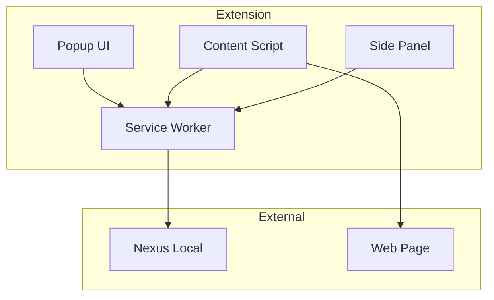

# Browser Extension - Architecture

Documentation de l'architecture Manifest V3.

---

## 🏗️ Composants



---

## 📄 Manifest

```json
{
  "manifest_version": 3,
  "name": "Genesis AI Extension",
  "version": "1.0.0",
  
  "action": {
    "default_popup": "popup/index.html",
    "default_icon": {
      "16": "icons/icon-16.png",
      "48": "icons/icon-48.png",
      "128": "icons/icon-128.png"
    }
  },
  
  "side_panel": {
    "default_path": "side-panel/index.html"
  },
  
  "background": {
    "service_worker": "background/index.js",
    "type": "module"
  },
  
  "content_scripts": [
    {
      "matches": ["<all_urls>"],
      "js": ["content/index.js"],
      "css": ["content/styles/overlay.css"],
      "run_at": "document_idle"
    }
  ],
  
  "permissions": [
    "activeTab",
    "storage",
    "contextMenus",
    "scripting",
    "sidePanel"
  ],
  
  "host_permissions": [
    "https://nexus.genesisai.io/*"
  ]
}
```

---

## 🔌 Content Script

```typescript
// content/index.ts
import { ContextExtractor } from './context-extractor';

// Extraire le contexte de la page
const context = ContextExtractor.extract();

// Envoyer au background
chrome.runtime.sendMessage({
  type: 'CONTEXT_UPDATE',
  payload: context,
});

// Écouter les réponses
chrome.runtime.onMessage.addListener((message, sender, sendResponse) => {
  if (message.type === 'HIGHLIGHT_TEXT') {
    highlightText(message.payload);
    sendResponse({ success: true });
  }
});
```

---

## 🌉 Background Service Worker

```typescript
// background/index.ts
import { NexusBridge } from './nexus-bridge';

const nexusBridge = new NexusBridge('ws://localhost:8080/ws');

// Message du content script
chrome.runtime.onMessage.addListener((message, sender, sendResponse) => {
  if (message.type === 'CONTEXT_UPDATE') {
    nexusBridge.sendContext(message.payload);
    sendResponse({ success: true });
  }
});

// Message du popup
chrome.runtime.onMessage.addListener((message, sender, sendResponse) => {
  if (message.type === 'EXECUTE_WORKFLOW') {
    nexusBridge.requestWorkflow(message.payload.id, message.payload.input)
      .then(sendResponse)
      .catch(err => sendResponse({ error: err.message }));
    return true; // Keep channel open for async response
  }
});
```

---

## 🎨 Popup

```tsx
// popup/App.tsx
export function App() {
  const [context, setContext] = useState<any>(null);
  
  useEffect(() => {
    chrome.tabs.query({ active: true, currentWindow: true }, (tabs) => {
      chrome.tabs.sendMessage(tabs[0].id!, { type: 'GET_CONTEXT' }, (response) => {
        setContext(response.context);
      });
    });
  }, []);
  
  return (
    <div className="w-80 p-4">
      <h1 className="text-lg font-bold">Genesis AI</h1>
      {context && (
        <div>
          <h2 className="text-sm font-semibold">{context.title}</h2>
          <p className="text-xs text-gray-500">{context.url}</p>
        </div>
      )}
      <button onClick={handleExecuteWorkflow}>
        Execute Workflow
      </button>
    </div>
  );
}
```

---

**Version :** 1.0.0
