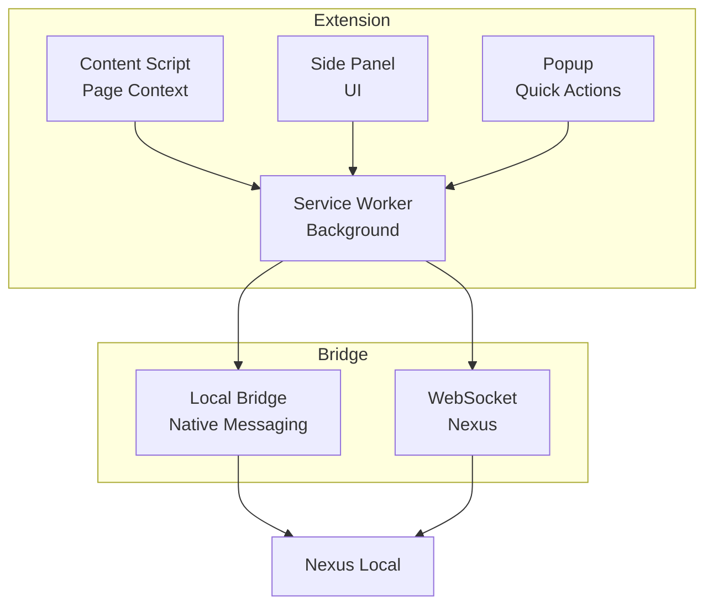

# Browser Extension - Vue d'ensemble

**Genesis Extension** est une extension Chrome Manifest V3 qui injecte du contexte web dans les workflows Genesis AI.

---

## 🔌 Fonctionnalités

- **Context Injection** : Capture de contexte depuis les pages web
- **Bridge Protocol** : Communication avec Nexus local
- **Side Panel** : Interface latérale pour contrôles rapides
- **Permissions** : Accès minimal et contrôlé

---

## 🏗️ Architecture MV3

---

## 📚 Références

- [Chrome MV3](./browser-extension/chrome-mv3)
- [Context Injection](./browser-extension/context-injection)
- [Bridge Protocol](./browser-extension/bridge-protocol)
- [Permissions](./browser-extension/permissions)

---

**Version :** 1.0.0  
**Platform :** Chrome Manifest V3  
**Language :** TypeScript  
**Build :** Vite + CRXJS
