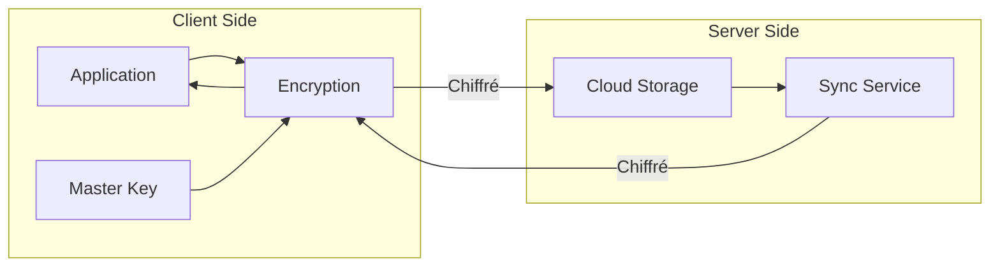

# Cloud API - E2EE Implementation

Implémentation complète du chiffrement de bout en bout.

---

## 🔐 Architecture E2EE



---

## 🧮 Algorithmes

### AES-256-GCM

```typescript
// src/common/e2ee.module.ts
@Injectable()
export class E2EEncryptionService {
  private readonly algorithm = 'aes-256-gcm';
  private readonly keyLength = 32;
  
  async deriveKey(password: string, salt: Buffer): Promise<Buffer> {
    return new Promise((resolve, reject) => {
      scrypt(password, salt, this.keyLength, (err, key) => {
        if (err) reject(err);
        resolve(key);
      });
    });
  }
  
  async encrypt(data: Buffer | string, password: string): Promise<EncryptedData> {
    const salt = randomBytes(16);
    const key = await this.deriveKey(password, salt);
    const iv = randomBytes(12);
    
    const cipher = createCipheriv(this.algorithm, key, iv);
    
    let encrypted = cipher.update(
      typeof data === 'string' ? Buffer.from(data) : data
    );
    encrypted = Buffer.concat([encrypted, cipher.final()]);
    
    return {
      ciphertext: encrypted.toString('base64'),
      iv: iv.toString('base64'),
      authTag: cipher.getAuthTag().toString('base64'),
      salt: salt.toString('base64'),
    };
  }
  
  async decrypt(encrypted: EncryptedData, password: string): Promise<Buffer> {
    const salt = Buffer.from(encrypted.salt, 'base64');
    const iv = Buffer.from(encrypted.iv, 'base64');
    const authTag = Buffer.from(encrypted.authTag, 'base64');
    const ciphertext = Buffer.from(encrypted.ciphertext, 'base64');
    
    const key = await this.deriveKey(password, salt);
    
    const decipher = createDecipheriv(this.algorithm, key, iv);
    decipher.setAuthTag(authTag);
    
    let decrypted = decipher.update(ciphertext);
    decrypted = Buffer.concat([decrypted, decipher.final()]);
    
    return decrypted;
  }
}
```

---

## 🔑 Key Management

### Hiérarchie de clés

```typescript
interface KeyHierarchy {
  masterKey: Uint8Array;           // Générée localement
  derivedKeys: {
    workflowDataKey: WrappedKey;   // Chiffrée avec master key
    agentStateKey: WrappedKey;
    settingsKey: WrappedKey;
    auditLogSigningKey: SigningKey;
  };
}

interface WrappedKey {
  encryptedKey: string;  // Base64
  iv: string;            // Base64
  authTag: string;       // Base64
}
```

### Key Rotation

```typescript
async function rotateMasterKey(
  userId: string,
  newMasterKey: Uint8Array,
  oldMasterKey: Uint8Array
): Promise<void> {
  // 1. Déchiffrer toutes les data keys avec l'ancienne master key
  const dataKeys = await unwrapAllDataKeys(oldMasterKey);
  
  // 2. Re-chiffrer avec la nouvelle master key
  const rewrappedKeys = await wrapDataKeys(dataKeys, newMasterKey);
  
  // 3. Mettre à jour le stockage
  await storeMasterKey(userId, newMasterKey);
  await storeDataKeys(userId, rewrappedKeys);
  
  // 4. Notifier les autres appareils
  await notifyDevices(userId, 'MASTER_KEY_ROTATED');
  
  // 5. Audit log
  await auditLog('MASTER_KEY_ROTATED', { userId });
}
```

---

## 📊 Métriques de sécurité

| Métrique | Cible |
|----------|-------|
| **Encryption Strength** | 256 bits |
| **Key Derivation** | PBKDF2 (100K iterations) |
| **Key Exchange** | X25519 (ECDH) |
| **Signature** | HMAC-SHA256 |

---

**Version :** 1.0.0
