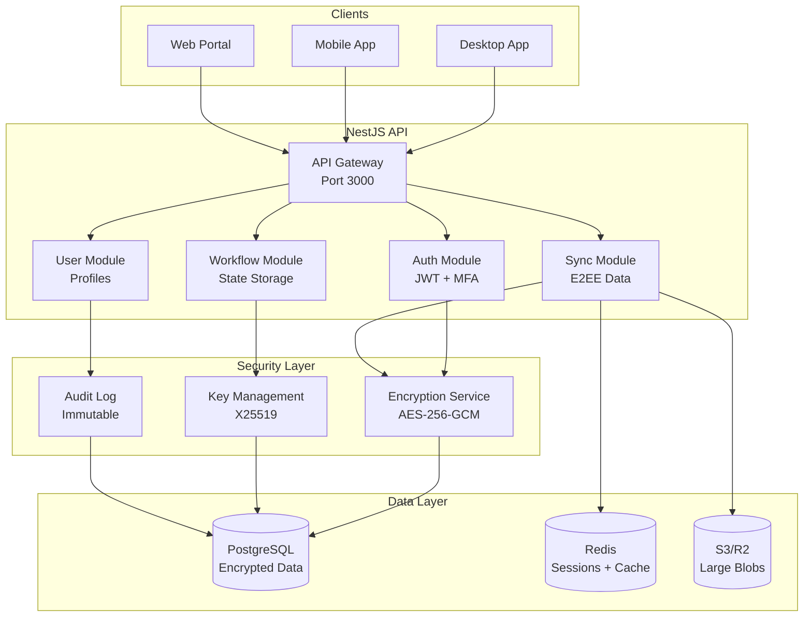

# Cloud API - Vue d'ensemble

**Genesis Cloud API** est le hub de synchronisation zero-knowledge de l'écosystème Genesis, construit avec NestJS et PostgreSQL. Il assure la synchronisation des états entre appareils avec chiffrement de bout en bout (E2EE).

---

## 🎯 Rôle de Cloud API

Cloud API agit comme un **tiers de confiance zéro** :
- **Synchronisation** : État synchronisé entre tous les appareils
- **Zero-Knowledge** : Les données restent chiffrées, jamais déchiffrées côté serveur
- **Persistance** : Stockage durable des workflows et états
- **Authentification** : Gestion des utilisateurs et permissions

---

## 🏗️ Architecture



---

## 🔐 Zero-Knowledge Implementation

### Chiffrement de Bout en Bout

```typescript
// src/encryption/e2ee.service.ts
import { Injectable } from '@nestjs/common';
import { randomBytes } from 'crypto';

@Injectable()
export class E2EEncryptionService {
  private readonly algorithm = 'aes-256-gcm';

  /**
   * Chiffrer des données avec une clé
   * Les données chiffrées incluent le nonce et le tag d'authentification
   */
  async encrypt(data: Buffer, key: Uint8Array): Promise<EncryptedData> {
    const iv = randomBytes(12); // 96-bit IV pour GCM
    const cipher = createCipheriv(this.algorithm, key, iv);
    
    let encrypted = cipher.update(data);
    encrypted = Buffer.concat([encrypted, cipher.final()]);
    
    return {
      ciphertext: encrypted.toString('base64'),
      iv: iv.toString('base64'),
      authTag: cipher.getAuthTag().toString('base64'),
    };
  }

  /**
   * Déchiffrer des données
   * NOTE: Cette fonction n'existe PAS côté serveur
   * Elle est uniquement utilisée pour les tests
   */
  async decrypt(encryptedData: EncryptedData, key: Uint8Array): Promise<Buffer> {
    const decipher = createDecipheriv(
      this.algorithm,
      key,
      Buffer.from(encryptedData.iv, 'base64')
    );
    
    decipher.setAuthTag(Buffer.from(encryptedData.authTag, 'base64'));
    
    let decrypted = decipher.update(Buffer.from(encryptedData.ciphertext, 'base64'));
    decrypted = Buffer.concat([decrypted, decipher.final()]);
    
    return decrypted;
  }
}
```

### Key Exchange (X25519)

```typescript
// src/encryption/key-exchange.service.ts
import { Injectable } from '@nestjs/common';
import { generateKeyPair, deriveBits } from 'crypto';

@Injectable()
export class KeyExchangeService {
  /**
   * Générer une paire de clés X25519
   */
  async generateKeyPair(): Promise<KeyPair> {
    return new Promise((resolve, reject) => {
      generateKeyPair('x25519', (err, publicKey, privateKey) => {
        if (err) reject(err);
        resolve({
          publicKey: publicKey.export({ type: 'spki', format: 'pem' }),
          privateKey: privateKey.export({ type: 'pkcs8', format: 'pem' }),
        });
      });
    });
  }

  /**
   * Dériver une clé secrète partagée (ECDH)
   */
  async deriveSharedSecret(
    privateKeyPem: string,
    publicKeyPem: string
  ): Promise<Uint8Array> {
    const sharedSecret = await deriveBits(
      {
        name: 'ECDH',
        private: await importKey(privateKeyPem, 'pkcs8'),
        public: await importKey(publicKeyPem, 'spki'),
      },
      256
    );
    
    return new Uint8Array(sharedSecret);
  }
}
```

---

## 📡 API Endpoints

### Authentication

```typescript
// src/auth/auth.controller.ts
@Controller('auth')
export class AuthController {
  constructor(private authService: AuthService) {}

  @Post('register')
  async register(@Body() dto: RegisterDto): Promise<AuthResponse> {
    return this.authService.register(dto);
  }

  @Post('login')
  async login(@Body() dto: LoginDto): Promise<AuthResponse> {
    return this.authService.login(dto);
  }

  @Post('mfa/verify')
  async verifyMFA(@Body() dto: MFAVerifyDto): Promise<MFAResponse> {
    return this.authService.verifyMFA(dto);
  }

  @Post('refresh')
  async refreshToken(@Body() dto: RefreshTokenDto): Promise<AuthResponse> {
    return this.authService.refreshToken(dto);
  }

  @Post('logout')
  @UseGuards(JwtAuthGuard)
  async logout(@CurrentUser() user: User): Promise<void> {
    await this.authService.logout(user.id);
  }
}
```

### Sync API

```typescript
// src/sync/sync.controller.ts
@Controller('sync')
@UseGuards(JwtAuthGuard)
export class SyncController {
  constructor(private syncService: SyncService) {}

  /**
   * Push d'état chiffré
   */
  @Post('push')
  async pushState(
    @CurrentUser() user: User,
    @Body() dto: PushStateDto
  ): Promise<SyncResponse> {
    // Les données sont DÉJÀ chiffrées côté client
    // Le serveur ne fait que les stocker
    return this.syncService.pushState(user.id, dto);
  }

  /**
   * Pull d'état chiffré
   */
  @Get('pull')
  async pullState(
    @CurrentUser() user: User,
    @Query('since') since?: string
  ): Promise<PullStateResponse> {
    return this.syncService.pullState(user.id, since);
  }

  /**
   * S'abonner aux changements (WebSocket)
   */
  @WebSocketGateway()
  @WebSocketServer()
  server: Server;

  @SubscribeMessage('sync:subscribe')
  async subscribe(
    @CurrentUser() user: User,
    @MessageBody() dto: SubscribeDto
  ): Promise<void> {
    await this.syncService.subscribe(user.id, dto);
  }
}
```

### Workflow API

```typescript
// src/workflow/workflow.controller.ts
@Controller('workflows')
@UseGuards(JwtAuthGuard)
export class WorkflowController {
  constructor(private workflowService: WorkflowService) {}

  @Get()
  async listWorkflows(
    @CurrentUser() user: User,
    @Query() query: ListWorkflowsDto
  ): Promise<PaginatedResponse<Workflow>> {
    return this.workflowService.list(user.id, query);
  }

  @Get(':id')
  async getWorkflow(
    @CurrentUser() user: User,
    @Param('id') id: string
  ): Promise<Workflow> {
    return this.workflowService.findOne(user.id, id);
  }

  @Post()
  async createWorkflow(
    @CurrentUser() user: User,
    @Body() dto: CreateWorkflowDto
  ): Promise<Workflow> {
    // Le workflow est chiffré côté client
    return this.workflowService.create(user.id, dto);
  }

  @Patch(':id')
  async updateWorkflow(
    @CurrentUser() user: User,
    @Param('id') id: string,
    @Body() dto: UpdateWorkflowDto
  ): Promise<Workflow> {
    return this.workflowService.update(user.id, id, dto);
  }

  @Delete(':id')
  async deleteWorkflow(
    @CurrentUser() user: User,
    @Param('id') id: string
  ): Promise<void> {
    await this.workflowService.delete(user.id, id);
  }
}
```

---

## 💾 Database Schema

```prisma
// prisma/schema.prisma
datasource db {
  provider = "postgresql"
  url      = env("DATABASE_URL")
}

generator client {
  provider = "prisma-client-js"
}

model User {
  id            String    @id @default(uuid())
  email         String    @unique
  passwordHash  String
  publicKey     String    // Clé publique X25519
  mfaSecret     String?
  mfaEnabled    Boolean   @default(false)
  createdAt     DateTime  @default(now())
  updatedAt     DateTime  @updatedAt
  
  devices       Device[]
  workflows     Workflow[]
  syncStates    SyncState[]
  auditLogs     AuditLog[]
}

model Device {
  id           String   @id @default(uuid())
  userId       String
  name         String
  publicKey    String
  lastSeenAt   DateTime
  createdAt    DateTime @default(now())
  
  user         User     @relation(fields: [userId], references: [id])
  syncStates   SyncState[]
  
  @@unique([userId, name])
}

model Workflow {
  id            String   @id @default(uuid())
  userId        String
  name          String   // En clair pour la recherche
  description   String?  // En clair
  encryptedData String   // Données chiffrées (DAG, état, etc.)
  encryptionKey String   // Clé chiffrée avec la clé du device
  version       Int      @default(1)
  status        WorkflowStatus @default(DRAFT)
  createdAt     DateTime @default(now())
  updatedAt     DateTime @updatedAt
  
  user          User     @relation(fields: [userId], references: [id])
  
  @@index([userId, status])
}

enum WorkflowStatus {
  DRAFT
  RUNNING
  COMPLETED
  FAILED
  ARCHIVED
}

model SyncState {
  id          String   @id @default(uuid())
  userId      String
  deviceId    String
  type        String   // workflow, agent, settings, etc.
  entityId    String
  encryptedData String // Données chiffrées
  version     BigInt   @default(0n)
  vectorClock Json     // CRDT vector clock
  createdAt   DateTime @default(now())
  updatedAt   DateTime @updatedAt
  
  user        User     @relation(fields: [userId], references: [id])
  device      Device   @relation(fields: [deviceId], references: [id])
  
  @@unique([userId, deviceId, type, entityId])
  @@index([userId, updatedAt])
}

model AuditLog {
  id          String   @id @default(uuid())
  userId      String
  action      String
  resource    String
  resourceId  String?
  metadata    Json?
  ipAddress   String?
  userAgent   String?
  timestamp   DateTime @default(now())
  previousHash String? // Pour l'immutabilité
  hash        String
  
  user        User     @relation(fields: [userId], references: [id])
  
  @@index([userId, timestamp])
}
```

---

## 🔑 Key Management

### Hiérarchie de Clés

```typescript
// src/encryption/key-hierarchy.ts

/**
 * Hiérarchie de clés pour chaque utilisateur :
 * 
 * Master Key (générée localement, jamais envoyée)
 * ├── Data Encryption Key (DEK) - Workflow Data
 * ├── Data Encryption Key (DEK) - Agent State
 * ├── Data Encryption Key (DEK) - Settings
 * ├── Signing Key - Audit Logs
 * └── Signing Key - Workflow Results
 * 
 * Chaque DEK est chiffrée avec la Master Key
 * et stockée dans Cloud API
 */

interface KeyHierarchy {
  masterKey: Uint8Array; // 256-bit, générée localement
  
  derivedKeys: {
    workflowDataKey: WrappedKey;
    agentStateKey: WrappedKey;
    settingsKey: WrappedKey;
    auditLogSigningKey: SigningKey;
    workflowResultSigningKey: SigningKey;
  };
}

interface WrappedKey {
  encryptedKey: string; // Base64
  iv: string;           // Base64
  authTag: string;      // Base64
}
```

### Key Rotation

```typescript
// src/encryption/key-rotation.service.ts
@Injectable()
export class KeyRotationService {
  constructor(
    private prisma: PrismaService,
    private encryptionService: E2EEncryptionService,
  ) {}

  /**
   * Rotation de la master key
   * Nécessite que le client fournisse les nouvelles clés chiffrées
   */
  async rotateMasterKey(
    userId: string,
    request: RotateMasterKeyRequest
  ): Promise<void> {
    const tx = await this.prisma.$transaction(async (tx) => {
      // 1. Vérifier l'authenticité de la requête
      const user = await tx.user.findUnique({ where: { id: userId } });
      if (!user) throw new Error('User not found');

      // 2. Mettre à jour la clé publique (si rotation de paire de clés)
      if (request.newPublicKey) {
        await tx.user.update({
          where: { id: userId },
          data: { publicKey: request.newPublicKey },
        });
      }

      // 3. Mettre à jour les clés chiffrées pour chaque device
      for (const deviceKey of request.wrappedKeys) {
        await tx.device.update({
          where: { id: deviceKey.deviceId },
          data: {
            // Les nouvelles clés sont déjà chiffrées côté client
            // Le serveur ne fait que les stocker
          },
        });
      }

      // 4. Journaliser la rotation
      await tx.auditLog.create({
        data: {
          userId,
          action: 'MASTER_KEY_ROTATED',
          resource: 'user',
          resourceId: userId,
          metadata: {
            deviceId: request.requestingDeviceId,
            timestamp: Date.now(),
          },
          hash: await this.hashAuditLog(userId, 'MASTER_KEY_ROTATED'),
        },
      });
    });
  }
}
```

---

## 📊 Monitoring

### Métriques Prometheus

```typescript
// src/metrics/metrics.service.ts
import { Injectable, OnModuleInit } from '@nestjs/common';
import { Counter, Histogram, Gauge } from 'prom-client';

@Injectable()
export class MetricsService implements OnModuleInit {
  // Compteurs
  public readonly apiRequestsTotal: Counter;
  public readonly authFailuresTotal: Counter;
  public readonly syncOperationsTotal: Counter;

  // Histogrammes
  public readonly requestDuration: Histogram;
  public readonly syncLatency: Histogram;

  // Jauges
  public readonly activeUsers: Gauge;
  public readonly pendingSyncs: Gauge;

  constructor() {
    this.apiRequestsTotal = new Counter({
      name: 'genesis_api_requests_total',
      help: 'Total number of API requests',
      labelNames: ['method', 'endpoint', 'status'],
    });

    this.authFailuresTotal = new Counter({
      name: 'genesis_auth_failures_total',
      help: 'Total number of authentication failures',
      labelNames: ['reason'],
    });

    this.requestDuration = new Histogram({
      name: 'genesis_request_duration_seconds',
      help: 'Request duration in seconds',
      labelNames: ['method', 'endpoint'],
      buckets: [0.01, 0.05, 0.1, 0.5, 1, 2, 5],
    });

    this.activeUsers = new Gauge({
      name: 'genesis_active_users',
      help: 'Number of active users',
    });
  }

  onModuleInit() {
    registerMetric(this.apiRequestsTotal);
    registerMetric(this.authFailuresTotal);
    registerMetric(this.requestDuration);
    registerMetric(this.activeUsers);
  }
}
```

---

## 📚 Références

- [Zero-Knowledge Sync](./cloud-api/zero-knowledge-sync)
- [Implémentation E2EE](./cloud-api/e2ee-implementation)
- [Endpoints API](./cloud-api/api-endpoints)
- [Schéma de base de données](./cloud-api/database-schema)
- [Authentification](./cloud-api/authentication)

---

**Version :** 1.0.0  
**Framework :** NestJS 10+  
**Database :** PostgreSQL 15+  
**Encryption :** AES-256-GCM, X25519
