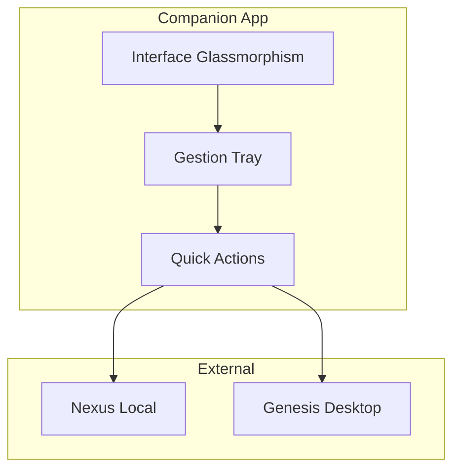

# Genesis Companion - Vue d'ensemble

**Genesis Companion** est l'application desktop secondaire de Genesis AI, une interface légère toujours-visible pour un accès rapide aux fonctionnalités principales.

---

## 🎯 Rôle de Companion

Companion agit comme un **assistant toujours disponible** :
- **Always-on-top** : Fenêtre toujours visible au-dessus des autres applications
- **Tray Icon** : Accès rapide depuis la barre des tâches
- **Quick Actions** : Actions rapides en un clic
- **Compact UI** : Interface compacte (400x600px)

---

## 🏗️ Architecture



---

## 🚀 Fonctionnalités principales

### 1. Always-on-top

```typescript
companionWindow = new BrowserWindow({
  width: 400,
  height: 600,
  alwaysOnTop: true,
  skipTaskbar: true,
  frame: false,
  transparent: true,
});
```

### 2. Tray Icon

- Double-clic pour afficher/masquer
- Menu contextuel avec actions rapides
- Statut en temps réel

### 3. Quick Actions

- **Capture d'écran** : Capture rapide et copie dans le presse-papier
- **Note rapide** : Prendre des notes instantanées
- **Workflow rapide** : Exécuter un workflow en un clic
- **Status check** : Vérifier l'état des agents

---

## 📦 Installation

📖 [Guide d'installation →](./companion/installation)

---

## 🎨 Interface

L'interface utilise le **design system glassmorphism** de Genesis :
- Effet de verre dépoli
- Transparence et flou
- Couleurs de marque Genesis
- Animations fluides

📖 [Documentation complète →](./companion/features)

---

## 🔗 Liens avec Desktop

Companion fonctionne en tandem avec Genesis Desktop :
- Partage le même Nexus embarqué
- Synchronisation des états
- Actions complémentaires

---

**Version :** 1.0.0  
**Runtime :** Electron  
**UI :** Glassmorphism
