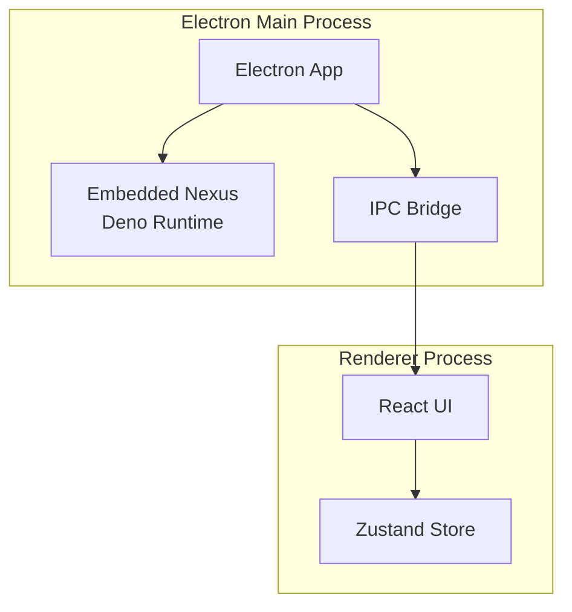

# Desktop Apps - Embedded Nexus

Documentation de l'intégration de Nexus embarqué.

---

## 🔌 Architecture



---

## 📦 Main Process

```typescript
// electron/main/index.ts
import { app, BrowserWindow } from 'electron';
import { spawn } from 'child_process';

let mainWindow: BrowserWindow | null = null;
let nexusProcess: any = null;

async function startNexus() {
  const nexusPath = join(__dirname, '../../genesis-nexus/main.ts');
  nexusProcess = spawn('deno', ['run', '--allow-all', nexusPath], {
    env: { ...process.env, NEXUS_EMBEDDED: 'true' },
  });
  
  nexusProcess.stdout.on('data', (data) => {
    console.log(`Nexus: ${data}`);
  });
  
  nexusProcess.stderr.on('data', (data) => {
    console.error(`Nexus Error: ${data}`);
  });
}

app.whenReady().then(async () => {
  await startNexus();
  await createWindow();
});
```

---

## 🌉 IPC Communication

```typescript
// electron/preload/index.ts
import { contextBridge, ipcRenderer } from 'electron';

contextBridge.exposeInMainWorld('genesisAPI', {
  // Workflow
  executeWorkflow: (workflowId: string, input: unknown) =>
    ipcRenderer.invoke('workflow:execute', workflowId, input),
  
  // Nexus
  sendToNexus: (message: unknown) =>
    ipcRenderer.invoke('nexus:send', message),
  
  receiveFromNexus: (callback: (data: unknown) => void) => {
    const subscription = (_: any, data: unknown) => callback(data);
    ipcRenderer.on('nexus:message', subscription);
    return () => ipcRenderer.removeListener('nexus:message', subscription);
  },
});
```

---

## 🎨 Renderer

```tsx
// src/hooks/use-nexus.ts
export function useNexus() {
  const [connected, setConnected] = useState(false);
  
  useEffect(() => {
    const unsubscribe = window.genesisAPI.receiveFromNexus((data) => {
      console.log('Received from Nexus:', data);
    });
    
    setConnected(true);
    
    return unsubscribe;
  }, []);
  
  const sendToNexus = async (message: any) => {
    return await window.genesisAPI.sendToNexus(message);
  };
  
  return { connected, sendToNexus };
}
```

---

**Version :** 1.0.0
