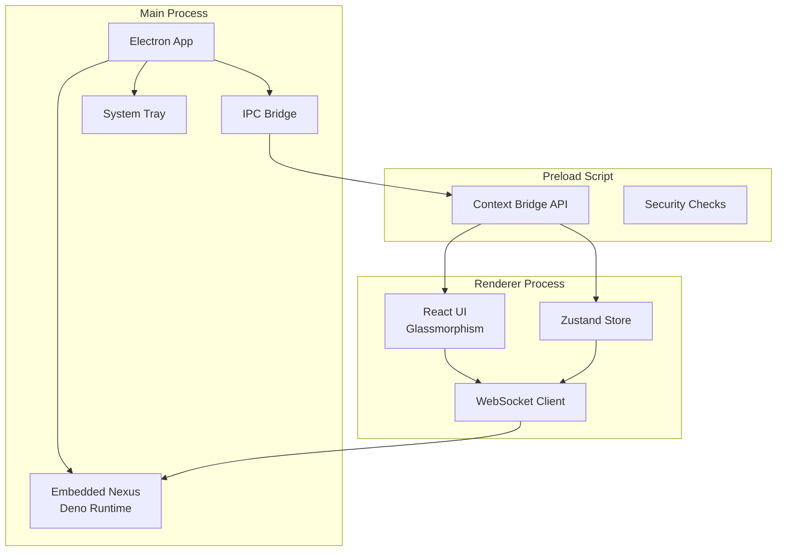

# Applications Desktop - Vue d'ensemble

Les applications Desktop de Genesis AI sont construites avec **Electron** et offrent une interface glassmorphism premium pour interagir avec l'écosystème Genesis.

---

## 🖥️ Projets Desktop

### Genesis Desktop

**Application principale** avec Nexus embarqué.

- **Framework :** Electron 28+
- **Bundler :** Vite 5+
- **UI :** React 18+ + TypeScript
- **Design :** Glassmorphism prestige
- **Intégration :** Nexus Deno embarqué

### Genesis Companion

**Interface secondaire** pour contrôles rapides.

- **Framework :** Electron
- **UI :** Glassmorphism léger
- **Fonction :** Vue complémentaire, notifications

---

## 🏗️ Architecture Desktop



---

## 📦 Genesis Desktop

### Configuration Principale

```typescript
// electron/main.ts
import { app, BrowserWindow, ipcMain } from 'electron';
import { join } from 'path';
import { spawn } from 'child_process';

let mainWindow: BrowserWindow | null = null;
let nexusProcess: any = null;

async function createWindow() {
  mainWindow = new BrowserWindow({
    width: 1400,
    height: 900,
    minWidth: 1024,
    minHeight: 768,
    frame: false, // Frameless pour glassmorphism
    transparent: true,
    vibrancy: 'under-window', // macOS
    visualEffectState: 'active',
    webPreferences: {
      preload: join(__dirname, 'preload.js'),
      contextIsolation: true,
      nodeIntegration: false,
    },
  });

  // Vite dev server ou build
  if (process.env.NODE_ENV === 'development') {
    await mainWindow.loadURL('http://localhost:5173');
    mainWindow.webContents.openDevTools();
  } else {
    await mainWindow.loadFile(join(__dirname, '../dist/index.html'));
  }
}

// Démarrer Nexus embarqué
async function startNexus() {
  const nexusPath = join(__dirname, '../../genesis-nexus/main.ts');
  nexusProcess = spawn('deno', ['run', '--allow-all', nexusPath], {
    env: { ...process.env, NEXUS_EMBEDDED: 'true' },
  });

  nexusProcess.stdout.on('data', (data) => {
    console.log(`Nexus: ${data}`);
  });

  nexusProcess.stderr.on('data', (data) => {
    console.error(`Nexus Error: ${data}`);
  });
}

app.whenReady().then(async () => {
  await startNexus();
  await createWindow();
});
```

### IPC Communication

```typescript
// electron/preload.ts
import { contextBridge, ipcRenderer } from 'electron';

// API sécurisée exposée au renderer
contextBridge.exposeInMainWorld('genesisAPI', {
  // Workflow
  executeWorkflow: (workflowId: string, input: unknown) =>
    ipcRenderer.invoke('workflow:execute', workflowId, input),
  
  getWorkflowStatus: (workflowId: string) =>
    ipcRenderer.invoke('workflow:status', workflowId),
  
  // Nexus
  sendToNexus: (message: unknown) =>
    ipcRenderer.invoke('nexus:send', message),
  
  receiveFromNexus: (callback: (data: unknown) => void) => {
    const subscription = (_: any, data: unknown) => callback(data);
    ipcRenderer.on('nexus:message', subscription);
    return () => ipcRenderer.removeListener('nexus:message', subscription);
  },
  
  // Système
  platform: process.platform,
  versions: process.versions,
});
```

### UI Glassmorphism

```tsx
// src/components/GlassCard.tsx
import { styled } from '@stitches/react';

export const GlassCard = styled('div', {
  // Glassmorphism
  background: 'rgba(255, 255, 255, 0.1)',
  backdropFilter: 'blur(20px)',
  WebkitBackdropFilter: 'blur(20px)',
  border: '1px solid rgba(255, 255, 255, 0.2)',
  borderRadius: '16px',
  
  // Ombres
  boxShadow: '0 8px 32px rgba(0, 0, 0, 0.3)',
  
  // Typography
  color: '$gray12',
  fontFamily: '$inter',
  
  // Spacing
  padding: '$4',
  
  // Variants
  variants: {
    variant: {
      default: { background: 'rgba(255, 255, 255, 0.1)' },
      primary: { background: 'rgba(59, 130, 246, 0.2)' },
      danger: { background: 'rgba(239, 68, 68, 0.2)' },
    },
  },
  
  defaultVariants: {
    variant: 'default',
  },
});
```

---

## 📱 Genesis Companion

### Configuration Légère

```typescript
// companion/electron/main.ts
import { app, BrowserWindow, Tray, Menu, nativeImage } from 'electron';

let companionWindow: BrowserWindow | null = null;
let tray: Tray | null = null;

function createCompanionWindow() {
  companionWindow = new BrowserWindow({
    width: 400,
    height: 600,
    frame: false,
    transparent: true,
    alwaysOnTop: true,
    skipTaskbar: true,
    webPreferences: {
      preload: join(__dirname, 'preload.js'),
      contextIsolation: true,
    },
  });

  companionWindow.loadURL('http://localhost:5174'); // Port différent
}

function createTray() {
  const icon = nativeImage.createFromPath(join(__dirname, '../icons/tray-icon.png'));
  tray = new Tray(icon);

  const contextMenu = Menu.buildFromTemplate([
    { label: 'Open Companion', click: () => companionWindow?.show() },
    { label: 'Quick Action 1', click: handleQuickAction1 },
    { label: 'Quick Action 2', click: handleQuickAction2 },
    { type: 'separator' },
    { label: 'Quit', click: () => app.quit() },
  ]);

  tray.setContextMenu(contextMenu);
  tray.setToolTip('Genesis Companion');
}

app.whenReady().then(() => {
  createTray();
  createCompanionWindow();
});
```

---

## 🎨 Design System

### Tokens

```typescript
// src/design-tokens.ts
export const tokens = {
  colors: {
    glass: {
      primary: 'rgba(255, 255, 255, 0.1)',
      secondary: 'rgba(255, 255, 255, 0.05)',
      border: 'rgba(255, 255, 255, 0.2)',
      highlight: 'rgba(255, 255, 255, 0.3)',
    },
    brand: {
      primary: '#3B82F6',
      secondary: '#8B5CF6',
      accent: '#06B6D4',
    },
    semantic: {
      success: 'rgba(34, 197, 94, 0.2)',
      warning: 'rgba(234, 179, 8, 0.2)',
      error: 'rgba(239, 68, 68, 0.2)',
    },
  },
  blur: {
    sm: '10px',
    md: '20px',
    lg: '30px',
    xl: '40px',
  },
  shadow: {
    glass: '0 8px 32px rgba(0, 0, 0, 0.3)',
    float: '0 12px 48px rgba(0, 0, 0, 0.4)',
  },
};
```

---

## 📚 Références

- [Genesis Desktop](./desktop-apps/genesis-desktop)
- [Genesis Companion](./desktop-apps/genesis-companion)
- [UI Glassmorphism](./desktop-apps/glassmorphism-ui)
- [Nexus Embarqué](./desktop-apps/embedded-nexus)
- [Communication IPC](./desktop-apps/ipc-communication)

---

**Version :** 1.0.0  
**Framework :** Electron 28+  
**UI :** React + Glassmorphism  
**Runtime :** Embedded Deno (Nexus)
