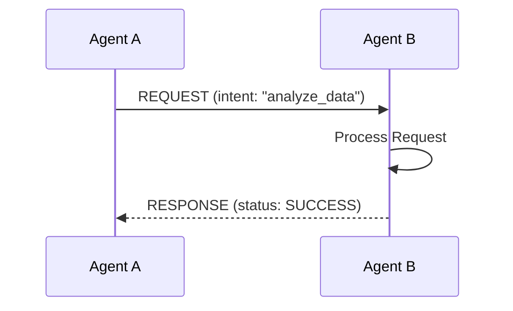
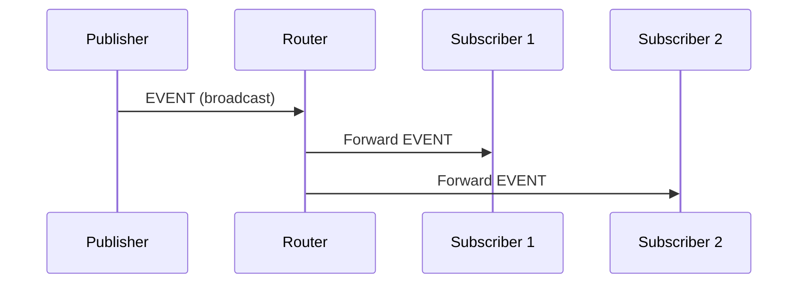

# Genesis Nexus - A2A Protocol

Spécification complète du protocole Agent-to-Agent.

---

## 📡 Message Format

```typescript
interface A2AMessage {
  // Header
  id: string;              // UUID v4
  type: MessageType;
  version: string;         // "1.0.0"
  timestamp: number;       // Unix timestamp (ms)
  
  // Routing
  from: AgentIdentity;
  to: AgentIdentity;
  correlationId?: string;
  
  // Payload
  action?: string;
  payload?: any;
  result?: any;
  error?: A2AError;
  
  // Security
  signature: string;       // HMAC-SHA256
  encryption?: {
    algorithm: 'AES-256-GCM';
    iv: string;
    ciphertext: string;
    authTag: string;
  };
  
  // Metadata
  priority: Priority;
  ttl: number;
  requiresAck: boolean;
  requiresSignature: boolean;
}
```

---

## 📨 Message Types

### COMMAND

```typescript
interface CommandMessage extends A2AMessage {
  type: MessageType.COMMAND;
  action: string;
  payload: {
    workflowId?: string;
    agentId?: string;
    parameters?: Record<string, any>;
  };
}
```

### QUERY

```typescript
interface QueryMessage extends A2AMessage {
  type: MessageType.QUERY;
  action: 'get_status' | 'get_metrics' | 'get_state';
  payload: {
    resourceId: string;
  };
}
```

### EVENT

```typescript
interface EventMessage extends A2AMessage {
  type: MessageType.EVENT;
  eventType: string;
  eventName: string;
  payload: {
    data: any;
    metadata: {
      schemaVersion: string;
      contentType: string;
    };
  };
  deliveryGuarantee: 'at-most-once' | 'at-least-once' | 'exactly-once';
}
```

### RESPONSE

```typescript
interface ResponseMessage extends A2AMessage {
  type: MessageType.RESPONSE;
  correlationId: string;
  requestId: string;
  status: 'SUCCESS' | 'FAILURE' | 'PARTIAL';
  data?: any;
  error?: A2AError;
  confidence?: number;
  sources?: string[];
  processingTime?: number;
}
```

---

## 🔐 Security

### Signature

```typescript
async function signMessage(
  message: A2AMessage,
  secretKey: string
): Promise<string> {
  const payload = JSON.stringify({
    id: message.id,
    type: message.type,
    from: message.from,
    to: message.to,
    timestamp: message.timestamp,
  });
  
  const encoder = new TextEncoder();
  const key = await crypto.subtle.importKey(
    'raw',
    encoder.encode(secretKey),
    { name: 'HMAC', hash: 'SHA-256' },
    false,
    ['sign']
  );
  
  const signature = await crypto.subtle.sign(
    'HMAC',
    key,
    encoder.encode(payload)
  );
  
  return Array.from(new Uint8Array(signature))
    .map(b => b.toString(16).padStart(2, '0'))
    .join('');
}
```

### Vérification

```typescript
async function verifySignature(
  message: A2AMessage,
  secretKey: string
): Promise<boolean> {
  const expected = await signMessage(message, secretKey);
  return message.signature === expected;
}
```

---

## 🔄 Flow de Communication

### Request-Response



### Publish-Subscribe



---

**Version :** 1.0.0
