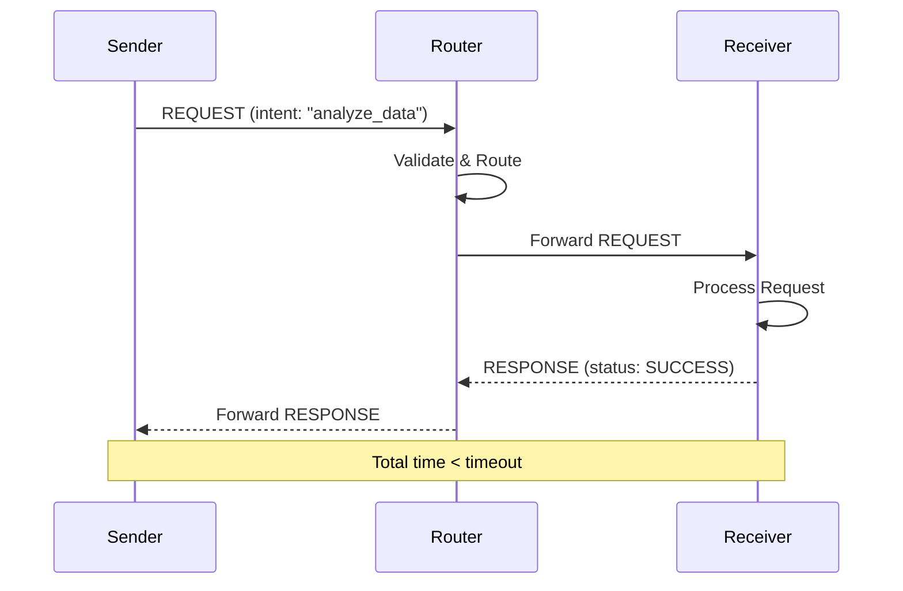
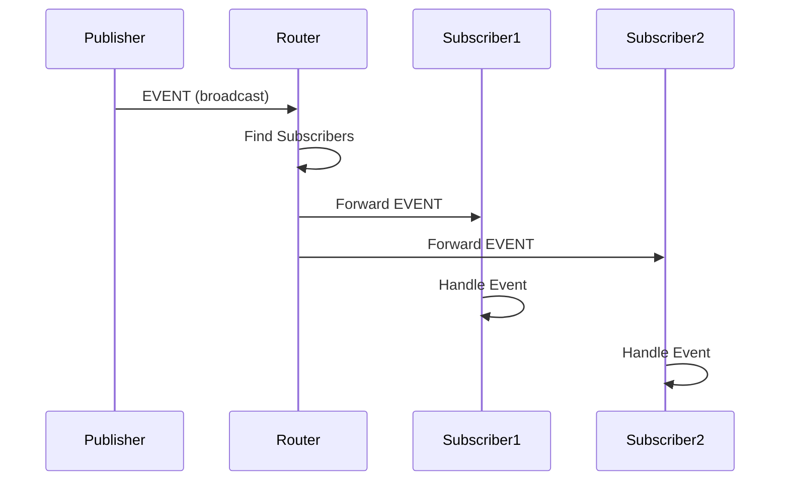
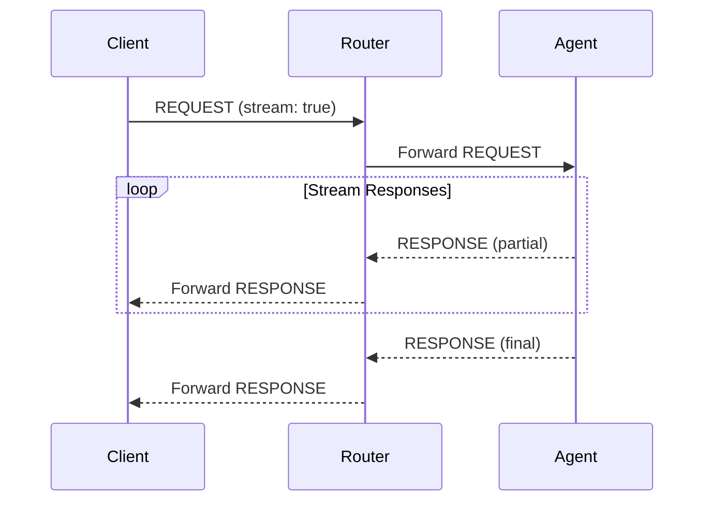

# Genesis Nexus - Protocole A2A Détaillé

Spécification complète du protocole Agent-to-Agent (A2A).

---

## 📡 Vue d'ensemble du Protocole A2A

Le protocole **A2A (Agent-to-Agent)** est le langage de communication universel entre tous les agents de l'écosystème Genesis.

---

## 📨 Types de Messages

### 1. REQUEST

```typescript
interface RequestMessage {
  // En-tête
  id: string                    // UUID unique
  type: 'REQUEST'
  version: '1.0'
  
  // Routing
  from: AgentId                 // Expéditeur
  to: AgentId | 'broadcast'     // Destinataire
  correlationId?: string        // Pour lier response
  
  // Sémantique
  intent: string                // Intention (ex: "analyze_data")
  confidence: number            // 0-1, confiance dans l'intention
  entities: Entity[]            // Entités extraites
  
  // Payload
  payload: unknown              // Données de la requête
  context: ExecutionContext     // Contexte d'exécution
  
  // Qualité de service
  priority: Priority            // LOW, NORMAL, HIGH, CRITICAL
  timeout?: number              // ms
  ttl?: number                  // Time to live (ms)
  
  // Sécurité
  timestamp: number             // Unix timestamp (nanoseconds)
  signature: string             // Signature Ed25519
  publicKey: string             // Clé publique de l'expéditeur
  
  // Options
  options: {
    requiresAck?: boolean       // Accusé de réception requis
    requiresResponse?: boolean  // Réponse requise
    allowPartialResponse?: boolean
    maxResponseTime?: number
  }
}
```

### 2. RESPONSE

```typescript
interface ResponseMessage {
  id: string
  type: 'RESPONSE'
  version: '1.0'
  
  // Correlation
  correlationId: string         // ID de la requête originale
  requestId: string             // ID du message REQUEST
  
  // Routing
  from: AgentId
  to: AgentId
  
  // Résultat
  status: 'SUCCESS' | 'FAILURE' | 'PARTIAL'
  data?: unknown                // Données de réponse
  error?: ErrorDetails          // Détails d'erreur
  
  // Qualité
  confidence?: number           // Confiance dans la réponse
  sources?: string[]            // Sources des données
  processingTime?: number       // ms
  
  // Sécurité
  timestamp: number
  signature: string
  publicKey: string
}

interface ErrorDetails {
  code: string                  // Code d'erreur
  message: string               // Message lisible
  details?: Record<string, unknown>
  stack?: string                // Stack trace
  retryable: boolean            // Peut-on retry?
}
```

### 3. EVENT

```typescript
interface EventMessage {
  id: string
  type: 'EVENT'
  version: '1.0'
  
  // Routing
  from: AgentId
  to?: AgentId | 'broadcast'    // Souvent broadcast
  
  // Événement
  eventType: string             // ex: "workflow.completed"
  eventName: string             // Nom lisible
  
  // Données
  payload: unknown
  metadata: {
    schemaVersion: string
    contentType: string
  }
  
  // Delivery
  deliveryGuarantee: 'at-most-once' | 'at-least-once' | 'exactly-once'
  deduplicationId?: string      // Pour exactly-once
  
  // Sécurité
  timestamp: number
  signature: string
  publicKey: string
}
```

### 4. ERROR

```typescript
interface ErrorMessage {
  id: string
  type: 'ERROR'
  version: '1.0'
  
  // Correlation
  correlationId?: string
  originalMessageId?: string
  
  // Routing
  from: AgentId
  to: AgentId
  
  // Erreur
  errorType: 'ROUTING_ERROR' | 'TIMEOUT' | 'VALIDATION_ERROR' | 'AGENT_ERROR'
  errorCode: string
  message: string
  details?: Record<string, unknown>
  
  // Recovery
  retryAfter?: number           // ms avant de retry
  fallbackSuggestion?: AgentId  // Agent alternatif
  
  // Sécurité
  timestamp: number
  signature: string
  publicKey: string
}
```

---

## 🎯 Intent Classification

### Intentions Standard

```typescript
type StandardIntent = 
  | 'query_data'                // Interroger des données
  | 'analyze_data'              // Analyser des données
  | 'transform_data'            // Transformer des données
  | 'store_data'                // Stocker des données
  | 'retrieve_data'             // Récupérer des données
  | 'execute_workflow'          // Exécuter un workflow
  | 'monitor_status'            // Surveiller un status
  | 'send_notification'         // Envoyer une notification
  | 'schedule_task'             // Planifier une tâche
  | 'cancel_task'               // Annuler une tâche
  | 'get_capability'            // Obtenir les capacités
  | 'register_agent'            // Enregistrer un agent
  | 'unregister_agent'          // Désenregistrer un agent
  | 'health_check'              // Vérifier la santé
  | 'authenticate'              // Authentifier
  | 'authorize'                 // Autoriser
```

### Extraction d'Entités

```typescript
interface Entity {
  type: string                  // Type d'entité
  value: string                 // Valeur extraite
  confidence: number            // 0-1
  startOffset?: number          // Position dans le texte
  endOffset?: number
  metadata?: Record<string, unknown>
}

// Exemples d'entités
const entities: Entity[] = [
  {
    type: 'workflow_id',
    value: 'etl-pipeline-123',
    confidence: 0.98
  },
  {
    type: 'date_range',
    value: '2024-01-01 to 2024-01-31',
    confidence: 0.95,
    metadata: {
      startDate: '2024-01-01',
      endDate: '2024-01-31'
    }
  },
  {
    type: 'agent_name',
    value: 'data-analyst',
    confidence: 0.99
  }
]
```

---

## 🔄 Message Flow

### Request-Response Pattern



### Publish-Subscribe Pattern



### Request-Stream Pattern



---

## 🔐 Sécurité des Messages

### Signature

```typescript
async function signMessage(
  message: A2AMessage,
  privateKey: Uint8Array
): Promise<string> {
  // Payload à signer (exclut signature)
  const payload = {
    id: message.id,
    type: message.type,
    from: message.from,
    to: message.to,
    intent: message.intent,
    payload: message.payload,
    timestamp: message.timestamp
  }
  
  const encoder = new TextEncoder()
  const data = encoder.encode(JSON.stringify(payload))
  
  // Signer avec Ed25519
  const signature = await crypto.subtle.sign(
    'Ed25519',
    privateKey,
    data
  )
  
  return bytesToBase64(new Uint8Array(signature))
}
```

### Vérification

```typescript
async function verifyMessage(
  message: A2AMessage,
  publicKey: Uint8Array
): Promise<boolean> {
  const payload = {
    id: message.id,
    type: message.type,
    from: message.from,
    to: message.to,
    intent: message.intent,
    payload: message.payload,
    timestamp: message.timestamp
  }
  
  const encoder = new TextEncoder()
  const data = encoder.encode(JSON.stringify(payload))
  const signature = base64ToBytes(message.signature)
  
  return await crypto.subtle.verify(
    'Ed25519',
    publicKey,
    signature,
    data
  )
}
```

---

## 📊 Quality of Service

### Priority Levels

```typescript
enum Priority {
  LOW = 0,        // Traitement quand possible
  NORMAL = 1,     // Traitement standard
  HIGH = 2,       // Traitement prioritaire
  CRITICAL = 3    // Traitement immédiat
}

interface QoSConfig {
  priority: Priority
  timeout?: number
  ttl?: number
  retry?: {
    maxAttempts: number
    initialInterval: number
    backoffCoefficient: number
  }
}
```

### Delivery Guarantees

```typescript
enum DeliveryGuarantee {
  AT_MOST_ONCE = 'at-most-once',    // Peut être perdu
  AT_LEAST_ONCE = 'at-least-once',  // Peut être dupliqué
  EXACTLY_ONCE = 'exactly-once'     // Exactement une fois
}

// Implémentation at-least-once
async function sendWithRetry(
  message: A2AMessage,
  config: RetryConfig
): Promise<void> {
  let lastError: Error
  
  for (let attempt = 1; attempt <= config.maxAttempts; attempt++) {
    try {
      await sendMessage(message)
      return // Succès
    } catch (error) {
      lastError = error
      const delay = config.initialInterval * Math.pow(
        config.backoffCoefficient,
        attempt - 1
      )
      await sleep(delay)
    }
  }
  
  throw lastError
}

// Implémentation exactly-once
async function sendExactlyOnce(
  message: A2AMessage,
  deduplicationId: string
): Promise<void> {
  // Vérifier si déjà envoyé
  const exists = await dedupStore.exists(deduplicationId)
  if (exists) {
    return // Déjà envoyé
  }
  
  // Envoyer et marquer comme envoyé
  await sendMessage(message)
  await dedupStore.set(deduplicationId, message.id, { ttl: 3600 })
}
```

---

## 🔍 Message Routing

### Routing Tables

```typescript
interface RoutingTable {
  // Map intention → agents capables
  intentMap: Map<string, AgentId[]>
  
  // Map agent → capabilities
  agentCapabilities: Map<AgentId, Capability[]>
  
  // Map agent → status
  agentStatus: Map<AgentId, AgentStatus>
  
  // Cache de routage
  routingCache: LRUCache<string, AgentId[]>
}

interface RoutingDecision {
  selectedAgents: AgentId[]
  reason: string
  confidence: number
  alternatives: AgentId[]
}
```

### Routing Algorithm

```typescript
function routeMessage(
  message: RequestMessage,
  routingTable: RoutingTable
): RoutingDecision {
  const { intent, entities } = message
  
  // 1. Trouver les agents capables
  const capableAgents = routingTable.findByIntent(intent)
  
  // 2. Filtrer par status
  const availableAgents = capableAgents.filter(
    agent => routingTable.getAgentStatus(agent) === 'AVAILABLE'
  )
  
  // 3. Score chaque agent
  const scored = availableAgents.map(agent => ({
    agent,
    score: calculateScore(agent, message, routingTable)
  }))
  
  // 4. Trier et sélectionner
  scored.sort((a, b) => b.score - a.score)
  
  return {
    selectedAgents: scored.slice(0, 3).map(s => s.agent),
    reason: 'Best match for intent',
    confidence: scored[0]?.score || 0,
    alternatives: scored.slice(3, 5).map(s => s.agent)
  }
}

function calculateScore(
  agent: AgentId,
  message: RequestMessage,
  table: RoutingTable
): number {
  const capabilities = table.getCapabilities(agent)
  const status = table.getAgentStatus(agent)
  const load = table.getAgentLoad(agent)
  
  // Score components
  const capabilityMatch = calculateSimilarity(
    message.intent,
    capabilities
  )
  
  const availabilityScore = status === 'AVAILABLE' ? 1.0 : 0.0
  const loadScore = 1.0 - load // Moins chargé = meilleur
  
  // Weighted sum
  return (
    capabilityMatch * 0.5 +
    availabilityScore * 0.3 +
    loadScore * 0.2
  )
}
```

---

**Version :** 1.0.0  
**Message Types :** 4  
**Intents :** 15+  
**Patterns :** 3
