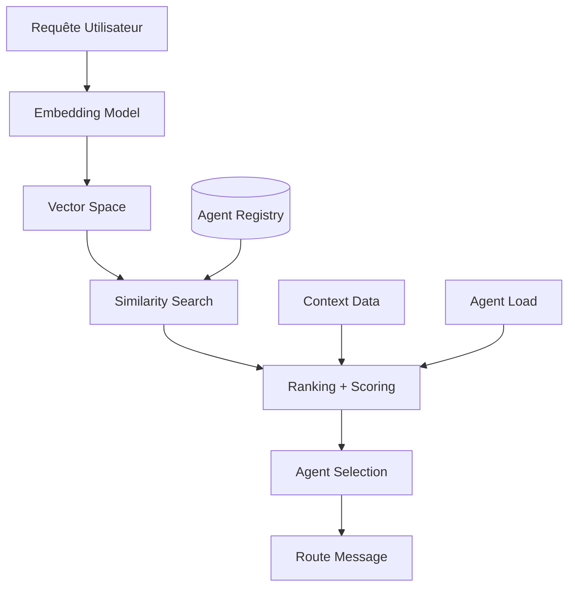

# Genesis Nexus - Routage Neural

Implémentation détaillée du routage neural des requêtes.

---

## 🧠 Vue d'ensemble du Routage Neural

Le **Neural Router** utilise l'IA pour comprendre sémantiquement les requêtes et les router vers les agents les plus compétents.

---

## 📊 Architecture du Neural Router



---

## 🔍 Embedding Generation

### Modèles Supportés

```typescript
interface EmbeddingModel {
  name: string
  dimension: number
  maxInputLength: number
  latency: 'fast' | 'medium' | 'slow'
  accuracy: number
  
  embed(text: string): Promise<Float32Array>
  embedBatch(texts: string[]): Promise<Float32Array[]>
}

const supportedModels: EmbeddingModel[] = [
  {
    name: 'text-embedding-3-small',
    dimension: 1536,
    maxInputLength: 8191,
    latency: 'fast',
    accuracy: 0.92
  },
  {
    name: 'text-embedding-3-large',
    dimension: 3072,
    maxInputLength: 8191,
    latency: 'medium',
    accuracy: 0.96
  },
  {
    name: 'all-MiniLM-L6-v2',
    dimension: 384,
    maxInputLength: 256,
    latency: 'fast',
    accuracy: 0.89
  }
]
```

### Implémentation

```typescript
class NeuralEmbedder {
  private model: EmbeddingModel
  private cache: LRUCache<string, Float32Array>
  
  constructor(modelName: string) {
    this.model = this.loadModel(modelName)
    this.cache = new LRUCache({ max: 10000 })
  }
  
  async embed(text: string): Promise<Float32Array> {
    // Check cache
    const cached = this.cache.get(text)
    if (cached) return cached
    
    // Prétraitement
    const processed = this.preprocess(text)
    
    // Générer embedding
    const embedding = await this.model.embed(processed)
    
    // Normaliser (L2 norm)
    const normalized = this.normalize(embedding)
    
    // Cache
    this.cache.set(text, normalized)
    
    return normalized
  }
  
  private preprocess(text: string): string {
    return text
      .toLowerCase()
      .trim()
      .replace(/\s+/g, ' ')
      .slice(0, this.model.maxInputLength)
  }
  
  private normalize(vec: Float32Array): Float32Array {
    const norm = Math.sqrt(
      vec.reduce((sum, val) => sum + val * val, 0)
    )
    return new Float32Array(
      vec.map(v => v / norm)
    )
  }
}
```

---

## 🔎 Similarity Search

### Algorithmes

```typescript
interface SimilaritySearch {
  search(
    query: Float32Array,
    vectors: Float32Array[],
    k: number,
    minSimilarity?: number
  ): SearchResult[]
}

// Cosine Similarity
class CosineSimilaritySearch implements SimilaritySearch {
  search(
    query: Float32Array,
    vectors: Float32Array[],
    k: number,
    minSimilarity: number = 0.0
  ): SearchResult[] {
    const results: SearchResult[] = []
    
    for (let i = 0; i < vectors.length; i++) {
      const similarity = this.cosine(query, vectors[i])
      
      if (similarity >= minSimilarity) {
        results.push({ index: i, similarity })
      }
    }
    
    return results
      .sort((a, b) => b.similarity - a.similarity)
      .slice(0, k)
  }
  
  private cosine(a: Float32Array, b: Float32Array): number {
    let dot = 0
    let normA = 0
    let normB = 0
    
    for (let i = 0; i < a.length; i++) {
      dot += a[i] * b[i]
      normA += a[i] * a[i]
      normB += b[i] * b[i]
    }
    
    return dot / (Math.sqrt(normA) * Math.sqrt(normB))
  }
}

// Dot Product (pour embeddings normalisés)
class DotProductSearch implements SimilaritySearch {
  search(
    query: Float32Array,
    vectors: Float32Array[],
    k: number,
    minSimilarity: number = 0.0
  ): SearchResult[] {
    const results: SearchResult[] = []
    
    for (let i = 0; i < vectors.length; i++) {
      let dot = 0
      for (let j = 0; j < query.length; j++) {
        dot += query[j] * vectors[i][j]
      }
      
      if (dot >= minSimilarity) {
        results.push({ index: i, similarity: dot })
      }
    }
    
    return results
      .sort((a, b) => b.similarity - a.similarity)
      .slice(0, k)
  }
}
```

### Indexation Vectorielle

```typescript
interface VectorIndex {
  add(id: string, vector: Float32Array, metadata?: unknown): void
  search(query: Float32Array, k: number): SearchResult[]
  remove(id: string): void
  update(id: string, vector: Float32Array): void
}

// Index naïf (brute force)
class BruteForceIndex implements VectorIndex {
  private vectors = new Map<string, Float32Array>()
  private metadata = new Map<string, unknown>()
  
  add(id: string, vector: Float32Array, metadata?: unknown): void {
    this.vectors.set(id, vector)
    if (metadata) this.metadata.set(id, metadata)
  }
  
  search(query: Float32Array, k: number): SearchResult[] {
    const results: SearchResult[] = []
    
    for (const [id, vector] of this.vectors) {
      const similarity = cosineSimilarity(query, vector)
      results.push({ id, similarity, metadata: this.metadata.get(id) })
    }
    
    return results
      .sort((a, b) => b.similarity - a.similarity)
      .slice(0, k)
  }
  
  remove(id: string): void {
    this.vectors.delete(id)
    this.metadata.delete(id)
  }
  
  update(id: string, vector: Float32Array): void {
    this.vectors.set(id, vector)
  }
}

// Index HNSW (approximate nearest neighbors)
class HNSWIndex implements VectorIndex {
  private index: HNSWLib
  
  constructor(dimension: number) {
    this.index = new HNSWLib({
      dimension,
      metric: 'cosine',
      maxConnections: 16,
      efConstruction: 200
    })
  }
  
  add(id: string, vector: Float32Array, metadata?: unknown): void {
    this.index.add(vector, { id, metadata })
  }
  
  search(query: Float32Array, k: number): SearchResult[] {
    return this.index.search(query, k, { ef: 50 })
  }
  
  remove(id: string): void {
    this.index.markDeleted(id)
  }
  
  update(id: string, vector: Float32Array): void {
    this.remove(id)
    this.add(id, vector)
  }
}
```

---

## 📈 Ranking et Scoring

### Score Calculation

```typescript
interface RankingConfig {
  weights: {
    similarity: number      // 0.5
    availability: number    // 0.3
    load: number            // 0.2
    latency?: number        // 0.0
    reliability?: number    // 0.0
  }
  
  boosts: {
    recentSuccess?: number  // +0.1 pour succès récents
    specialty?: number      // +0.2 pour spécialité
    proximity?: number      // +0.1 pour proximité réseau
  }
}

class AgentRanker {
  constructor(private config: RankingConfig) {}
  
  score(agent: Agent, query: Query, context: Context): number {
    const weights = this.config.weights
    
    // Similarité sémantique
    const similarityScore = this.calculateSimilarity(agent, query)
    
    // Disponibilité
    const availabilityScore = agent.status === 'AVAILABLE' ? 1.0 : 0.0
    
    // Charge actuelle
    const loadScore = 1.0 - (agent.currentLoad / agent.maxLoad)
    
    // Score de base
    let score = (
      similarityScore * weights.similarity +
      availabilityScore * weights.availability +
      loadScore * weights.load
    )
    
    // Boosts
    if (this.config.boosts.recentSuccess && agent.recentSuccessRate > 0.95) {
      score += this.config.boosts.recentSuccess
    }
    
    if (this.config.boosts.specialty && this.isSpecialtyMatch(agent, query)) {
      score += this.config.boosts.specialty
    }
    
    return Math.min(score, 1.0)
  }
  
  private calculateSimilarity(agent: Agent, query: Query): number {
    // Similarité entre les capacités de l'agent et l'intent
    const agentEmbedding = agent.capabilityEmbedding
    const queryEmbedding = query.intentEmbedding
    
    return cosineSimilarity(agentEmbedding, queryEmbedding)
  }
  
  private isSpecialtyMatch(agent: Agent, query: Query): boolean {
    // Vérifier si c'est la spécialité principale de l'agent
    return agent.primaryCapability === query.primaryIntent
  }
}
```

---

## 🎯 Agent Selection Strategies

### Single Best

```typescript
function selectSingleBest(
  candidates: ScoredAgent[]
): AgentSelection {
  if (candidates.length === 0) {
    throw new Error('No available agents')
  }
  
  const best = candidates.reduce((a, b) => 
    a.score > b.score ? a : b
  )
  
  return {
    selectedAgents: [best.agent],
    strategy: 'single-best',
    confidence: best.score,
    alternatives: candidates.slice(1, 3)
  }
}
```

### Top K

```typescript
function selectTopK(
  candidates: ScoredAgent[],
  k: number = 3
): AgentSelection {
  const sorted = candidates.sort((a, b) => b.score - a.score)
  
  return {
    selectedAgents: sorted.slice(0, k).map(c => c.agent),
    strategy: 'top-k',
    confidence: sorted[0]?.score || 0,
    alternatives: sorted.slice(k, k + 2)
  }
}
```

### Threshold Based

```typescript
function selectByThreshold(
  candidates: ScoredAgent[],
  minScore: number = 0.7
): AgentSelection {
  const qualified = candidates.filter(c => c.score >= minScore)
  
  return {
    selectedAgents: qualified.map(c => c.agent),
    strategy: 'threshold',
    confidence: qualified[0]?.score || 0,
    alternatives: candidates.filter(c => c.score < minScore)
  }
}
```

---

## 🔄 Dynamic Load Balancing

```typescript
class LoadBalancer {
  private agentLoads = new Map<AgentId, number>()
  private recentLatencies = new Map<AgentId, number[]>()
  
  getAdjustedScore(agent: Agent, baseScore: number): number {
    const load = this.agentLoads.get(agent.id) || 0
    const latencies = this.recentLatencies.get(agent.id) || []
    
    // Pénaliser les agents chargés
    const loadPenalty = load * 0.3
    
    // Pénaliser les latences élevées
    const avgLatency = latencies.length > 0 
      ? latencies.reduce((a, b) => a + b, 0) / latencies.length
      : 0
    const latencyPenalty = avgLatency > 1000 ? 0.2 : 0
    
    return Math.max(baseScore - loadPenalty - latencyPenalty, 0)
  }
  
  updateLoad(agentId: AgentId, load: number): void {
    this.agentLoads.set(agentId, load)
  }
  
  updateLatency(agentId: AgentId, latency: number): void {
    const latencies = this.recentLatencies.get(agentId) || []
    latencies.push(latency)
    
    // Garder les 10 dernières mesures
    if (latencies.length > 10) {
      latencies.shift()
    }
    
    this.recentLatencies.set(agentId, latencies)
  }
}
```

---

## 📊 Monitoring du Routage

### Métriques

```typescript
interface RoutingMetrics {
  // Performance
  routingLatency: {
    p50: number
    p95: number
    p99: number
  }
  
  // Précision
  routingAccuracy: number       // % de bons routages
  intentConfidence: number      // Confiance moyenne
  
  // Distribution
  requestsPerAgent: Map<AgentId, number>
  loadDistribution: number      // 0 = équitable, 1 = déséquilibré
  
  // Erreurs
  routingErrors: number
  noAgentFound: number
  timeoutCount: number
}

class RoutingMonitor {
  private metrics = new MetricsCollector()
  
  recordRouting(
    intent: string,
    selectedAgent: AgentId,
    confidence: number,
    latency: number
  ): void {
    this.metrics.histogram('routing_latency', latency)
    this.metrics.histogram('routing_confidence', confidence)
    this.metrics.counter(`routing_intent_${intent}`, 1)
    this.metrics.counter(`routing_agent_${selectedAgent}`, 1)
  }
  
  recordFeedback(
    routingId: string,
    success: boolean,
    actualAgent?: AgentId
  ): void {
    if (success) {
      this.metrics.counter('routing_success', 1)
    } else {
      this.metrics.counter('routing_failure', 1)
    }
  }
  
  getMetrics(): RoutingMetrics {
    return {
      routingLatency: {
        p50: this.metrics.percentile('routing_latency', 0.5),
        p95: this.metrics.percentile('routing_latency', 0.95),
        p99: this.metrics.percentile('routing_latency', 0.99)
      },
      routingAccuracy: this.metrics.rate('routing_success'),
      intentConfidence: this.metrics.average('routing_confidence'),
      requestsPerAgent: this.metrics.counters('routing_agent_*'),
      loadDistribution: this.calculateLoadDistribution(),
      routingErrors: this.metrics.count('routing_errors'),
      noAgentFound: this.metrics.count('routing_no_agent'),
      timeoutCount: this.metrics.count('routing_timeout')
    }
  }
}
```

---

**Version :** 1.0.0  
**Algorithmes :** 5+  
**Stratégies :** 3
