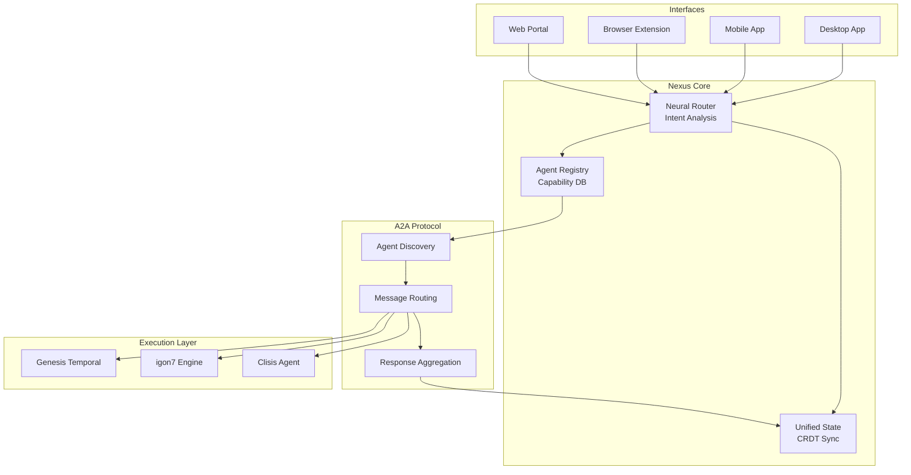
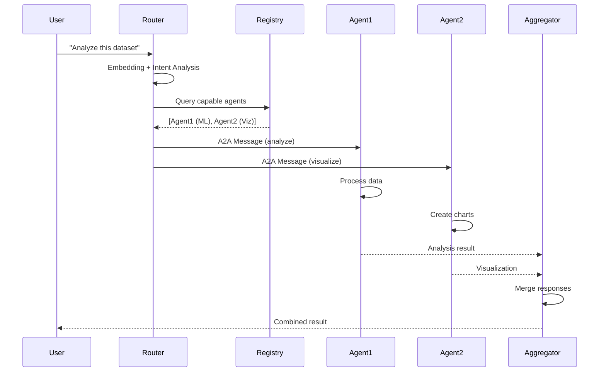
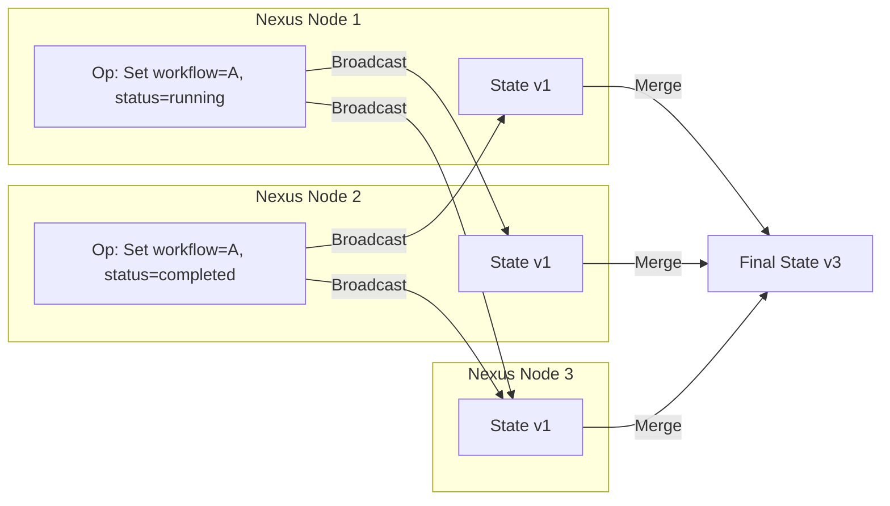

# Genesis Nexus - Vue d'ensemble

**Genesis Nexus** est le cerveau central de l'écosystème Genesis AI. Il implémente le protocole **A2A (Agent-to-Agent)** pour le routage neural des requêtes vers les agents appropriés.

---

## 🧠 Rôle de Nexus

Nexus agit comme un **routeur intelligent** qui :
- **Comprend** les intentions des utilisateurs via l'IA
- **Découvre** les agents disponibles et leurs capacités
- **Route** les requêtes vers les agents les plus compétents
- **Agrège** les réponses de multiples agents
- **Maintient** un état unifié du système

---

## 🏗️ Architecture



---

## 🎯 A2A Protocol (Agent-to-Agent)

### Message Format

```typescript
interface A2AMessage {
  // Identification
  id: string;              // UUID unique
  correlationId?: string;  // Pour lier request/response
  
  // Routing
  from: AgentId;           // Expéditeur
  to: AgentId | Broadcast; // Destinataire (ou broadcast)
  
  // Type de message
  type: "REQUEST" | "RESPONSE" | "EVENT" | "ERROR";
  
  // Sémantique
  intent: string;          // Intention (ex: "analyze_data")
  confidence?: number;     // Confiance dans l'intention (0-1)
  
  // Données
  payload: unknown;        // Données du message
  context: ExecutionContext; // Contexte d'exécution
  
  // Métadonnées
  timestamp: number;       // Unix timestamp (nanoseconds)
  ttl?: number;            // Time to live (ms)
  priority: "LOW" | "NORMAL" | "HIGH" | "CRITICAL";
  
  // Sécurité
  signature: string;       // Signature cryptographique
  publicKey: string;       // Clé publique de l'expéditeur
}
```

### Flow de Communication



---

## 🔍 Neural Router

### Analyse Sémantique

Le Neural Router utilise des **embeddings** pour comprendre les requêtes :

```typescript
import { NeuralRouter } from "./neural-router.ts";
import { EmbeddingModel } from "@genesis/embeddings";

const router = new NeuralRouter({
  embeddingModel: new EmbeddingModel("text-embedding-3-small"),
  agentRegistry: await AgentRegistry.load(),
  similarityThreshold: 0.75,
});

// Analyser une requête utilisateur
const analysis = await router.analyzeIntent(
  "Can you analyze this sales data and show me trends?"
);

console.log(analysis);
// {
//   intent: "analyze_data",
//   confidence: 0.94,
//   entities: [
//     { type: "data_type", value: "sales_data" },
//     { type: "task", value: "trend_analysis" }
//   ],
//   requiredCapabilities: ["data_analysis", "visualization"]
// }
```

### Agent Matching

```typescript
interface AgentMatch {
  agentId: string;
  capabilities: string[];
  similarityScore: number; // 0-1
  availability: "AVAILABLE" | "BUSY" | "OFFLINE";
  loadScore: number;       // 0-1 (0 = idle, 1 = overloaded)
  finalScore: number;      // Score combiné
}

async function findBestAgents(
  intent: string,
  requiredCapabilities: string[]
): Promise<AgentMatch[]> {
  // 1. Calculer l'embedding de l'intention
  const intentEmbedding = await embeddingModel.embed(intent);
  
  // 2. Recherche de similarité dans le registry
  const candidates = await agentRegistry.findBySimilarity(
    intentEmbedding,
    { minSimilarity: 0.6 }
  );
  
  // 3. Filtrer par capacités requises
  const capable = candidates.filter(agent =>
    requiredCapabilities.every(cap =>
      agent.capabilities.includes(cap)
    )
  );
  
  // 4. Score combiné
  const scored = capable.map(agent => ({
    agentId: agent.id,
    similarityScore: agent.similarity,
    availability: agent.status,
    loadScore: agent.currentLoad,
    finalScore: calculateFinalScore(agent),
  }));
  
  // 5. Trier et retourner le top N
  return scored
    .sort((a, b) => b.finalScore - a.finalScore)
    .slice(0, 5);
}

function calculateFinalScore(agent: AgentMatch): number {
  const weights = {
    similarity: 0.5,
    availability: 0.3,
    load: 0.2,
  };
  
  const availabilityScore = 
    agent.availability === "AVAILABLE" ? 1.0 :
    agent.availability === "BUSY" ? 0.5 : 0.0;
  
  const loadScore = 1.0 - agent.loadScore;
  
  return (
    agent.similarityScore * weights.similarity +
    availabilityScore * weights.availability +
    loadScore * weights.load
  );
}
```

---

## 📦 Agent Registry

### Registration

```typescript
import { AgentRegistry } from "./agent-registry.ts";

const registry = new AgentRegistry();

// Enregistrer un agent
await registry.register({
  id: "data-analyst-agent",
  name: "Data Analyst",
  description: "Analyzes datasets and extracts insights",
  version: "1.0.0",
  
  // Capacités
  capabilities: [
    "data_analysis",
    "statistical_modeling",
    "trend_detection",
    "anomaly_detection"
  ],
  
  // Embedding des capacités (pour recherche sémantique)
  capabilityEmbeddings: {
    "data_analysis": [...], // Vector<float>
    "statistical_modeling": [...],
  },
  
  // Configuration
  config: {
    maxConcurrentTasks: 5,
    timeout: 300000, // 5 minutes
    retryPolicy: { maxAttempts: 3 },
  },
  
  // Endpoints
  endpoints: {
    execute: "http://localhost:8081/execute",
    health: "http://localhost:8081/health",
  },
  
  // Métadonnées
  metadata: {
    author: "Genesis AI Team",
    license: "MIT",
    tags: ["data", "analytics", "ml"],
  },
});
```

### Querying

```typescript
// Recherche par capacité
const agents = await registry.findByCapability("data_analysis");

// Recherche sémantique
const similar = await registry.findBySimilarity(
  "I need help understanding my sales trends",
  { minSimilarity: 0.7 }
);

// Recherche multi-critères
const filtered = await registry.query({
  capabilities: ["data_analysis", "visualization"],
  availability: "AVAILABLE",
  maxLoad: 0.8,
  tags: ["analytics"],
});
```

---

## 🔄 Unified State Management

### CRDT Implementation

Nexus utilise des **CRDT** (Conflict-free Replicated Data Types) pour synchroniser l'état :

```typescript
import { CRDTMap, CRDTCounter, LWWRegister } from "@genesis/crdt";

class UnifiedState {
  // État des workflows
  private workflowState = new CRDTMap<string, WorkflowStatus>();
  
  // État des agents
  private agentState = new CRDTMap<string, AgentStatus>();
  
  // Compteurs
  private executionCount = new CRDTCounter("executions");
  private errorCount = new CRDTCounter("errors");
  
  // Registre last-writer-wins
  private lastHeartbeat = new LWWRegister<number>("last-hb");
  
  // Synchronisation
  async syncWith(remote: UnifiedState) {
    await this.workflowState.merge(remote.workflowState);
    await this.agentState.merge(remote.agentState);
    await this.executionCount.merge(remote.executionCount);
    await this.errorCount.merge(remote.errorCount);
    await this.lastHeartbeat.merge(remote.lastHeartbeat);
  }
  
  // Lecture
  getWorkflowStatus(id: string): WorkflowStatus | undefined {
    return this.workflowState.get(id);
  }
  
  getAgentStatus(id: string): AgentStatus | undefined {
    return this.agentState.get(id);
  }
  
  getMetrics(): StateMetrics {
    return {
      totalWorkflows: this.workflowState.size,
      activeAgents: this.agentState.size,
      totalExecutions: this.executionCount.value,
      totalErrors: this.errorCount.value,
      lastSync: this.lastHeartbeat.value,
    };
  }
}
```

### State Propagation



---

## 🎭 Response Aggregation

### Stratégies d'Agrégation

```typescript
interface AggregationStrategy {
  name: string;
  aggregate<T>(responses: Response<T>[]): AggregatedResult<T>;
}

// 1. First Successful Response
class FirstSuccessfulStrategy implements AggregationStrategy {
  name = "first-successful";
  
  aggregate<T>(responses: Response<T>[]): AggregatedResult<T> {
    const success = responses.find(r => r.success);
    if (!success) {
      throw new Error("All agents failed");
    }
    return {
      data: success.data,
      source: success.agentId,
      fallbacks: responses.filter(r => !r.success),
    };
  }
}

// 2. Majority Vote
class MajorityVoteStrategy implements AggregationStrategy {
  name = "majority-vote";
  
  aggregate<T>(responses: Response<T>[]): AggregatedResult<T> {
    const grouped = new Map<string, number>();
    
    for (const response of responses) {
      const key = JSON.stringify(response.data);
      grouped.set(key, (grouped.get(key) || 0) + 1);
    }
    
    const [majorityKey, count] = [...grouped.entries()]
      .sort((a, b) => b[1] - a[1])[0];
    
    if (count < responses.length / 2) {
      throw new Error("No majority consensus");
    }
    
    return {
      data: JSON.parse(majorityKey),
      confidence: count / responses.length,
      dissenters: responses.filter(
        r => JSON.stringify(r.data) !== majorityKey
      ),
    };
  }
}

// 3. Merge Results
class MergeStrategy implements AggregationStrategy {
  name = "merge";
  
  aggregate<T extends Record<string, unknown>>(
    responses: Response<T>[]
  ): AggregatedResult<T> {
    const merged = {} as T;
    
    for (const response of responses) {
      if (response.success) {
        Object.assign(merged, response.data);
      }
    }
    
    return {
      data: merged,
      sources: responses.filter(r => r.success).map(r => r.agentId),
    };
  }
}

// 4. Custom Aggregation
class CustomStrategy implements AggregationStrategy {
  name = "custom";
  
  constructor(
    private aggregator: (responses: Response<unknown>[]) => unknown
  ) {}
  
  aggregate<T>(responses: Response<T>[]): AggregatedResult<T> {
    const result = this.aggregator(responses);
    return {
      data: result as T,
      custom: true,
    };
  }
}
```

---

## 🧪 Simulations

### Simulation Engine

Nexus inclut un moteur de simulation pour tester des scénarios complexes :

```typescript
import { SimulationEngine } from "./simulation-engine.ts";

const scenario = {
  name: "High Load Agent Routing",
  description: "Test routing performance under heavy load",
  
  // Configuration
  agents: {
    count: 100,
    capabilities: ["data_analysis", "visualization", "nlp"],
    distribution: "normal", // Distribution des capacités
  },
  
  // Charge
  load: {
    requestsPerSecond: 1000,
    duration: "5m",
    requestTypes: ["analyze", "visualize", "query"],
  },
  
  // Chaos
  chaos: {
    networkLatency: { min: 10, max: 500 }, // ms
    agentFailures: 0.05, // 5% failure rate
    networkPartitions: [
      { start: "2m", duration: "30s", affectedNodes: ["node-3", "node-4"] }
    ],
  },
};

const engine = new SimulationEngine(scenario);

// Exécuter la simulation
const results = await engine.run();

// Générer un rapport
const report = await engine.generateReport(results);
console.log(report.summary);
// {
//   totalRequests: 300000,
//   successfulRequests: 298500,
//   successRate: 0.995,
//   avgLatency: 45, // ms
//   p99Latency: 230, // ms
//   routingAccuracy: 0.97,
//   agentUtilization: 0.78,
// }
```

### Chaos Testing

```typescript
interface ChaosExperiment {
  name: string;
  hypothesis: string;
  steps: ChaosStep[];
  successCriteria: string[];
}

const experiment: ChaosExperiment = {
  name: "Agent Failure Recovery",
  hypothesis: "Nexus should reroute requests when agents fail",
  
  steps: [
    { type: "START_TRAFFIC", requestsPerSecond: 100 },
    { type: "WAIT", duration: "1m" },
    { type: "KILL_AGENT", agentId: "data-analyst-1" },
    { type: "WAIT", duration: "30s" },
    { type: "METRICS", metric: "error_rate" },
    { type: "ASSERT", condition: "error_rate < 0.01" },
    { type: "METRICS", metric: "reroute_count" },
    { type: "ASSERT", condition: "reroute_count > 0" },
    { type: "STOP_TRAFFIC" },
  ],
  
  successCriteria: [
    "Error rate remains below 1% during agent failure",
    "Requests are automatically rerouted to healthy agents",
    "No manual intervention required",
  ],
};

await engine.runExperiment(experiment);
```

---

## 📊 Monitoring

### Métriques Exposées

```typescript
interface NexusMetrics {
  // Routing
  routingLatency: Histogram;      // Temps de routage
  routingAccuracy: Gauge;         // Précision du routage (%)
  intentConfidence: Histogram;    // Confiance dans l'intention
  
  // Agents
  registeredAgents: Gauge;        // Nombre d'agents enregistrés
  availableAgents: Gauge;         // Agents disponibles
  agentUtilization: Histogram;    // Utilisation des agents
  
  // Messages
  messagesPerSecond: Counter;     // Messages traités/s
  messageSize: Histogram;         // Taille des messages
  broadcastCount: Counter;        // Messages broadcast
  
  // État
  stateSize: Gauge;               // Taille de l'état (MB)
  syncLatency: Histogram;         // Latence de synchronisation
  conflictCount: Counter;         // Conflits CRDT résolus
  
  // Erreurs
  routingErrors: Counter;         // Erreurs de routage
  agentFailures: Counter;         // Échecs d'agents
  aggregationErrors: Counter;     // Erreurs d'agrégation
}
```

### Dashboard

```typescript
// Exemple de configuration de dashboard
const dashboard = {
  title: "Nexus Real-time Monitoring",
  refresh: "5s",
  panels: [
    {
      title: "Routing Performance",
      type: "graph",
      targets: [
        {
          metric: "nexus_routing_latency_seconds",
          aggregation: "histogram",
          quantiles: [0.5, 0.9, 0.99],
        },
        {
          metric: "nexus_routing_accuracy",
          aggregation: "avg",
        },
      ],
    },
    {
      title: "Agent Health",
      type: "stat",
      targets: [
        {
          metric: "nexus_available_agents",
          aggregation: "sum",
        },
        {
          metric: "nexus_agent_utilization",
          aggregation: "avg",
        },
      ],
    },
  ],
};
```

---

## 🔐 Sécurité

### Message Signing

```typescript
import { sign, verify } from "@std/crypto/ed25519";

async function signMessage(
  message: A2AMessage,
  privateKey: Uint8Array
): Promise<A2AMessage> {
  // Créer le payload à signer
  const payload = new TextEncoder().encode(
    JSON.stringify({
      id: message.id,
      from: message.from,
      to: message.to,
      intent: message.intent,
      payload: message.payload,
      timestamp: message.timestamp,
    })
  );
  
  // Signer avec Ed25519
  const signature = await sign(privateKey, payload);
  
  return {
    ...message,
    signature: bytesToBase64(signature),
  };
}

async function verifyMessage(
  message: A2AMessage,
  publicKey: Uint8Array
): Promise<boolean> {
  const payload = new TextEncoder().encode(
    JSON.stringify({
      id: message.id,
      from: message.from,
      to: message.to,
      intent: message.intent,
      payload: message.payload,
      timestamp: message.timestamp,
    })
  );
  
  const signature = base64ToBytes(message.signature);
  
  return await verify(publicKey, payload, signature);
}
```

---

## 📚 Références

- [Protocole A2A détaillé](./genesis-nexus/a2a-protocol)
- [Routage neural](./genesis-nexus/neural-routing)
- [Système d'agents](./genesis-nexus/agent-system)
- [Gestion d'état](./genesis-nexus/state-management)
- [Simulations](./genesis-nexus/simulations)

---

**Version :** 1.0.0  
**Runtime :** Deno 1.40+  
**Protocole :** A2A v1.0
