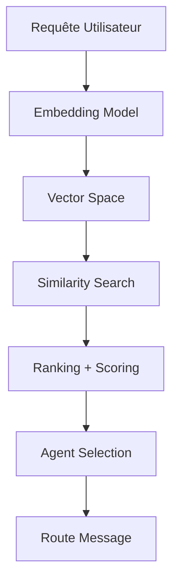

# Genesis Nexus - Neural Routing

Implémentation détaillée du routage neural.

---

## 🧠 Architecture du Neural Router



---

## 🔍 Embedding Generation

### Modèles supportés

```typescript
interface EmbeddingModel {
  name: string;
  dimension: number;
  maxInputLength: number;
  latency: 'fast' | 'medium' | 'slow';
  accuracy: number;
  
  embed(text: string): Promise<Float32Array>;
  embedBatch(texts: string[]): Promise<Float32Array[]>;
}

const supportedModels: EmbeddingModel[] = [
  {
    name: 'text-embedding-3-small',
    dimension: 1536,
    maxInputLength: 8191,
    latency: 'fast',
    accuracy: 0.92,
  },
  {
    name: 'text-embedding-3-large',
    dimension: 3072,
    maxInputLength: 8191,
    latency: 'medium',
    accuracy: 0.96,
  },
];
```

---

## 📊 Similarity Search

### Cosine Similarity

```typescript
function cosineSimilarity(a: Float32Array, b: Float32Array): number {
  let dot = 0;
  let normA = 0;
  let normB = 0;
  
  for (let i = 0; i < a.length; i++) {
    dot += a[i] * b[i];
    normA += a[i] * a[i];
    normB += b[i] * b[i];
  }
  
  return dot / (Math.sqrt(normA) * Math.sqrt(normB));
}
```

### Vector Index

```typescript
class VectorIndex {
  private vectors: Map<string, Float32Array>;
  private metadata: Map<string, any>;
  
  add(id: string, vector: Float32Array, metadata?: any): void {
    this.vectors.set(id, vector);
    if (metadata) this.metadata.set(id, metadata);
  }
  
  search(query: Float32Array, k: number): SearchResult[] {
    const results: SearchResult[] = [];
    
    for (const [id, vector] of this.vectors) {
      const similarity = cosineSimilarity(query, vector);
      results.push({ id, similarity, metadata: this.metadata.get(id) });
    }
    
    return results
      .sort((a, b) => b.similarity - a.similarity)
      .slice(0, k);
  }
}
```

---

## 📈 Ranking et Scoring

```typescript
interface RankingConfig {
  weights: {
    similarity: number;      // 0.5
    availability: number;    // 0.3
    load: number;            // 0.2
  };
  
  boosts: {
    recentSuccess?: number;  // +0.1
    specialty?: number;      // +0.2
  };
}

function calculateScore(
  agent: Agent,
  query: Query,
  config: RankingConfig
): number {
  const similarityScore = calculateSimilarity(agent, query);
  const availabilityScore = agent.status === 'AVAILABLE' ? 1.0 : 0.0;
  const loadScore = 1.0 - (agent.currentLoad / agent.maxLoad);
  
  let score = (
    similarityScore * config.weights.similarity +
    availabilityScore * config.weights.availability +
    loadScore * config.weights.load
  );
  
  // Boosts
  if (config.boosts.recentSuccess && agent.recentSuccessRate > 0.95) {
    score += config.boosts.recentSuccess;
  }
  
  return Math.min(score, 1.0);
}
```

---

**Version :** 1.0.0
