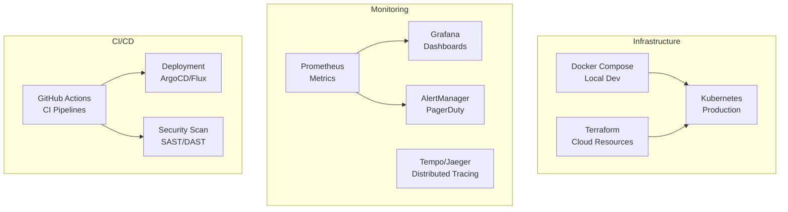

# Genesis Ops - Vue d'ensemble

**Genesis Ops** est l'ensemble des outils DevOps et d'infrastructure pour déployer, monitorer et gouverner l'écosystème Genesis.

---

## 🛠️ Fonctionnalités

- **Infrastructure as Code** : Docker, Kubernetes, Terraform
- **Monitoring** : Prometheus, Grafana, Alerting
- **CI/CD** : Pipelines automatisés
- **Governance** : Policies et compliance

---

## 🏗️ Architecture

---

## 📚 Références

- [Infrastructure](./genesis-ops/infrastructure)
- [Docker Compose](./genesis-ops/docker-compose)
- [Kubernetes](./genesis-ops/kubernetes)
- [Monitoring](./genesis-ops/monitoring)
- [CI/CD](./genesis-ops/ci-cd)

---

**Version :** 1.0.0  
**Tools :** Docker, K8s, Terraform  
**Monitoring :** Prometheus, Grafana  
**CI/CD :** GitHub Actions
