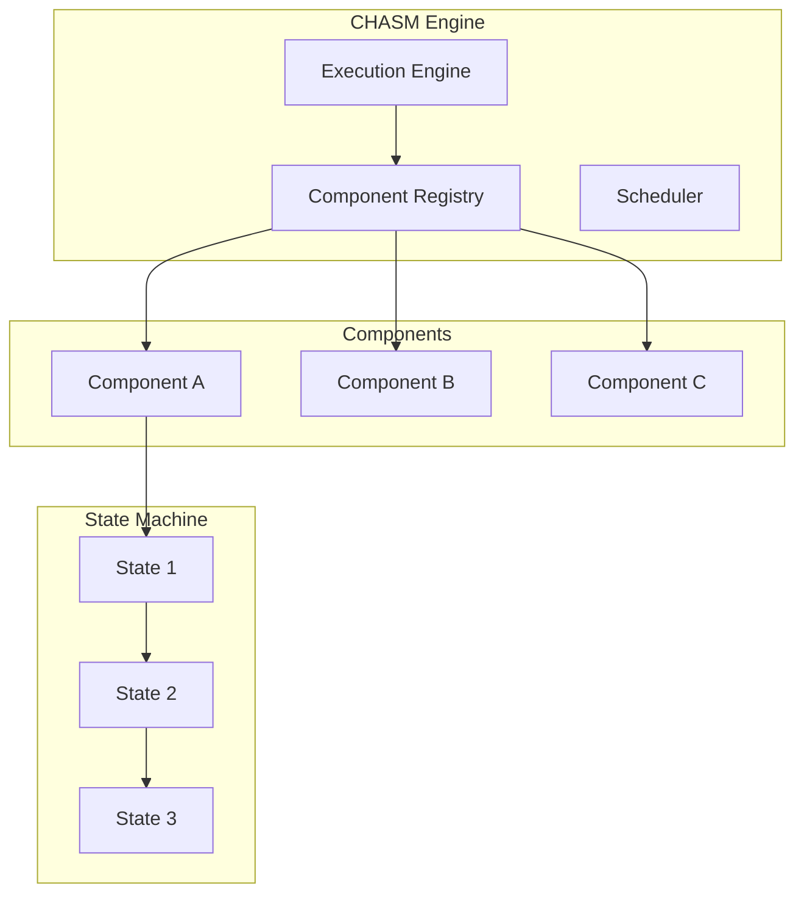

# Genesis Temporal - CHASM Layer

Documentation complète de la couche CHASM.

---

## 🧩 Qu'est-ce que CHASM ?

**CHASM** (Custom Heterogeneous Agent State Machine) est une couche personnalisée pour la coordination de machines à états hétérogènes.

---

## 🏗️ Architecture



---

## 📦 Component Interface

```go
// chasm/component.go
package chasm

type Component interface {
    LifecycleState(ctx Context) LifecycleState
    mustEmbedUnimplementedComponent()
}

type TerminableComponent interface {
    Component
    Terminate(ctx MutableContext, req TerminateComponentRequest) (TerminateComponentResponse, error)
}

type RootComponent interface {
    TerminableComponent
}
```

---

## 🔄 Lifecycle States

```go
// chasm/statemachine.go
type LifecycleState int

const (
    LifecycleStateUnspecified LifecycleState = 0
    LifecycleStateRunning     LifecycleState = 2 << iota  // OPEN
    LifecycleStateCompleted                                // CLOSED
    LifecycleStateFailed                                   // CLOSED
)

func (s LifecycleState) IsClosed() bool {
    return s == LifecycleStateCompleted || s == LifecycleStateFailed
}

func (s LifecycleState) String() string {
    switch s {
    case LifecycleStateRunning:
        return "OPEN"
    case LifecycleStateCompleted:
        return "CLOSED_COMPLETED"
    case LifecycleStateFailed:
        return "CLOSED_FAILED"
    default:
        return "UNSPECIFIED"
    }
}
```

---

## 🎯 Transitions

```go
// Transition type
type Transition[S comparable, SM StateMachine[S], E any] struct {
    Sources     []S
    Destination S
    apply       func(SM, MutableContext, E) error
}

// Exemple de transition
func NewWorkflowTransition() Transition[WorkflowState, Workflow, WorkflowEvent] {
    return Transition[WorkflowState, Workflow, WorkflowEvent]{
        Sources:     []WorkflowState{WorkflowStateRunning},
        Destination: WorkflowStateCompleted,
        apply: func(wf Workflow, ctx MutableContext, event WorkflowEvent) error {
            wf.SetState(WorkflowStateCompleted)
            return nil
        },
    }
}

// Validation de transition
func (t Transition) Possible(sm StateMachine) bool {
    currentState := sm.StateMachineState()
    for _, source := range t.Sources {
        if source == currentState {
            return true
        }
    }
    return false
}
```

---

## 📊 Field System

```go
// chasm/field.go
type Field[T any] struct {
    name      string
    value     T
    isSet     bool
    isMutable bool
    validators []Validator[T]
    onChange  []func(T, T)
}

// Création de champ
func NewField[T any](name string, opts ...FieldOption[T]) *Field[T] {
    field := &Field[T]{name: name}
    for _, opt := range opts {
        opt(field)
    }
    return field
}

// Options
func WithDefault[T any](value T) FieldOption[T] {
    return func(f *Field[T]) {
        f.value = value
        f.isSet = true
    }
}

func WithValidator[T any](validator Validator[T]) FieldOption[T] {
    return func(f *Field[T]) {
        f.validators = append(f.validators, validator)
    }
}

// Get/Set
func (f *Field[T]) Get() (T, error) {
    var zero T
    if !f.isSet {
        return zero, &FieldNotSetError{Field: f.name}
    }
    return f.value, nil
}

func (f *Field[T]) Set(value T) error {
    for _, validator := range f.validators {
        if err := validator(value); err != nil {
            return &FieldValidationError{Field: f.name, Error: err}
        }
    }
    
    oldVal := f.value
    f.value = value
    f.isSet = true
    
    for _, callback := range f.onChange {
        callback(oldVal, value)
    }
    return nil
}
```

---

## 🔧 Engine Implementation

```go
// chasm/engine.go
type Engine struct {
    registry         *Registry
    activeExecutions map[ExecutionID]*Execution
    mu               sync.RWMutex
    config           EngineConfig
}

type EngineConfig struct {
    MaxConcurrentExecutions int
    ExecutionTimeout        time.Duration
    RetryPolicy             RetryPolicy
}

// Démarrer une exécution
func (e *Engine) StartExecution(
    ctx context.Context,
    componentID string,
    input []byte,
) (ExecutionID, error) {
    e.mu.Lock()
    defer e.mu.Unlock()
    
    if len(e.activeExecutions) >= e.config.MaxConcurrentExecutions {
        return "", &MaxExecutionsReachedError{Max: e.config.MaxConcurrentExecutions}
    }
    
    componentType, err := e.registry.GetComponent(componentID)
    if err != nil {
        return "", err
    }
    
    component, err := componentType.CreateInstance(input)
    if err != nil {
        return "", err
    }
    
    execID := ExecutionID(generateUUID())
    execution := &Execution{
        ID:        execID,
        Component: component,
        State:     ComponentStateRunning,
        StartTime: time.Now(),
    }
    
    e.activeExecutions[execID] = execution
    go e.runExecution(ctx, execution)
    
    return execID, nil
}
```

---

## 📋 Registry

```go
// chasm/registry.go
type Registry struct {
    components map[string]ComponentType
    tasks      map[string]TaskType
    libraries  map[string]Library
    mu         sync.RWMutex
}

// Enregistrer un composant
func (r *Registry) RegisterComponent(name string, componentType ComponentType) error {
    r.mu.Lock()
    defer r.mu.Unlock()
    
    if _, exists := r.components[name]; exists {
        return &ComponentAlreadyRegisteredError{Name: name}
    }
    
    r.components[name] = componentType
    return nil
}

// Obtenir un composant
func (r *Registry) GetComponent(name string) (ComponentType, error) {
    r.mu.RLock()
    defer r.mu.RUnlock()
    
    componentType, exists := r.components[name]
    if !exists {
        return nil, &ComponentNotFoundError{Name: name}
    }
    
    return componentType, nil
}

// Lister les composants
func (r *Registry) ListComponents() []string {
    r.mu.RLock()
    defer r.mu.RUnlock()
    
    names := make([]string, 0, len(r.components))
    for name := range r.components {
        names = append(names, name)
    }
    return names
}
```

---

## 🧪 Tests CHASM

```go
// chasm/statemachine_test.go
func TestTransition_ValidSource(t *testing.T) {
    transition := NewWorkflowTransition()
    workflow := &Workflow{state: WorkflowStateRunning}
    
    if !transition.Possible(workflow) {
        t.Error("Expected transition to be possible")
    }
}

func TestTransition_InvalidSource(t *testing.T) {
    transition := NewWorkflowTransition()
    workflow := &Workflow{state: WorkflowStateCompleted}
    
    if transition.Possible(workflow) {
        t.Error("Expected transition to be impossible")
    }
}

func TestField_SetAndGet(t *testing.T) {
    field := NewField[string]("test", WithDefault("default"))
    
    value, err := field.Get()
    if err != nil {
        t.Errorf("Unexpected error: %v", err)
    }
    if value != "default" {
        t.Errorf("Expected 'default', got '%s'", value)
    }
}
```

---

**Version :** 1.0.0  
**Fichiers CHASM :** 63 fichiers Go
