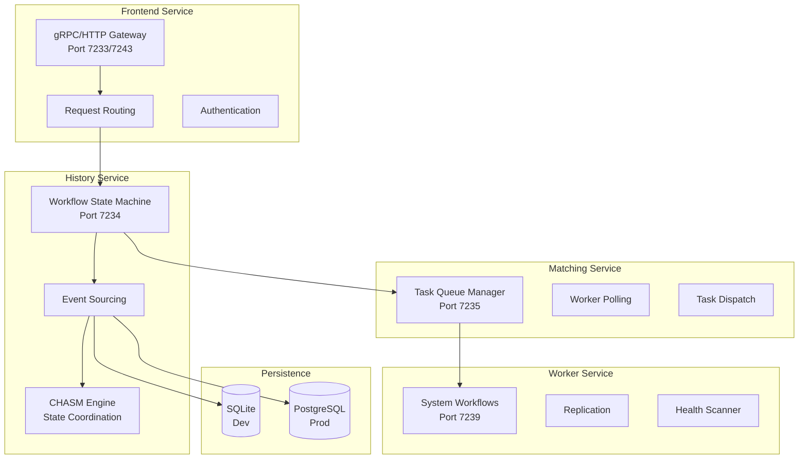
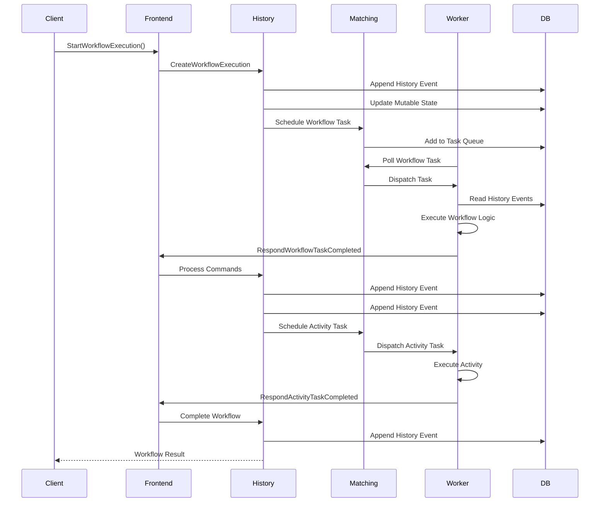

# Genesis Temporal - Vue d'ensemble

**Genesis Temporal** est un serveur de workflows durables basé sur Temporal.io, optimisé pour l'écosystème Genesis AI avec une couche CHASM personnalisée pour la coordination de machines à états hétérogènes.

---

## 🎯 Rôle de Genesis Temporal

Temporal fournit l'**exécution durable** garantie pour tous les workflows Genesis :
- **Persistance** : État sauvegardé après chaque étape
- **Reprise** : Redémarre automatiquement après une panne
- **Scaling** : Distribution sur plusieurs workers
- **Observabilité** : Tracing complet de chaque exécution

---

## 🏗️ Architecture



---

## 🔄 Workflow Lifecycle



---

## 🧩 CHASM Layer

### Custom State Machine Coordination

Genesis Temporal inclut une couche **CHASM** (Custom Heterogeneous Agent State Machine) pour coordonner des machines à états multiples :

```go
// chasm/engine.go
package chasm

type Engine interface {
    // Démarrer l'exécution d'un composant
    StartExecution(ctx context.Context, componentID string, input []byte) error
    
    // Mettre à jour l'état d'un composant
    UpdateComponent(ctx context.Context, componentID string, update func(state ComponentState) ComponentState) error
    
    // Polling pour les composants prêts à être exécutés
    PollComponent(ctx context.Context, queueName string, timeout time.Duration) (*Component, error)
    
    // Coordonner les dépendances entre composants
    CoordinateDependencies(ctx context.Context, componentIDs []string) error
}

type Component interface {
    // Type de composant (définit le comportement)
    Type() string
    
    // État actuel du composant
    State() ComponentState
    
    // Transition d'état
    Transition(event Event) (ComponentState, error)
    
    // Sérialisation pour persistance
    Marshal() ([]byte, error)
    Unmarshal([]byte) error
}
```

### Exemple : Workflow AI Multi-Agents

```go
// workflows/ai-multi-agent-workflow.go
package workflows

import (
    "github.com/genesisAI4/genesis-temporal/chasm"
    "go.temporal.io/sdk/workflow"
)

type MultiAgentWorkflow struct {
    chasm.Component
}

func (m *MultiAgentWorkflow) Execute(ctx workflow.Context, input WorkflowInput) (WorkflowResult, error) {
    // Étape 1: Analyser l'intention
    var analysis IntentAnalysis
    err := workflow.ExecuteActivity(ctx, AnalyzeIntentActivity, input.Query).Get(ctx, &analysis)
    if err != nil {
        return WorkflowResult{}, err
    }
    
    // Étape 2: Sélectionner les agents (CHASM state transition)
    m.Transition(StateAnalyzing, StateSelecting)
    agents := m.selectAgents(ctx, analysis)
    
    // Étape 3: Exécuter les agents en parallèle
    m.Transition(StateSelecting, StateExecuting)
    var futures []workflow.Future
    for _, agent := range agents {
        future := workflow.ExecuteActivity(ctx, ExecuteAgentActivity, agent, input)
        futures = append(futures, future)
    }
    
    // Étape 4: Agréger les résultats
    m.Transition(StateExecuting, StateAggregating)
    var results []AgentResult
    for _, future := range futures {
        var result AgentResult
        if err := future.Get(ctx, &result); err != nil {
            return WorkflowResult{}, err
        }
        results = append(results, result)
    }
    
    aggregated := m.aggregateResults(results)
    m.Transition(StateAggregating, StateCompleted)
    
    return WorkflowResult{
        Result: aggregated,
        Metadata: WorkflowMetadata{
            AgentsUsed: agents,
            Duration: workflow.Now(ctx).Sub(workflow.Now(ctx)),
        },
    }, nil
}

func (m *MultiAgentWorkflow) Transition(from, to State) error {
    // Validation des transitions d'état
    validTransitions := map[State][]State{
        StateIdle:      {StateAnalyzing},
        StateAnalyzing: {StateSelecting, StateFailed},
        StateSelecting: {StateExecuting, StateFailed},
        StateExecuting: {StateAggregating, StateRetrying},
        StateAggregating: {StateCompleted, StateFailed},
        StateRetrying:  {StateExecuting, StateFailed},
        StateFailed:    {StateIdle},
        StateCompleted: {},
    }
    
    allowedStates, ok := validTransitions[from]
    if !ok || !contains(allowedStates, to) {
        return fmt.Errorf("invalid state transition: %s -> %s", from, to)
    }
    
    m.state = to
    m.emitEvent(StateTransitionEvent{From: from, To: to})
    return nil
}
```

---

## 📊 Services Temporal

### Frontend Service

```go
// service/frontend/service.go
package frontend

type Service struct {
    workflowHandler *WorkflowHandler
    healthHandler   *HealthHandler
    nexusHandler    *NexusHandler // Nexus RPC pour cross-cluster
}

// Configuration
type Config struct {
    GRPCPort       int           `yaml:"grpcPort"`
    HTTPPort       int           `yaml:"httpPort"`
    MaxConnections int           `yaml:"maxConnections"`
    TLS            TLSConfig     `yaml:"tls"`
    Nexus          NexusConfig   `yaml:"nexus"`
}

// Démarrage du service
func (s *Service) Start() error {
    // gRPC server
    grpcServer := grpc.NewServer(
        grpc.MaxConcurrentStreams(100),
        grpc.KeepaliveParams(keepalive.ServerParameters{
            MaxConnectionIdle: 5 * time.Minute,
            Timeout:           20 * time.Second,
        }),
    )
    
    // Enregistrer les handlers
    workflowservice.RegisterWorkflowServiceServer(grpcServer, s.workflowHandler)
    healthgrpc.RegisterHealthServer(grpcServer, s.healthHandler)
    
    // Écouter
    lis, err := net.Listen("tcp", fmt.Sprintf(":%d", s.config.GRPCPort))
    if err != nil {
        return err
    }
    
    return grpcServer.Serve(lis)
}
```

### History Service

```go
// service/history/history_engine.go
package history

type HistoryEngine struct {
    shardController ShardController
    stateMachine    *StateMachine
    eventStore      *EventStore
    chasmEngine     chasm.Engine
}

// Traiter une requête de workflow
func (e *HistoryEngine) ScheduleWorkflowTask(ctx context.Context, request *ScheduleRequest) error {
    // Obtenir le shard pour ce workflow
    shard, err := e.shardController.GetShard(request.WorkflowID)
    if err != nil {
        return err
    }
    
    // Acquérir le lock du shard
    if err := shard.AcquireLock(ctx); err != nil {
        return err
    }
    defer shard.ReleaseLock()
    
    // Charger l'état mutable
    mutableState, err := e.stateMachine.Load(ctx, shard.ID, request.WorkflowID)
    if err != nil {
        return err
    }
    
    // Créer l'événement
    event := &historypb.HistoryEvent{
        EventId:   mutableState.GetNextEventID(),
        EventType: enumspb.EVENT_TYPE_WORKFLOW_TASK_SCHEDULED,
        Attributes: &historypb.HistoryEvent_WorkflowTaskScheduledEventAttributes{
            WorkflowTaskScheduledEventAttributes: &historypb.WorkflowTaskScheduledEventAttributes{
                ScheduledTime: timestamppb.Now(),
            },
        },
    }
    
    // Persister
    if err := e.eventStore.AppendEvents(ctx, shard.ID, event); err != nil {
        return err
    }
    
    // Mettre à jour l'état mutable
    mutableState.AddEvent(event)
    if err := e.stateMachine.Persist(ctx, mutableState); err != nil {
        return err
    }
    
    // Notifier le Matching Service
    return e.notifyMatchingService(ctx, request.WorkflowID)
}
```

### Matching Service

```go
// service/matching/matching_engine.go
package matching

type MatchingEngine struct {
    taskQueueManager TaskQueueManager
    pollerRegistry   *PollerRegistry
    forwarder        *TaskForwarder
}

// Polling pour les tâches
func (e *MatchingEngine) PollWorkflowTaskQueue(
    ctx context.Context,
    request *workflowservice.PollWorkflowTaskQueueRequest,
) (*workflowservice.PollWorkflowTaskQueueResponse, error) {
    
    // Obtenir le manager de file d'attente
    queue, err := e.taskQueueManager.GetQueue(
        request.GetNamespaceId(),
        request.GetTaskQueue().GetName(),
        enumspb.TASK_QUEUE_TYPE_WORKFLOW,
    )
    if err != nil {
        return nil, err
    }
    
    // Attendre une tâche
    task, err := queue.Poll(ctx, request.GetPollerId())
    if err != nil {
        return nil, err
    }
    
    if task == nil {
        // Timeout - retourner empty
        return &workflowservice.PollWorkflowTaskQueueResponse{}, nil
    }
    
    // Retourner la tâche
    return &workflowservice.PollWorkflowTaskQueueResponse{
        TaskToken:         task.Token,
        WorkflowExecution: task.WorkflowExecution,
        WorkflowType:      task.WorkflowType,
        History:           task.History,
    }, nil
}
```

---

## 💾 Persistence

### Configuration SQLite (Dev)

```yaml
# config/development.yaml
persistence:
  defaultStore:
    pluginName: "sqlite"
    databaseName: "/tmp/genesis-temporal.db"
    connectAttributes:
      _busy_timeout: "5000"
      _txlock: "immediate"
  
  visibilityStore:
    pluginName: "sqlite"
    databaseName: "/tmp/genesis-temporal-visibility.db"

log:
  level: "debug"
  format: "json"
```

### Configuration PostgreSQL (Prod)

```yaml
# config/production.yaml
persistence:
  defaultStore:
    pluginName: "postgres"
    databaseName: "temporal"
    connectAddr: "postgres:5432"
    user: "temporal"
    password: "temporal"
    maxConns: 20
    maxIdleConns: 10
    connMaxLifetime: 1h
    
  visibilityStore:
    pluginName: "postgres"
    databaseName: "temporal_visibility"
    connectAddr: "postgres:5432"
    user: "temporal"
    password: "temporal"
    maxConns: 10

clusterMetadata:
  enableGlobalNamespace: true
  replicationConsumer:
    type: "kafka"
    kafka:
      version: "3.0.0"
      brokers:
        - kafka1:9092
        - kafka2:9092
```

---

## 🚀 Déploiement

### Docker Compose (Dev)

```yaml
# docker/docker-compose.yml
version: '3.8'

services:
  temporal:
    image: temporalio/auto-setup:1.26.0
    ports:
      - "7233:7233"   # gRPC
      - "7243:7243"   # HTTP
    environment:
      - DB=postgresql
      - DBNAME=temporal
      - POSTGRES_SEEDS=postgres
      - POSTGRES_USER=temporal
      - POSTGRES_PWD=temporal
      - NUM_HISTORY_SHARDS=4
    depends_on:
      postgres:
        condition: service_healthy
    volumes:
      - ./config/dynamicconfig:/etc/temporal/config/dynamicconfig

  postgres:
    image: postgres:15-alpine
    environment:
      POSTGRES_USER: temporal
      POSTGRES_PASSWORD: temporal
      POSTGRES_DB: temporal
    volumes:
      - postgres-data:/var/lib/postgresql/data
    healthcheck:
      test: ["CMD-SHELL", "pg_isready -U temporal"]
      interval: 5s
      timeout: 5s
      retries: 5

  temporal-ui:
    image: temporalio/ui:2.31.2
    ports:
      - "8080:8080"
    environment:
      - TEMPORAL_ADDRESS=temporal:7233
      - TEMPORAL_CORS_ORIGINS=http://localhost:3000
    depends_on:
      - temporal

  prometheus:
    image: prom/prometheus:v2.47.0
    ports:
      - "9090:9090"
    volumes:
      - ./prometheus.yml:/etc/prometheus/prometheus.yml
    depends_on:
      - temporal

volumes:
  postgres-data:
```

### Commandes de Démarrage

```bash
# Développement (SQLite in-memory)
cd genesis-temporal
make start

# Développement avec persistance
make start-sqlite-file

# Production (PostgreSQL)
make install-schema-postgresql
make start-postgresql

# Docker
cd docker
docker-compose up -d

# Vérifier le statut
docker-compose ps
docker-compose logs -f temporal
```

---

## 📈 Monitoring

### Métriques Prometheus

```yaml
# prometheus.yml
global:
  scrape_interval: 15s

scrape_configs:
  - job_name: 'temporal'
    static_configs:
      - targets: ['temporal:7233']
    metrics_path: '/metrics'
    
  - job_name: 'temporal-frontend'
    static_configs:
      - targets: ['temporal:7233']
    metrics_path: '/metrics/frontend'
    
  - job_name: 'temporal-history'
    static_configs:
      - targets: ['temporal:7234']
    metrics_path: '/metrics/history'
    
  - job_name: 'temporal-matching'
    static_configs:
      - targets: ['temporal:7235']
    metrics_path: '/metrics/matching'
```

### Dashboard Grafana

Genesis Temporal inclut des dashboards Grafana pré-configurés :

- **Workflow Executions** : Taux d'exécution, succès, échecs
- **Task Queue Health** : Taille des files, latence de dispatch
- **Resource Utilization** : CPU, mémoire, connexions DB
- **CHASM Metrics** : Transitions d'état, coordination latency

---

## 🧪 Testing

### Unit Tests

```go
// chasm/engine_test.go
package chasm_test

import (
    "testing"
    "github.com/genesisAI4/genesis-temporal/chasm"
    "github.com/stretchr/testify/assert"
)

func TestComponentTransition(t *testing.T) {
    component := &TestComponent{state: StateIdle}
    
    // Transition valide
    err := component.Transition(StateIdle, StateRunning)
    assert.NoError(t, err)
    assert.Equal(t, StateRunning, component.State())
    
    // Transition invalide
    err = component.Transition(StateIdle, StateCompleted)
    assert.Error(t, err)
    assert.Contains(t, err.Error(), "invalid state transition")
}

func TestEngineStartExecution(t *testing.T) {
    engine := chasm.NewTestEngine()
    
    err := engine.StartExecution(context.Background(), "test-component", []byte(`{"input": "data"}`))
    assert.NoError(t, err)
    
    component, err := engine.GetComponent(context.Background(), "test-component")
    assert.NoError(t, err)
    assert.Equal(t, StateRunning, component.State())
}
```

---

## 📚 Références

- [Architecture détaillée](./genesis-temporal/architecture)
- [Workflows](./genesis-temporal/workflows)
- [Activities](./genesis-temporal/activities)
- [CHASM Layer](./genesis-temporal/chasm-layer)
- [Déploiement](./genesis-temporal/deployment)
- [Monitoring](./genesis-temporal/monitoring)

---

**Version :** 1.0.0  
**Runtime :** Go 1.26.0  
**Base :** Temporal Server 1.26.0  
**CHASM :** Custom Implementation v1.0
