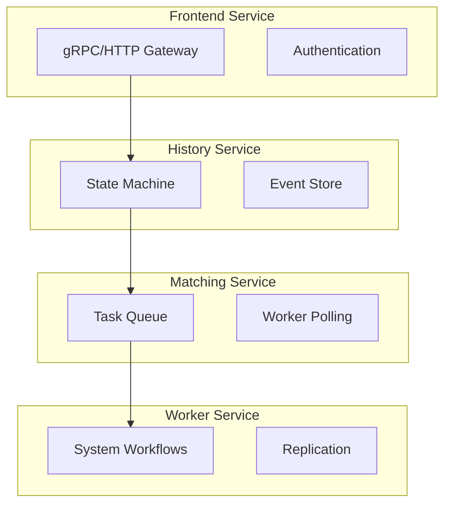

# Genesis Temporal - Services

Documentation des services Temporal.

---

## 🏗️ Architecture des services



---

## 🌐 Frontend Service

```go
// service/frontend/service.go
type Service struct {
    config          *Config
    workflowHandler *WorkflowHandler
    healthHandler   *HealthHandler
    nexusHandler    *NexusHandler
    server          *grpc.Server
}

type Config struct {
    GRPCPort       int
    HTTPPort       int
    MaxConnections int
    TLS            TLSConfig
    KeepAlive      KeepAliveConfig
}

func (s *Service) Start() error {
    grpcServer := grpc.NewServer(
        grpc.MaxConcurrentStreams(uint32(s.config.MaxConnections)),
        grpc.KeepaliveParams(keepalive.ServerParameters{
            MaxConnectionIdle:     s.config.KeepAlive.MaxConnectionIdle,
            MaxConnectionAge:      s.config.KeepAlive.MaxConnectionAge,
            Time:                  s.config.KeepAlive.Time,
            Timeout:               s.config.KeepAlive.Timeout,
        }),
    )
    
    workflowservice.RegisterWorkflowServiceServer(grpcServer, s.workflowHandler)
    healthgrpc.RegisterHealthServer(grpcServer, s.healthHandler)
    
    lis, err := net.Listen("tcp", fmt.Sprintf(":%d", s.config.GRPCPort))
    if err != nil {
        return err
    }
    
    s.server = grpcServer
    return grpcServer.Serve(lis)
}
```

---

## 📜 History Service

```go
// service/history/history_engine.go
type HistoryEngine struct {
    shardController ShardController
    stateMachine    *StateMachine
    eventStore      *EventStore
    chasmEngine     *chasm.Engine
}

func (e *HistoryEngine) ScheduleWorkflowTask(
    ctx context.Context,
    request *ScheduleRequest,
) error {
    shard, err := e.shardController.GetShard(request.WorkflowID)
    if err != nil {
        return err
    }
    
    if err := shard.AcquireLock(ctx); err != nil {
        return err
    }
    defer shard.ReleaseLock()
    
    mutableState, err := e.stateMachine.Load(ctx, shard.ID, request.WorkflowID)
    if err != nil {
        return err
    }
    
    event := &history.HistoryEvent{
        EventId:   mutableState.GetNextEventID(),
        EventType: EVENT_TYPE_WORKFLOW_TASK_SCHEDULED,
    }
    
    if err := e.eventStore.AppendEvents(ctx, shard.ID, event); err != nil {
        return err
    }
    
    mutableState.AddEvent(event)
    return e.stateMachine.Persist(ctx, mutableState)
}
```

---

## 📋 Matching Service

```go
// service/matching/matching_engine.go
type MatchingEngine struct {
    taskQueueManager TaskQueueManager
    pollerRegistry   *PollerRegistry
    forwarder        *TaskForwarder
}

func (e *MatchingEngine) PollWorkflowTaskQueue(
    ctx context.Context,
    request *workflowservice.PollWorkflowTaskQueueRequest,
) (*workflowservice.PollWorkflowTaskQueueResponse, error) {
    queue, err := e.taskQueueManager.GetQueue(
        request.GetNamespaceId(),
        request.GetTaskQueue().GetName(),
        enums.TASK_QUEUE_TYPE_WORKFLOW,
    )
    if err != nil {
        return nil, err
    }
    
    task, err := queue.Poll(ctx, request.GetPollerId(), e.config.LongPollExpirationInterval)
    if err != nil {
        return nil, err
    }
    
    if task == nil {
        return &workflowservice.PollWorkflowTaskQueueResponse{}, nil
    }
    
    return &workflowservice.PollWorkflowTaskQueueResponse{
        TaskToken:         task.Token,
        WorkflowExecution: task.WorkflowExecution,
        WorkflowType:      task.WorkflowType,
        History:           task.History,
    }, nil
}
```

---

## 👷 Worker Service

```go
// service/worker/worker.go
type Worker struct {
    replicator *Replicator
    batcher    *Batcher
    scanner    *Scanner
}

func (w *Worker) Start() error {
    go w.replicator.Run()
    go w.batcher.Run()
    go w.scanner.Run()
    return nil
}

func (w *Worker) Stop() {
    w.replicator.Stop()
    w.batcher.Stop()
    w.scanner.Stop()
}
```

---

## 📊 Métriques par service

| Service | Métriques clés |
|---------|----------------|
| **Frontend** | Requests/s, Latency P99, Connections |
| **History** | Shard acquisitions, Events appended |
| **Matching** | Task queue size, Poller count |
| **Worker** | Active replicators, Batch size |

---

**Version :** 1.0.0
