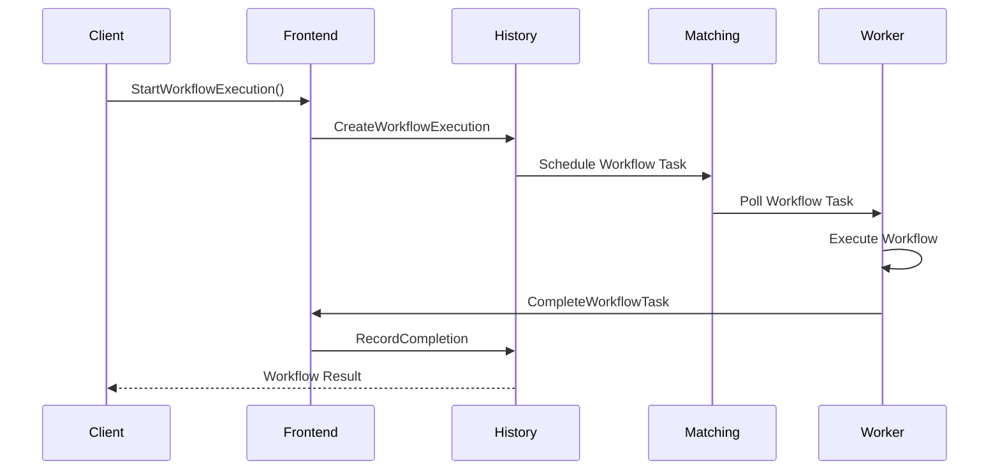

# Genesis Temporal - Workflow Types

Documentation des types de workflows.

---

## 📊 Types de workflows

### 1. Workflow Execution

```go
type WorkflowExecution struct {
    WorkflowId  string
    RunId       string
    WorkflowType string
    StartTime   time.Time
    CloseTime   time.Time
    Status      WorkflowStatus
}

type WorkflowStatus int

const (
    WorkflowStatusRunning WorkflowStatus = iota
    WorkflowStatusCompleted
    WorkflowStatusFailed
    WorkflowStatusCanceled
    WorkflowStatusTerminated
)
```

### 2. Activity Execution

```go
type ActivityExecution struct {
    ActivityId   string
    ActivityType string
    Input        []byte
    Result       []byte
    ScheduledTime time.Time
    StartedTime   time.Time
    CloseTime     time.Time
}
```

### 3. Timer

```go
type TimerExecution struct {
    TimerId     string
    StartTime   time.Time
    ExpiryTime  time.Time
    Fired       bool
    Cancelled   bool
}
```

---

## 🔄 Workflow Lifecycle



---

## 📝 Workflow Definition

```go
// Exemple de workflow
func SimpleWorkflow(ctx workflow.Context, name string) (string, error) {
    // Activités
    var result string
    err := workflow.ExecuteActivity(ctx, SimpleActivity, name).Get(ctx, &result)
    if err != nil {
        return "", err
    }
    return result, nil
}

// Exemple d'activité
func SimpleActivity(ctx context.Context, name string) (string, error) {
    return fmt.Sprintf("Hello %s!", name), nil
}

// Enregistrement
func RegisterWorker(w worker.Worker) {
    w.RegisterWorkflow(SimpleWorkflow)
    w.RegisterActivity(SimpleActivity)
}
```

---

## ⚙️ Configuration

### Workflow Options

```go
options := workflow.Options{
    ID:                    "workflow-id",
    TaskQueue:             "my-task-queue",
    WorkflowExecutionTimeout: 5 * time.Minute,
    WorkflowRunTimeout:    4 * time.Minute,
    WorkflowTaskTimeout:   time.Minute,
    RetryPolicy: &RetryPolicy{
        InitialInterval:    time.Second,
        BackoffCoefficient: 2.0,
        MaximumInterval:    time.Minute,
        MaximumAttempts:    10,
    },
}
```

### Activity Options

```go
ctx := workflow.WithActivityOptions(ctx, workflow.ActivityOptions{
    StartToCloseTimeout: 10 * time.Second,
    RetryPolicy: &RetryPolicy{
        InitialInterval:    time.Second,
        BackoffCoefficient: 2.0,
        MaximumInterval:    time.Minute,
    },
})
```

---

**Version :** 1.0.0
