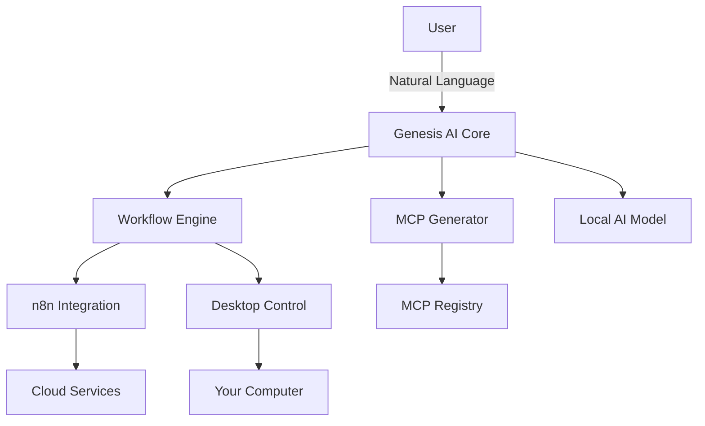

# Introduction to Genesis AI

Welcome to Genesis AI - your universal personal AI assistant that automates your digital life.

## What is Genesis AI?

Genesis AI is an AI-powered automation platform that combines:
- **Natural Language Understanding**: Just describe what you want
- **Unlimited Integrations**: Auto-generate connectors for any service
- **Desktop Control**: Automate your computer, not just cloud apps
- **Mobile Automation**: Control from anywhere
- **Local AI**: Your data stays private

## Key Features

### 🤖 Conversational Automation
Create workflows by simply describing them in plain English:
```
"Every Monday at 9am, send me an email with my calendar for the week"
```

Genesis AI understands your intent and creates the workflow automatically.

### 🔌 Auto-Generated Integrations
Need to connect to a service we don't support yet? No problem.

Genesis AI can automatically generate MCP (Model Context Protocol) servers for any API:
- Fetches API documentation
- Generates connector code
- Tests automatically
- Deploys in minutes

### 💻 Desktop Control
Unlike cloud-only automation tools, Genesis AI can control your computer:
- Open applications
- Manage files
- Take screenshots
- Execute commands
- Control hardware

### 📱 Mobile Companion
Install the companion app to:
- Trigger workflows from your phone
- Receive notifications
- Control desktop remotely
- Automate mobile tasks

### 🔒 Privacy-First
- Run entirely on your computer (self-hosted)
- Local AI model (optional)
- No data sent to cloud (unless you want)
- Open-source core

## Architecture


## Getting Started

Ready to automate your life? Continue to [Installation](./installation.md).
