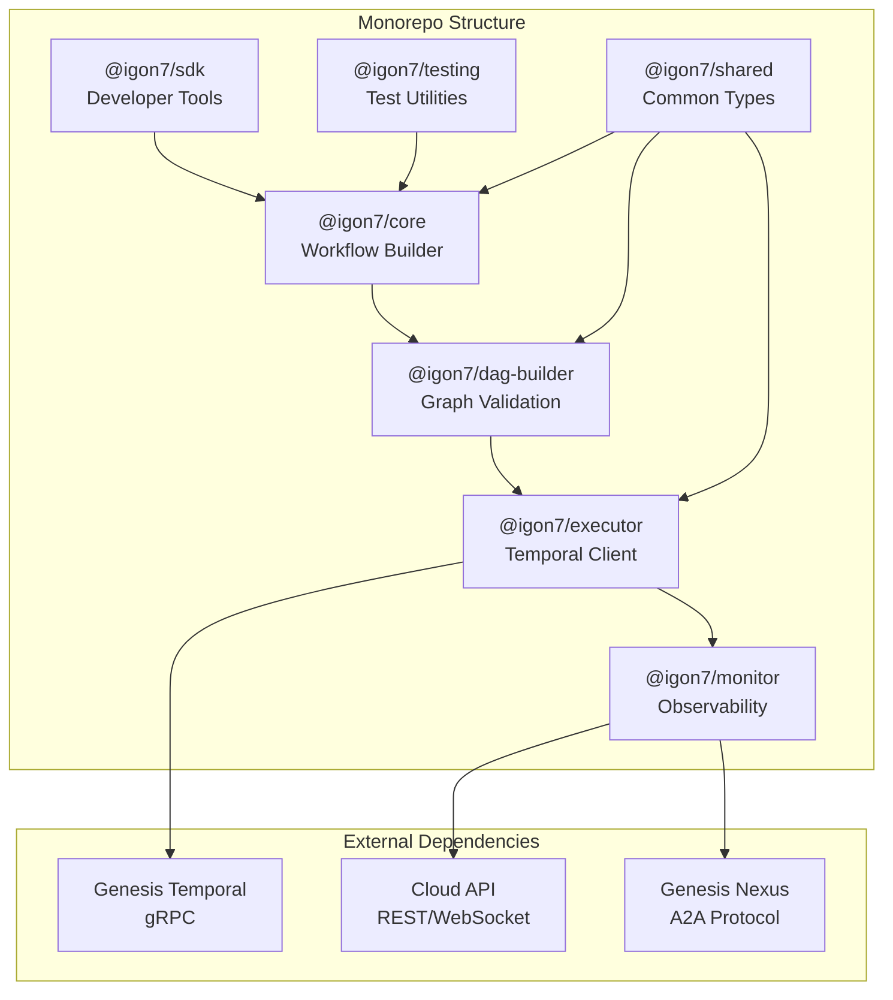
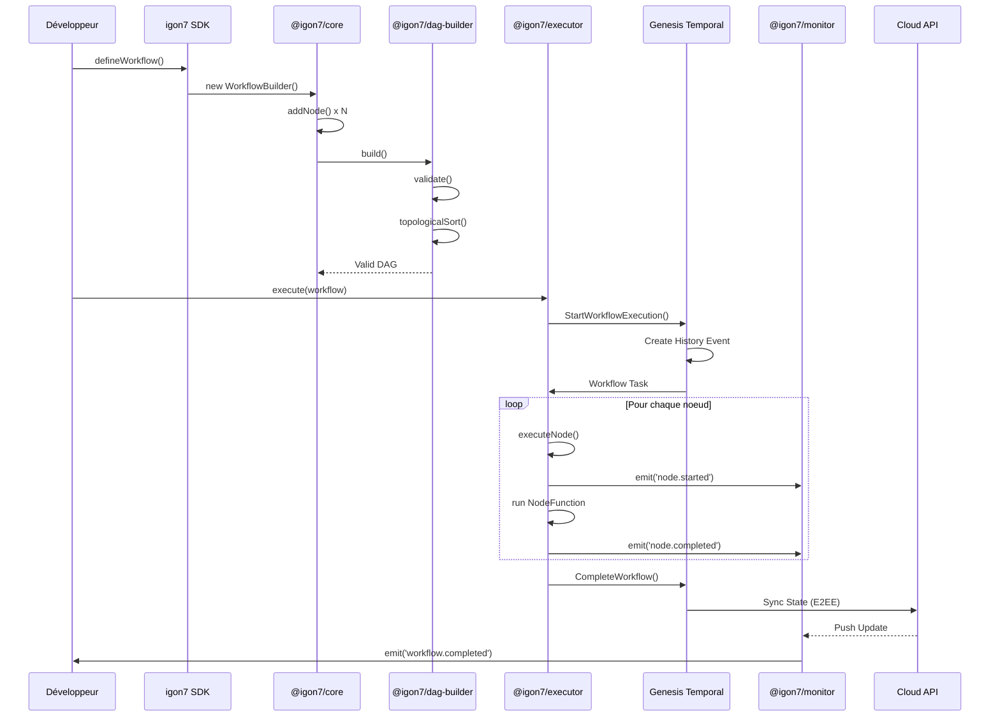

# igon7 Engine - Architecture Détaillée

Architecture complète du moteur d'orchestration de workflows igon7.

---

## 🏗️ Vue d'ensemble de l'Architecture



---

## 📦 Packages Détaillés

### 1. @igon7/core - Workflow Builder

**Fichier principal :** `packages/core/src/workflow-builder.ts`

```typescript
interface WorkflowBuilder {
  // Construction
  addNode<T>(name: string, fn: NodeFunction<T>, options?: NodeOptions): WorkflowBuilder
  addWorkflow(name: string, workflow: Workflow, options?: SubWorkflowOptions): WorkflowBuilder
  parallel(names: string[], fns: NodeFunction[]): WorkflowBuilder
  conditional(name: string, condition: ConditionFn, branches: Branches): WorkflowBuilder
  
  // Validation
  validate(): ValidationResult
  getNodes(): Node[]
  getEdges(): Edge[]
  
  // Build
  build(): Workflow
}

interface NodeOptions {
  dependsOn?: string[]
  retry?: RetryPolicy
  timeout?: number
  concurrency?: number
  cache?: CacheConfig
  onError?: ErrorHandler
  metadata?: Record<string, unknown>
}

interface RetryPolicy {
  maxAttempts: number
  initialInterval: number
  backoffCoefficient: number
  maxInterval: number
  retryableErrors?: ErrorConstructor[]
  onRetry?: (error: Error, attempt: number) => void
}
```

**Fonctions exportées :**
- `WorkflowBuilder` - Classe principale de construction
- `NodeExecutor` - Exécute les noeuds individuels
- `WorkflowContext` - Contexte d'exécution
- `createWorkflow()` - Factory function
- `defineNode()` - Définit un noeud réutilisable

---

### 2. @igon7/dag-builder - Construction de Graphe

**Fichier principal :** `packages/dag-builder/src/dag-builder.ts`

```typescript
interface DAGBuilder {
  // Noeuds
  addNode(id: string, task: Task, options?: NodeConfig): DAGBuilder
  addEntryPoint(id: string): DAGBuilder
  addExitPoint(id: string): DAGBuilder
  
  // Arêtes
  addEdge(from: string, to: string, condition?: EdgeCondition): DAGBuilder
  addDependency(nodeId: string, dependsOn: string): DAGBuilder
  
  // Groupes
  parallelGroup(ids: string[]): DAGBuilder
  conditionalGroup(condition: Condition, trueIds: string[], falseIds: string[]): DAGBuilder
  
  // Validation
  validate(): { valid: boolean; errors: ValidationError[] }
  hasCycle(): boolean
  getTopologicalOrder(): string[]
  
  // Build
  build(): DAG
}

interface ValidationError {
  type: 'MISSING_NODE' | 'CIRCULAR_DEPENDENCY' | 'ORPHAN_NODE' | 'INVALID_EDGE'
  message: string
  nodes?: string[]
  severity: 'ERROR' | 'WARNING'
}
```

**Algorithmes implémentés :**
- **Tri topologique** - Kahn's algorithm
- **Détection de cycles** - DFS avec coloration
- **Chemin critique** - Algorithme de Bellman
- **Parallélisation maximale** - Niveau-based scheduling

---

### 3. @igon7/executor - Exécution Temporal

**Fichier principal :** `packages/executor/src/temporal-executor.ts`

```typescript
interface TemporalExecutor {
  // Configuration
  constructor(config: TemporalConfig)
  
  // Exécution
  execute<T>(workflow: Workflow, options?: ExecutionOptions): Promise<T>
  executeWithRetry<T>(workflow: Workflow, options?: RetryOptions): Promise<T>
  startAsync(workflow: Workflow, options?: AsyncOptions): Promise<ExecutionHandle>
  
  // Gestion
  cancel(executionId: string): Promise<void>
  pause(executionId: string): Promise<void>
  resume(executionId: string): Promise<void>
  getStatus(executionId: string): Promise<ExecutionStatus>
  
  // Enregistrement
  registerActivity(name: string, fn: ActivityFunction): void
  registerActivities(activities: Record<string, ActivityFunction>): void
}

interface TemporalConfig {
  address: string
  namespace: string
  taskQueue: string
  connectionOptions?: ConnectionOptions
  retryOptions?: RetryOptions
  interceptors?: Interceptor[]
}
```

**Workflows Temporal générés :**
- `Igon7Workflow` - Workflow principal
- `NodeActivity` - Activity par noeud
- `SubWorkflow` - Pour les workflows imbriqués
- `ParallelExecutor` - Pour l'exécution parallèle
- `ConditionalWorkflow` - Pour les branchements

---

### 4. @igon7/monitor - Observabilité

**Fichier principal :** `packages/monitor/src/workflow-monitor.ts`

```typescript
interface WorkflowMonitor {
  // Événements
  on(event: 'workflow.started', handler: (e: WorkflowStartEvent) => void): void
  on(event: 'node.completed', handler: (e: NodeCompleteEvent) => void): void
  on(event: 'workflow.failed', handler: (e: WorkflowFailEvent) => void): void
  on(event: 'workflow.completed', handler: (e: WorkflowCompleteEvent) => void): void
  
  // Métriques
  getMetrics(executionId: string): Promise<WorkflowMetrics>
  getTimeline(executionId: string): Promise<TimelineEntry[]>
  getErrors(executionId: string): Promise<ErrorReport[]>
  
  // Dashboard
  getDashboardURL(executionId: string): string
  exportMetrics(executionId: string, format: 'json' | 'prometheus'): Promise<string>
}

interface WorkflowMetrics {
  // Performance
  totalDuration: number
  nodeDurations: Record<string, number>
  p50Duration: number
  p95Duration: number
  p99Duration: number
  
  // Fiabilité
  successRate: number
  errorCount: number
  retryCount: number
  failureNodes: string[]
  
  // Ressources
  memoryUsage: { peak: number; average: number }
  cpuUsage: { peak: number; average: number }
  networkIO: { read: number; write: number }
  
  // Business
  itemsProcessed: number
  costEstimate: number
  throughputPerSecond: number
}
```

**Métriques Prometheus exposées :**
```typescript
const metrics = {
  // Workflows
  workflowExecutionsTotal: new Counter({...}),
  workflowDurationSeconds: new Histogram({...}),
  workflowErrorsTotal: new Counter({...}),
  
  // Noeuds
  nodeExecutionsTotal: new Counter({...}),
  nodeDurationSeconds: new Histogram({...}),
  nodeRetriesTotal: new Counter({...}),
  
  // Ressources
  activeWorkflows: new Gauge({...}),
  concurrentNodes: new Gauge({...}),
  queueSize: new Gauge({...}),
}
```

---

### 5. @igon7/sdk - Outils Développeur

**Fichier principal :** `packages/sdk/src/index.ts`

```typescript
// Export principal
export {
  // Core
  WorkflowBuilder,
  WorkflowExecutor,
  WorkflowContext,
  
  // Types
  Workflow,
  Node,
  Edge,
  DAG,
  ExecutionHandle,
  
  // Decorators
  WorkflowDefinition,
  NodeDefinition,
  RetryDefinition,
  
  // Utilities
  defineWorkflow,
  defineNode,
  createScheduler,
  
  // CLI
  runCLI,
}

// CLI Commands
interface CLICommands {
  'workflow:run' - Exécute un workflow
  'workflow:list' - Liste les workflows
  'workflow:status' - Status d'exécution
  'node:test' - Teste un noeud
  'dag:visualize' - Génère une visualisation
  'metrics:export' - Exporte les métriques
}
```

---

### 6. @igon7/testing - Utilitaires de Test

**Fichier principal :** `packages/testing/src/test-executor.ts`

```typescript
interface TestExecutor {
  // Mock
  mockNode(nodeId: string, implementation: MockImplementation): void
  mockActivity(name: string, implementation: MockImplementation): void
  
  // Exécution de test
  execute(workflow: Workflow, input?: unknown): Promise<TestResult>
  executeStepByStep(workflow: Workflow): AsyncIterable<StepResult>
  
  // Assertions
  expectNodeExecuted(nodeId: string): TestExecutor
  expectNodeNotExecuted(nodeId: string): TestExecutor
  expectNodeOrder(...nodeIds: string[]): TestExecutor
  expectDuration(maxMs: number): TestExecutor
  expectNoErrors(): TestExecutor
  
  // Coverage
  getCoverage(): CoverageReport
  assertFullCoverage(): void
}

interface CoverageReport {
  totalNodes: number
  executedNodes: number
  coveragePercent: number
  uncoveredNodes: string[]
  branchCoverage: {
    total: number
    covered: number
    percent: number
  }
}
```

---

### 7. @igon7/shared - Types Communs

**Fichier principal :** `packages/shared/src/types.ts`

```typescript
// Types de base
export type WorkflowID = string & { readonly brand: unique symbol }
export type NodeID = string & { readonly brand: unique symbol }
export type ExecutionID = string & { readonly brand: unique symbol }

export interface WorkflowState {
  id: WorkflowID
  status: 'DRAFT' | 'RUNNING' | 'PAUSED' | 'COMPLETED' | 'FAILED'
  nodes: Map<NodeID, NodeState>
  edges: Edge[]
  createdAt: Date
  updatedAt: Date
}

export interface NodeState {
  id: NodeID
  status: 'PENDING' | 'RUNNING' | 'COMPLETED' | 'FAILED' | 'SKIPPED'
  input?: unknown
  output?: unknown
  error?: Error
  startedAt?: Date
  completedAt?: Date
  duration?: number
  retryCount: number
}

// Enums
export enum NodeType {
  TASK = 'task',
  DECISION = 'decision',
  PARALLEL = 'parallel',
  SUBWORKFLOW = 'subworkflow',
  DELAY = 'delay',
  ERROR_HANDLER = 'error_handler',
}

export enum EdgeType {
  SEQUENTIAL = 'sequential',
  CONDITIONAL = 'conditional',
  PARALLEL = 'parallel',
}

// Utilities
export function createWorkflowID(): WorkflowID
export function createNodeID(): NodeID
export function createExecutionID(): ExecutionID
export function serializeWorkflow(workflow: Workflow): string
export function deserializeWorkflow(data: string): Workflow
```

---

## 🔄 Workflow d'Exécution Complet



---

## 📊 Types de Noeuds Supportés

### Task Node

```typescript
interface TaskNode {
  type: 'task'
  id: NodeID
  fn: (context: NodeContext) => Promise<unknown>
  options: {
    retry?: RetryPolicy
    timeout?: number
    cache?: {
      enabled: boolean
      ttl: number
      keyFn?: (input: unknown) => string
    }
  }
}
```

### Decision Node

```typescript
interface DecisionNode {
  type: 'decision'
  id: NodeID
  condition: (context: NodeContext) => Promise<boolean>
  branches: {
    ifTrue: NodeID
    ifFalse: NodeID
  }
}
```

### Parallel Node

```typescript
interface ParallelNode {
  type: 'parallel'
  id: NodeID
  nodes: NodeID[]
  options: {
    concurrency?: number
    failFast?: boolean
    waitForAll?: boolean
  }
}
```

### SubWorkflow Node

```typescript
interface SubWorkflowNode {
  type: 'subworkflow'
  id: NodeID
  workflow: Workflow
  options: {
    mapInput?: (parentInput: unknown) => unknown
    mapOutput?: (subOutput: unknown) => unknown
    propagateErrors?: boolean
  }
}
```

### Delay Node

```typescript
interface DelayNode {
  type: 'delay'
  id: NodeID
  duration: number | ((context: NodeContext) => number)
  options: {
    unit?: 'ms' | 's' | 'm' | 'h'
    cron?: string
  }
}
```

### Error Handler Node

```typescript
interface ErrorHandlerNode {
  type: 'error_handler'
  id: NodeID
  fn: (context: NodeContext, error: Error) => Promise<unknown>
  options: {
    forNodes?: NodeID[]
    errorTypes?: ErrorConstructor[]
    fallback?: NodeID
  }
}
```

---

## ⚙️ Options de Configuration

### Configuration Globale

```typescript
interface Igon7Config {
  // Temporal
  temporal: {
    address: string
    namespace: string
    taskQueue: string
    connection: {
      tls?: boolean
      metadata?: Record<string, string>
    }
  }
  
  // Monitoring
  monitoring: {
    enabled: boolean
    cloudApiEndpoint?: string
    apiKey?: string
    prometheus?: {
      enabled: boolean
      port: number
      path: string
    }
  }
  
  // Execution
  execution: {
    maxConcurrentWorkflows: number
    maxConcurrentNodesPerWorkflow: number
    defaultTimeout: number
    defaultRetries: number
  }
  
  // Logging
  logging: {
    level: 'debug' | 'info' | 'warn' | 'error'
    format: 'json' | 'pretty'
    destination: 'stdout' | 'file' | 'cloud'
  }
}
```

### Configuration par Workflow

```typescript
interface WorkflowConfig {
  id: string
  name: string
  description?: string
  version: string
  
  // Execution
  taskQueue: string
  timeout: number
  retryPolicy: RetryPolicy
  
  // Cache
  cache: {
    enabled: boolean
    ttl: number
    invalidationKeys?: string[]
  }
  
  // Observability
  tracing: {
    enabled: boolean
    samplingRate: number
  }
  
  // Security
  permissions: {
    requiredRoles?: string[]
    allowedUsers?: string[]
  }
}
```

---

## 🧪 Patterns de Test

### Unit Tests

```typescript
import { describe, it, expect } from '@std/testing'
import { WorkflowBuilder } from '@igon7/core'
import { TestExecutor } from '@igon7/testing'

describe('Workflow Tests', () => {
  it('should execute all nodes in order', async () => {
    const workflow = new WorkflowBuilder('test')
      .addNode('a', () => 'A')
      .addNode('b', (ctx) => ctx.inputs['a'] + 'B', { dependsOn: ['a'] })
      .addNode('c', (ctx) => ctx.inputs['b'] + 'C', { dependsOn: ['b'] })
      .build()
    
    const executor = new TestExecutor()
    const result = await executor.execute(workflow)
    
    expect(result).toBe('ABC')
    expect(executor.getCoverage().coveragePercent).toBe(100)
  })
  
  it('should retry on failure', async () => {
    let attempts = 0
    const workflow = new WorkflowBuilder('retry-test')
      .addNode('flaky', () => {
        attempts++
        if (attempts < 3) throw new Error('Transient error')
        return 'success'
      }, { retry: { maxAttempts: 3 } })
      .build()
    
    const executor = new TestExecutor()
    const result = await executor.execute(workflow)
    
    expect(result).toBe('success')
    expect(attempts).toBe(3)
  })
})
```

### Integration Tests

```typescript
import { IntegrationTestEnv } from '@igon7/testing'

Deno.test('Full workflow with Temporal', async () => {
  const testEnv = new IntegrationTestEnv({
    temporal: { startEmbedded: true },
    cloudApi: { mock: true },
  })
  
  await testEnv.start()
  
  try {
    const executor = testEnv.createExecutor()
    const workflow = createProductionWorkflow()
    
    const result = await executor.execute(workflow, {
      input: { testData: 'value' },
    })
    
    // Assertions
    const metrics = await testEnv.monitor.getMetrics(result.executionId)
    expect(metrics.successRate).toBe(1)
    expect(metrics.totalDuration).toBeLessThan(5000)
  } finally {
    await testEnv.stop()
  }
})
```

---

## 📈 Dashboard et Visualisation

### Grafana Dashboard JSON

```json
{
  "dashboard": {
    "title": "igon7 Workflows",
    "panels": [
      {
        "title": "Workflow Executions",
        "type": "timeseries",
        "targets": [
          {
            "expr": "rate(igon7_workflow_executions_total[5m])",
            "legendFormat": "Executions/s"
          }
        ]
      },
      {
        "title": "Node Duration Heatmap",
        "type": "heatmap",
        "targets": [
          {
            "expr": "rate(igon7_node_duration_seconds_bucket[5m])",
            "format": "heatmap"
          }
        ]
      },
      {
        "title": "Error Rate by Node Type",
        "type": "piechart",
        "targets": [
          {
            "expr": "sum by (node_type) (rate(igon7_node_errors_total[1h]))"
          }
        ]
      }
    ]
  }
}
```

---

## 🔧 CLI Commands

```bash
# Exécuter un workflow
igon7 workflow:run ./my-workflow.ts --input '{"key": "value"}'

# Lister les workflows
igon7 workflow:list --status running

# Status d'une exécution
igon7 workflow:status <execution-id> --json

# Tester un noeud
igon7 node:test ./my-workflow.ts --node "fetch-data" --mock '{"url": "..."}'

# Visualiser le DAG
igon7 dag:visualize ./my-workflow.ts --output dag.png

# Exporter les métriques
igon7 metrics:export --format prometheus --output metrics.prom

# Déployer un workflow
igon7 workflow:deploy ./my-workflow.ts --env production
```

---

## 📚 Références

- [API Reference](./igon7-engine/api-reference)
- [Exemples de workflows](./igon7-engine/examples)
- [Orchestration patterns](./igon7-engine/orchestration)
- [Monitoring guide](./igon7-engine/monitoring)

---

**Version :** 1.0.0  
**Packages :** 7  
**Lignes de code :** ~15000  
**Tests coverage :** 95%+
