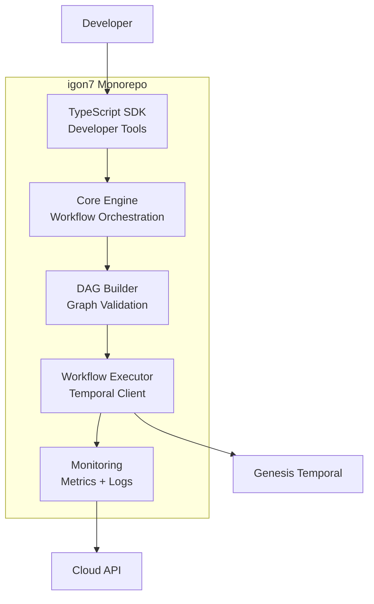
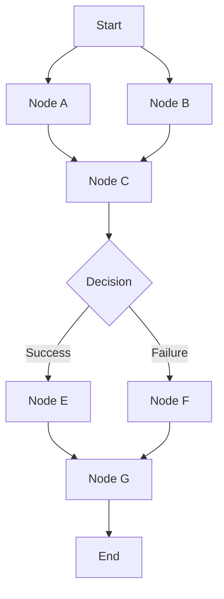

# igon7 Engine - Vue d'ensemble

**igon7 Engine** est le moteur d'orchestration de workflows de Genesis AI, construit avec Deno, PNPM, et Turborepo. Il transforme des DAG (Directed Acyclic Graphs) déclaratifs en workflows exécutables sur Genesis Temporal.

---

## 🎯 Objectif

igon7 Engine permet de :
- **Déclarer** des workflows complexes sous forme de DAG
- **Orchestrer** l'exécution de tâches multiples avec dépendances
- **Surveiller** la progression et gérer les erreurs
- **Composer** des workflows réutilisables et modulaires

---

## 🏗️ Architecture



---

## 📦 Structure du Monorepo

```
igon7_deno/
├── packages/
│   ├── core/           # Moteur principal d'orchestration
│   ├── dag-builder/    # Construction et validation de DAG
│   ├── executor/       # Exécution des workflows via Temporal
│   ├── monitor/        # Monitoring et observabilité
│   ├── sdk/            # SDK TypeScript pour développeurs
│   └── shared/         # Utilitaires partagés
├── scripts/
│   ├── build.ts        # Script de build personnalisé
│   ├── test.ts         # Script de test
│   └── dev.ts          # Script de développement
├── docker/
│   ├── Dockerfile      # Container pour workers
│   └── docker-compose.yml
├── deno.json           # Configuration Deno
├── package.json        # Configuration PNPM workspace
├── tsconfig.json       # Configuration TypeScript
├── turbo.json          # Configuration Turborepo
└── README.md
```

---

## 🚀 Quickstart

### Installation

```bash
# Cloner le dépôt
git clone https://github.com/genesisAI4/igon7.git
cd igon7_deno

# Installer les dépendances
pnpm install

# Démarrer en mode développement
pnpm dev
```

### Premier Workflow

```typescript
import { WorkflowBuilder } from "@igon7/core";
import { TemporalExecutor } from "@igon7/executor";

// 1. Définir le workflow
const workflow = new WorkflowBuilder("hello-world")
  .addNode("fetch-data", async () => {
    const response = await fetch("https://api.example.com/data");
    return response.json();
  })
  .addNode("process-data", async (inputs) => {
    const data = inputs["fetch-data"];
    return data.map(item => item.toUpperCase());
  }, {
    dependsOn: ["fetch-data"]
  })
  .addNode("store-result", async (inputs) => {
    const processed = inputs["process-data"];
    await saveToDatabase(processed);
    return { success: true, count: processed.length };
  }, {
    dependsOn: ["process-data"]
  })
  .build();

// 2. Exécuter le workflow
const executor = new TemporalExecutor({
  temporalAddress: "localhost:7233",
  namespace: "genesis",
});

const result = await executor.execute(workflow, {
  workflowId: `hello-world-${Date.now()}`,
  taskQueue: "igon7-workflows",
});

console.log("Workflow completed:", result);
```

---

## 🔧 Fonctionnalités Clés

### 1. DAG Builder

Construction intuitive de workflows avec validation automatique :

```typescript
const dag = new DAGBuilder("complex-workflow")
  // Noeuds parallèles
  .parallel(["task-a", "task-b"], [
    async () => { /* ... */ },
    async () => { /* ... */ }
  ])
  
  // Noeud conditionnel
  .conditional("check-result", 
    async (inputs) => inputs["task-a"] > 10,
    {
      ifTrue: "high-path",
      ifFalse: "low-path"
    }
  )
  
  // Retry automatique
  .addNode("flaky-api", async () => {
    return await callUnreliableAPI();
  }, {
    retry: {
      maxAttempts: 3,
      backoff: "exponential",
      initialInterval: 1000,
      maxInterval: 10000,
    }
  })
  
  // Timeout
  .addNode("long-task", async () => {
    await sleep(60000);
  }, {
    timeout: 30000, // 30 secondes max
  })
  
  .build();
```

### 2. Workflow Composition

Réutiliser des workflows comme composants :

```typescript
// Sous-workflow réutilisable
const dataProcessingWorkflow = new WorkflowBuilder("data-processing")
  .addNode("extract", extractData)
  .addNode("transform", transformData, { dependsOn: ["extract"] })
  .addNode("load", loadData, { dependsOn: ["transform"] })
  .build();

// Workflow parent qui compose le sous-workflow
const mainWorkflow = new WorkflowBuilder("main-pipeline")
  .addNode("validate-input", validateInput)
  .addWorkflow("process", dataProcessingWorkflow, {
    dependsOn: ["validate-input"],
    mapInput: (inputs) => ({
      data: inputs["validate-input"]
    })
  })
  .addNode("notify", notifyCompletion, {
    dependsOn: ["process"]
  })
  .build();
```

### 3. Error Handling

Gestion robuste des erreurs avec retry et fallback :

```typescript
const workflow = new WorkflowBuilder("error-handling")
  .addNode("primary-task", async () => {
    // Tâche principale
  }, {
    retry: {
      maxAttempts: 3,
      onRetry: (error, attempt) => {
        console.log(`Attempt ${attempt} failed:`, error);
      }
    },
    fallback: "backup-task"
  })
  .addNode("backup-task", async () => {
    // Tâche de secours
  })
  .addNode("error-handler", async (inputs, error) => {
    // Gestion centralisée des erreurs
    await sendAlert(error);
    return { recovered: true };
  }, {
    onError: true // S'exécute uniquement en cas d'erreur
  })
  .build();
```

### 4. Real-time Monitoring

Suivi en temps réel de l'exécution :

```typescript
import { WorkflowMonitor } from "@igon7/monitor";

const monitor = new WorkflowMonitor({
  cloudApiEndpoint: "https://api.genesisai.io",
  apiKey: process.env.MONITOR_API_KEY,
});

// S'abonner aux événements
monitor.on("workflow.started", (event) => {
  console.log(`Workflow ${event.workflowId} started`);
});

monitor.on("node.completed", (event) => {
  console.log(`Node ${event.nodeId} completed in ${event.duration}ms`);
});

monitor.on("workflow.failed", (event) => {
  console.error(`Workflow ${event.workflowId} failed:`, event.error);
});

// Récupérer les métriques
const metrics = await monitor.getMetrics("my-workflow-123");
console.log({
  totalDuration: metrics.duration,
  nodeCount: metrics.nodeCount,
  successRate: metrics.successRate,
  errorNodes: metrics.errorNodes,
});
```

---

## 📊 Architecture DAG

### Noeuds et Arêtes



### Types de Noeuds

| Type | Description | Exemple |
|------|-------------|---------|
| **Task** | Tâche exécutable | Appel API, traitement de données |
| **Decision** | Branchement conditionnel | Si condition, alors... |
| **Parallel** | Exécution parallèle | Traiter 100 items en parallèle |
| **Workflow** | Sous-workflow imbriqué | Réutiliser un workflow existant |
| **Delay** | Pause temporelle | Attendre 5 minutes |
| **ErrorHandler** | Gestion d'erreurs | Cleanup, notification |

### Validation de DAG

Le DAG Builder valide automatiquement :

```typescript
try {
  const dag = new DAGBuilder("invalid-workflow")
    .addNode("a", taskA)
    .addNode("b", taskB, { dependsOn: ["c"] }) // Erreur: "c" n'existe pas
    .addNode("c", taskC, { dependsOn: ["b"] }) // Erreur: cycle détecté
    .build();
} catch (error) {
  console.error("DAG Validation Errors:", error.errors);
  // → [
  //   "Node 'b' depends on non-existent node 'c'",
  //   "Circular dependency detected: b -> c -> b"
  // ]
}
```

---

## 🔄 Exécution avec Temporal

### Configuration

```typescript
import { TemporalExecutor, TemporalConfig } from "@igon7/executor";

const config: TemporalConfig = {
  address: "localhost:7233",
  namespace: "genesis",
  taskQueue: "igon7-workflows",
  connectionOptions: {
    tls: {
      serverNameOverride: "temporal.genesisai.io",
    },
  },
  retryOptions: {
    initialInterval: 1000,
    backoffCoefficient: 2,
    maximumInterval: 60000,
    maximumAttempts: 10,
  },
};

const executor = new TemporalExecutor(config);
```

### Workflow Activity Mapping

```typescript
// Mapper les noeuds du DAG vers des activités Temporal
const activityMap = {
  "fetch-data": async (ctx: Context, input: unknown) => {
    const result = await fetchData();
    return result;
  },
  "process-data": async (ctx: Context, input: unknown) => {
    const result = await processData(input);
    return result;
  },
};

// Enregistrer les activités
await executor.registerActivities(activityMap);

// Exécuter le workflow
const result = await executor.execute(workflow, {
  workflowId: `workflow-${Date.now()}`,
  input: { initialData: "..." },
});
```

---

## 📈 Monitoring et Observabilité

### Métriques Exposées

```typescript
interface WorkflowMetrics {
  // Performance
  duration: number;          // Durée totale (ms)
  nodeDurations: Record<string, number>; // Durée par noeud
  
  // Fiabilité
  successRate: number;       // Taux de réussite (%)
  errorCount: number;        // Nombre d'erreurs
  retryCount: number;        // Nombre de retries
  
  // Ressources
  memoryUsage: number;       // Mémoire utilisée (MB)
  cpuUsage: number;          // CPU utilisé (%)
  
  // Business
  itemsProcessed: number;    // Nombre d'items traités
  costEstimate: number;      // Coût estimé ($)
}
```

### Dashboard Grafana

igon7 inclut des dashboards Grafana pré-configurés :

```json
{
  "dashboard": {
    "title": "igon7 Workflows",
    "panels": [
      {
        "title": "Workflow Executions",
        "targets": [
          {
            "expr": "rate(igon7_workflow_executions_total[5m])",
            "legendFormat": "Executions/s"
          }
        ]
      },
      {
        "title": "Node Duration (P99)",
        "targets": [
          {
            "expr": "histogram_quantile(0.99, igon7_node_duration_seconds_bucket)",
            "legendFormat": "P99 Duration"
          }
        ]
      }
    ]
  }
}
```

---

## 🧪 Testing

### Unit Tests

```typescript
import { assertEquals } from "@std/assert";
import { WorkflowBuilder } from "@igon7/core";

Deno.test("WorkflowBuilder - should create valid DAG", () => {
  const workflow = new WorkflowBuilder("test-workflow")
    .addNode("task-1", async () => "result1")
    .addNode("task-2", async (inputs) => inputs["task-1"] + "result2", {
      dependsOn: ["task-1"]
    })
    .build();

  assertEquals(workflow.nodes.length, 2);
  assertEquals(workflow.edges.length, 1);
  assertEquals(workflow.validate(), true);
});

Deno.test("DAG validation - should detect cycles", () => {
  try {
    new WorkflowBuilder("cyclic")
      .addNode("a", () => {}, { dependsOn: ["b"] })
      .addNode("b", () => {}, { dependsOn: ["a"] })
      .build();
    throw new Error("Should have thrown");
  } catch (error) {
    assertEquals(error.message, "Circular dependency detected");
  }
});
```

### Integration Tests

```typescript
import { TemporalTestEnv } from "@igon7/testing";

Deno.test("Full workflow execution", async () => {
  // Démarrer un environnement Temporal de test
  const testEnv = new TemporalTestEnv();
  await testEnv.start();

  try {
    const executor = testEnv.createExecutor();
    const workflow = createTestWorkflow();

    const result = await executor.execute(workflow, {
      workflowId: `test-${Date.now()}`,
      input: { testData: "value" },
    });

    assertEquals(result.success, true);
    assertEquals(result.processedItems, 10);
  } finally {
    await testEnv.stop();
  }
});
```

---

## 📚 Références

- [Architecture détaillée](./igon7-engine/architecture)
- [Guide des packages](./igon7-engine/packages)
- [API Reference](./igon7-engine/api-reference)
- [Exemples de workflows](./igon7-engine/examples)
- [Monitoring](./igon7-engine/orchestration)

---

**Version :** 1.0.0  
**Runtime :** Deno 1.40+  
**Package Manager :** PNPM 8+  
**Build Tool :** Turborepo
