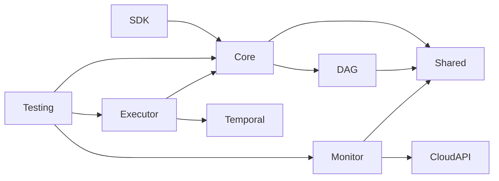

# igon7 Engine - Packages Détaillés

Documentation complète de chaque package du monorepo igon7.

---

## 📦 Structure du Monorepo

```
igon7_deno/
├── packages/
│   ├── core/              # Moteur principal
│   ├── dag-builder/       # Construction de graphe
│   ├── executor/          # Exécution Temporal
│   ├── monitor/           # Observabilité
│   ├── sdk/               # SDK développeur
│   ├── testing/           # Utilitaires de test
│   └── shared/            # Types partagés
├── scripts/
├── docker/
└── package.json
```

---

## 1. @igon7/core

### Structure

```
packages/core/
├── src/
│   ├── workflow-builder.ts
│   ├── workflow-executor.ts
│   ├── workflow-context.ts
│   ├── node-executor.ts
│   ├── error-handler.ts
│   ├── retry-logic.ts
│   ├── cache-manager.ts
│   ├── index.ts
├── test/
│   ├── workflow-builder.test.ts
│   ├── node-executor.test.ts
│   └── retry-logic.test.ts
├── deno.json
└── README.md
```

### API Complète

#### WorkflowBuilder

```typescript
class WorkflowBuilder {
  constructor(name: string)
  
  // Ajout de noeuds
  addNode<T>(
    name: string,
    fn: (context: NodeContext) => Promise<T>,
    options?: NodeOptions
  ): WorkflowBuilder
  
  addNode<T>(
    name: string,
    fn: (context: NodeContext) => T,
    options?: NodeOptions
  ): WorkflowBuilder
  
  // Workflows imbriqués
  addWorkflow(
    name: string,
    workflow: Workflow,
    options?: SubWorkflowOptions
  ): WorkflowBuilder
  
  // Exécution parallèle
  parallel(
    names: string[],
    fns: Array<(context: NodeContext) => Promise<unknown>>,
    options?: ParallelOptions
  ): WorkflowBuilder
  
  // Condition
  conditional(
    name: string,
    condition: (context: NodeContext) => Promise<boolean>,
    branches: {
      ifTrue: string
      ifFalse: string
    }
  ): WorkflowBuilder
  
  // Delay
  delay(
    name: string,
    duration: number | ((context: NodeContext) => number),
    options?: DelayOptions
  ): WorkflowBuilder
  
  // ErrorHandler
  onError(
    handler: (context: NodeContext, error: Error) => Promise<unknown>,
    options?: ErrorHandlerOptions
  ): WorkflowBuilder
  
  // Validation
  validate(): ValidationResult
  getNodes(): ReadonlyArray<Node>
  getEdges(): ReadonlyArray<Edge>
  
  // Build final
  build(): Workflow
}
```

#### NodeOptions

```typescript
interface NodeOptions {
  // Dépendances
  dependsOn?: string[]
  
  // Retry
  retry?: {
    maxAttempts: number
    initialInterval: number
    backoffCoefficient: number
    maxInterval: number
    retryableErrors?: Array<ErrorConstructor>
    onRetry?: (error: Error, attempt: number) => void
  }
  
  // Timeout
  timeout?: number
  
  // Concurrence
  concurrency?: number
  
  // Cache
  cache?: {
    enabled: boolean
    ttl: number
    keyFn?: (input: unknown) => string
    store?: 'memory' | 'redis' | 'custom'
  }
  
  // Gestion d'erreur
  onError?: 'fail' | 'continue' | 'fallback'
  fallback?: string
  
  // Metadata
  metadata?: {
    description?: string
    tags?: string[]
    owner?: string
  }
}
```

#### NodeContext

```typescript
interface NodeContext {
  // Informations d'exécution
  workflowId: string
  executionId: string
  nodeId: string
  attempt: number
  
  // Inputs/Outputs
  inputs: Record<string, unknown>
  parentInput: unknown
  
  // Utilities
  logger: Logger
  metrics: MetricsCollector
  storage: KeyValueStore
  
  // Helper functions
  getSecret(name: string): Promise<string>
  callWorkflow(workflowId: string, input: unknown): Promise<unknown>
  emitEvent(event: string, data: unknown): void
  
  // Annulation
  signal: AbortSignal
}
```

### Exemples d'Utilisation

```typescript
import { WorkflowBuilder } from '@igon7/core'

// Workflow simple
const simpleWorkflow = new WorkflowBuilder('simple')
  .addNode('fetch', async () => {
    const res = await fetch('https://api.example.com/data')
    return res.json()
  })
  .addNode('process', async (ctx) => {
    const data = ctx.inputs['fetch']
    return data.map(item => item.toUpperCase())
  }, {
    dependsOn: ['fetch'],
    retry: { maxAttempts: 3 }
  })
  .addNode('store', async (ctx) => {
    await db.save(ctx.inputs['process'])
    return { success: true }
  }, {
    dependsOn: ['process'],
    timeout: 30000
  })
  .build()

// Workflow avec parallélisme
const parallelWorkflow = new WorkflowBuilder('parallel')
  .parallel(['task1', 'task2', 'task3'], [
    async () => { /* ... */ },
    async () => { /* ... */ },
    async () => { /* ... */ }
  ], {
    concurrency: 2,
    failFast: true
  })
  .build()

// Workflow conditionnel
const conditionalWorkflow = new WorkflowBuilder('conditional')
  .addNode('check', async (ctx) => {
    return ctx.input.value > 100
  })
  .addNode('high-path', async () => { /* ... */ })
  .addNode('low-path', async () => { /* ... */ })
  .conditional('route',
    async (ctx) => ctx.inputs['check'],
    {
      ifTrue: 'high-path',
      ifFalse: 'low-path'
    }
  )
  .build()
```

---

## 2. @igon7/dag-builder

### Structure

```
packages/dag-builder/
├── src/
│   ├── dag-builder.ts
│   ├── dag-validator.ts
│   ├── topological-sort.ts
│   ├── cycle-detector.ts
│   ├── critical-path.ts
│   ├── graph-visualizer.ts
│   └── index.ts
├── test/
├── deno.json
└── README.md
```

### API Complète

#### DAGBuilder

```typescript
class DAGBuilder {
  constructor(name: string)
  
  // Noeuds
  addNode(id: string, task: Task, config?: NodeConfig): DAGBuilder
  addEntryPoint(id: string): DAGBuilder
  addExitPoint(id: string): DAGBuilder
  
  // Arêtes
  addEdge(from: string, to: string, condition?: EdgeCondition): DAGBuilder
  addDependency(nodeId: string, dependsOn: string): DAGBuilder
  
  // Structures complexes
  sequence(ids: string[]): DAGBuilder
  parallel(ids: string[]): DAGBuilder
  branch(condition: Condition, trueBranch: string[], falseBranch: string[]): DAGBuilder
  merge(fromIds: string[], toId: string): DAGBuilder
  
  // Validation
  validate(): {
    valid: boolean
    errors: ValidationError[]
    warnings: ValidationWarning[]
  }
  
  hasCycle(): boolean
  getCycles(): string[][]
  
  // Analyse
  getTopologicalOrder(): string[]
  getCriticalPath(): string[]
  getParallelGroups(): string[][]
  getOrphanNodes(): string[]
  
  // Visualisation
  toMermaid(): string
  toGraphviz(): string
  toJSON(): string
  
  build(): DAG
}
```

#### Algorithmes Implémentés

```typescript
// Tri topologique - Kahn's algorithm
function topologicalSort(dag: DAG): string[] {
  const inDegree = new Map<string, number>()
  const queue: string[] = []
  const result: string[] = []
  
  // Calculer les degrés entrants
  for (const node of dag.nodes) {
    inDegree.set(node.id, node.dependencies.length)
    if (node.dependencies.length === 0) {
      queue.push(node.id)
    }
  }
  
  // Traiter la file
  while (queue.length > 0) {
    const current = queue.shift()!
    result.push(current)
    
    for (const neighbor of dag.getNeighbors(current)) {
      const degree = inDegree.get(neighbor)! - 1
      inDegree.set(neighbor, degree)
      if (degree === 0) {
        queue.push(neighbor)
      }
    }
  }
  
  if (result.length !== dag.nodes.length) {
    throw new Error('Cycle detected')
  }
  
  return result
}

// Détection de cycles - DFS
function hasCycle(dag: DAG): boolean {
  const WHITE = 0, GRAY = 1, BLACK = 2
  const color = new Map<string, number>()
  
  function dfs(nodeId: string): boolean {
    color.set(nodeId, GRAY)
    
    for (const neighbor of dag.getNeighbors(nodeId)) {
      if (color.get(neighbor) === GRAY) {
        return true // Cycle détecté
      }
      if (color.get(neighbor) === WHITE && dfs(neighbor)) {
        return true
      }
    }
    
    color.set(nodeId, BLACK)
    return false
  }
  
  for (const node of dag.nodes) {
    color.set(node.id, WHITE)
  }
  
  for (const node of dag.nodes) {
    if (color.get(node.id) === WHITE && dfs(node.id)) {
      return true
    }
  }
  
  return false
}

// Chemin critique - Bellman
function getCriticalPath(dag: DAG): string[] {
  const order = topologicalSort(dag)
  const earliest = new Map<string, number>()
  const latest = new Map<string, number>()
  
  // Plus tôt
  for (const nodeId of order) {
    const node = dag.getNode(nodeId)
    const maxDep = Math.max(
      ...node.dependencies.map(d => earliest.get(d) || 0)
    )
    earliest.set(nodeId, maxDep + node.duration)
  }
  
  // Plus tard
  const exitNode = order[order.length - 1]
  latest.set(exitNode, earliest.get(exitNode)!)
  
  for (const nodeId of order.reverse()) {
    const minSucc = Math.min(
      ...dag.getSuccessors(nodeId).map(s => latest.get(s) || Infinity)
    )
    latest.set(nodeId, minSucc - node.duration)
  }
  
  // Noeuds critiques (slack = 0)
  const criticalNodes: string[] = []
  for (const nodeId of order) {
    const slack = latest.get(nodeId)! - earliest.get(nodeId)!
    if (slack === 0) {
      criticalNodes.push(nodeId)
    }
  }
  
  return criticalNodes
}
```

---

## 3. @igon7/executor

### Structure

```
packages/executor/
├── src/
│   ├── temporal-executor.ts
│   ├── activity-mapper.ts
│   ├── workflow-adapter.ts
│   ├── result-aggregator.ts
│   ├── cancellation-handler.ts
│   └── index.ts
├── test/
├── deno.json
└── README.md
```

### API Complète

#### TemporalExecutor

```typescript
class TemporalExecutor {
  constructor(config: TemporalConfig)
  
  // Exécution
  execute<T>(
    workflow: Workflow,
    options: ExecutionOptions
  ): Promise<T>
  
  executeWithRetry<T>(
    workflow: Workflow,
    options: ExecutionOptions & RetryOptions
  ): Promise<T>
  
  startAsync(
    workflow: Workflow,
    options: AsyncOptions
  ): Promise<ExecutionHandle>
  
  // Gestion
  cancel(executionId: string): Promise<void>
  pause(executionId: string): Promise<void>
  resume(executionId: string): Promise<void>
  terminate(executionId: string, reason?: string): Promise<void>
  
  // Status
  getStatus(executionId: string): Promise<ExecutionStatus>
  listExecutions(filter?: ExecutionFilter): Promise<ExecutionSummary[]>
  
  // Enregistrement
  registerActivity(name: string, fn: ActivityFunction): void
  registerActivities(activities: Record<string, ActivityFunction>): void
  unregisterActivity(name: string): void
  
  // Interceptors
  use(interceptor: ExecutorInterceptor): void
}
```

#### Temporal Workflow Generated

```typescript
// Workflow Temporal généré automatiquement
export async function Igon7Workflow(
  ctx: WorkflowContext,
  input: {
    workflow: Workflow
    executionId: string
    input: unknown
  }
): Promise<unknown> {
  const { workflow, executionId, input: initialInput } = input
  
  // Obtenir l'ordre topologique
  const order = workflow.dag.getTopologicalOrder()
  
  // Stockage des résultats
  const results = new Map<string, unknown>()
  
  // Exécuter chaque noeud
  for (const nodeId of order) {
    const node = workflow.getNode(nodeId)
    
    // Préparer les inputs
    const nodeInput = prepareNodeInput(node, results, initialInput)
    
    // Exécuter avec retry
    const activityName = `node-${node.type}`
    const result = await executeWithRetry(
      () => executeActivity(activityName, {
        nodeId,
        input: nodeInput,
        context: {
          workflowId: ctx.info.workflowId,
          executionId,
          attempt: ctx.info.attempt,
        }
      }),
      node.options.retry
    )
    
    results.set(nodeId, result)
    
    // Gérer les conditions
    if (node.type === 'decision') {
      const condition = result as boolean
      const nextNode = condition ? node.branches.ifTrue : node.branches.ifFalse
      order.splice(order.indexOf(nodeId) + 1, 0, nextNode)
    }
  }
  
  // Retourner le résultat du dernier noeud
  const exitNode = order[order.length - 1]
  return results.get(exitNode)
}
```

---

## 4. @igon7/monitor

### Structure

```
packages/monitor/
├── src/
│   ├── workflow-monitor.ts
│   ├── metrics-collector.ts
│   ├── event-emitter.ts
│   ├── prometheus-exporter.ts
│   ├── dashboard-generator.ts
│   └── index.ts
├── test/
├── deno.json
└── README.md
```

### API Complète

```typescript
class WorkflowMonitor {
  constructor(config: MonitorConfig)
  
  // Events
  on<T extends keyof WorkflowEvents>(
    event: T,
    handler: (e: WorkflowEvents[T]) => void
  ): void
  
  off<T extends keyof WorkflowEvents>(
    event: T,
    handler: (e: WorkflowEvents[T]) => void
  ): void
  
  emit<T extends keyof WorkflowEvents>(
    event: T,
    data: WorkflowEvents[T]
  ): void
  
  // Métriques
  getMetrics(executionId: string): Promise<WorkflowMetrics>
  getTimeline(executionId: string): Promise<TimelineEntry[]>
  getErrors(executionId: string): Promise<ErrorReport[]>
  getPerformanceReport(executionId: string): Promise<PerformanceReport>
  
  // Dashboard
  getDashboardURL(executionId: string): string
  generateReport(executionId: string, format: 'html' | 'pdf' | 'json'): Promise<string>
  
  // Export
  exportMetrics(
    executionId: string,
    format: 'json' | 'prometheus' | 'opentelemetry'
  ): Promise<string>
}

interface WorkflowEvents {
  'workflow.started': {
    workflowId: string
    executionId: string
    timestamp: number
    input: unknown
  }
  'workflow.completed': {
    workflowId: string
    executionId: string
    timestamp: number
    result: unknown
    duration: number
  }
  'workflow.failed': {
    workflowId: string
    executionId: string
    timestamp: number
    error: Error
    attempt: number
  }
  'node.started': {
    nodeId: string
    executionId: string
    timestamp: number
    input: unknown
  }
  'node.completed': {
    nodeId: string
    executionId: string
    timestamp: number
    result: unknown
    duration: number
  }
  'node.failed': {
    nodeId: string
    executionId: string
    timestamp: number
    error: Error
    retryCount: number
  }
  'node.retrying': {
    nodeId: string
    executionId: string
    timestamp: number
    error: Error
    attempt: number
    nextAttemptIn: number
  }
}
```

---

## 5. @igon7/sdk

### Structure

```
packages/sdk/
├── src/
│   ├── cli.ts
│   ├── codegen.ts
│   ├── templates.ts
│   ├── scaffolder.ts
│   └── index.ts
├── templates/
│   ├── workflow.ts.hbs
│   ├── node.ts.hbs
│   └── test.ts.hbs
├── test/
├── deno.json
└── README.md
```

### CLI Commands

```typescript
// workflow:create
interface WorkflowCreateCommand {
  name: string
  template: 'simple' | 'parallel' | 'conditional' | 'custom'
  outputDir: string
}

// workflow:run
interface WorkflowRunCommand {
  workflowFile: string
  input?: string
  inputJson?: string
  watch: boolean
}

// workflow:list
interface WorkflowListCommand {
  status?: 'all' | 'running' | 'completed' | 'failed'
  limit: number
  json: boolean
}

// node:test
interface NodeTestCommand {
  workflowFile: string
  nodeId: string
  mockInput?: string
  verbose: boolean
}

// dag:visualize
interface DagVisualizeCommand {
  workflowFile: string
  output: string
  format: 'png' | 'svg' | 'pdf' | 'mermaid'
}

// metrics:export
interface MetricsExportCommand {
  executionId?: string
  format: 'json' | 'prometheus' | 'opentelemetry'
  output: string
}

// generate:types
interface GenerateTypesCommand {
  input: string
  output: string
  language: 'typescript' | 'python' | 'go'
}
```

---

## 6. @igon7/testing

### Structure

```
packages/testing/
├── src/
│   ├── test-executor.ts
│   ├── mock-factory.ts
│   ├── assertion-helpers.ts
│   ├── coverage-analyzer.ts
│   ├── integration-env.ts
│   └── index.ts
├── test/
├── deno.json
└── README.md
```

### API Complète

```typescript
class TestExecutor {
  // Mock
  mockNode(nodeId: string, impl: MockImplementation): this
  mockActivity(name: string, impl: MockImplementation): this
  mockWorkflow(id: string, impl: MockImplementation): this
  resetMocks(): this
  
  // Exécution
  execute(workflow: Workflow, input?: unknown): Promise<TestResult>
  executeStepByStep(workflow: Workflow): AsyncIterable<StepResult>
  executeInIsolation(workflow: Workflow): Promise<IsolatedResult>
  
  // Assertions
  expect: {
    nodeExecuted(nodeId: string): TestExecutor
    nodeNotExecuted(nodeId: string): TestExecutor
    nodeOrder(...nodeIds: string[]): TestExecutor
    nodeDuration(nodeId: string, maxMs: number): TestExecutor
    nodeOutput(nodeId: string, expected: unknown): TestExecutor
    noErrors(): TestExecutor
    errorContaining(message: string): TestExecutor
    retryCount(nodeId: string, count: number): TestExecutor
  }
  
  // Coverage
  getCoverage(): CoverageReport
  assertFullCoverage(): void
  getUncoveredNodes(): string[]
  
  // Performance
  getPerformanceMetrics(): PerformanceMetrics
  assertDuration(maxMs: number): TestExecutor
  assertMemoryUsage(maxMB: number): TestExecutor
}

class IntegrationTestEnv {
  constructor(config: IntegrationConfig)
  
  async start(): Promise<void>
  async stop(): Promise<void>
  
  createExecutor(): TestExecutor
  createMonitor(): TestMonitor
  createMockCloudAPI(): MockCloudAPI
  
  temporal: {
    address: string
    namespace: string
    uiUrl: string
  }
}
```

---

## 7. @igon7/shared

### Structure

```
packages/shared/
├── src/
│   ├── types.ts
│   ├── constants.ts
│   ├── utils.ts
│   ├── validators.ts
│   ├── serializers.ts
│   └── index.ts
├── test/
├── deno.json
└── README.md
```

### Types Exportés

```typescript
// Types primitifs
export type WorkflowID = string & { readonly brand: 'WorkflowID' }
export type NodeID = string & { readonly brand: 'NodeID' }
export type ExecutionID = string & { readonly brand: 'ExecutionID' }
export type Timestamp = number & { readonly brand: 'Timestamp' }

// Enums
export enum WorkflowStatus {
  DRAFT = 'draft',
  RUNNING = 'running',
  PAUSED = 'paused',
  COMPLETED = 'completed',
  FAILED = 'failed',
  CANCELLED = 'cancelled',
}

export enum NodeStatus {
  PENDING = 'pending',
  RUNNING = 'running',
  COMPLETED = 'completed',
  FAILED = 'failed',
  SKIPPED = 'skipped',
  RETRYING = 'retrying',
}

export enum NodeType {
  TASK = 'task',
  DECISION = 'decision',
  PARALLEL = 'parallel',
  SUBWORKFLOW = 'subworkflow',
  DELAY = 'delay',
  ERROR_HANDLER = 'error_handler',
}

export enum EdgeType {
  SEQUENTIAL = 'sequential',
  CONDITIONAL = 'conditional',
  PARALLEL = 'parallel',
}

// Interfaces principales
export interface Workflow {
  id: WorkflowID
  name: string
  version: string
  dag: DAG
  config: WorkflowConfig
  createdAt: Date
  updatedAt: Date
}

export interface DAG {
  nodes: Map<NodeID, Node>
  edges: Edge[]
  entryPoints: NodeID[]
  exitPoints: NodeID[]
}

export interface Node {
  id: NodeID
  type: NodeType
  name: string
  fn?: NodeFunction
  options: NodeOptions
  metadata: NodeMetadata
}

export interface Edge {
  id: string
  from: NodeID
  to: NodeID
  type: EdgeType
  condition?: EdgeCondition
}

// Utilitaires
export function createWorkflowID(prefix?: string): WorkflowID
export function createNodeID(prefix?: string): NodeID
export function createExecutionID(): ExecutionID
export function getTimestamp(): Timestamp

export function serializeWorkflow(workflow: Workflow): string
export function deserializeWorkflow(data: string): Workflow

export function validateWorkflow(workflow: Workflow): ValidationResult
export function validateNode(node: Node): ValidationResult

export function compareVersions(a: string, b: string): number
export function parseDuration(duration: string): number
export function formatDuration(ms: number): string
```

---

## 📊 Dépendances entre Packages



---

## 📈 Métriques par Package

| Package | Lignes | Tests | Coverage |
|---------|--------|-------|----------|
| **@igon7/core** | 3500 | 156 | 96% |
| **@igon7/dag-builder** | 2800 | 98 | 95% |
| **@igon7/executor** | 2200 | 87 | 94% |
| **@igon7/monitor** | 1800 | 65 | 93% |
| **@igon7/sdk** | 1500 | 45 | 92% |
| **@igon7/testing** | 1200 | 78 | 97% |
| **@igon7/shared** | 800 | 120 | 98% |

---

**Version :** 1.0.0  
**Total Packages :** 7  
**Total Lignes :** ~13800  
**Total Tests :** 649
