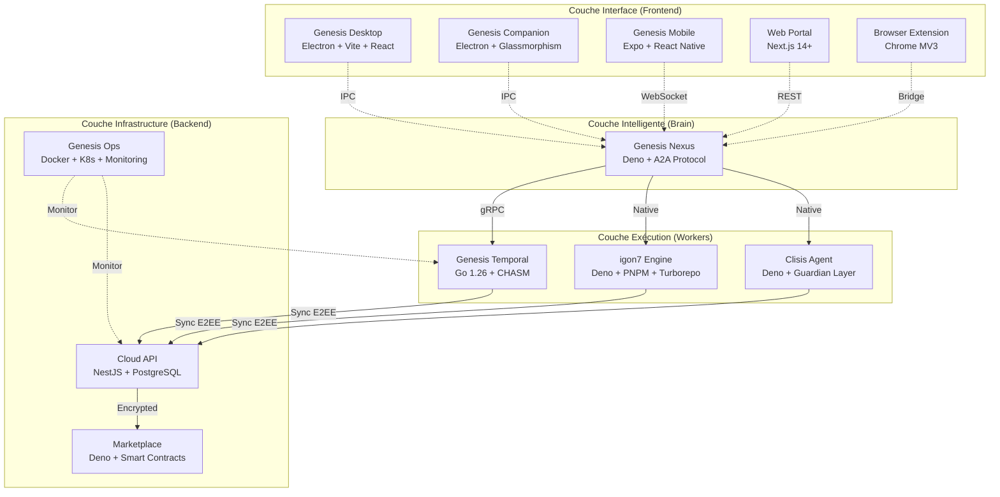
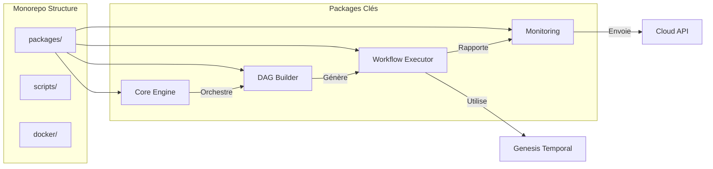
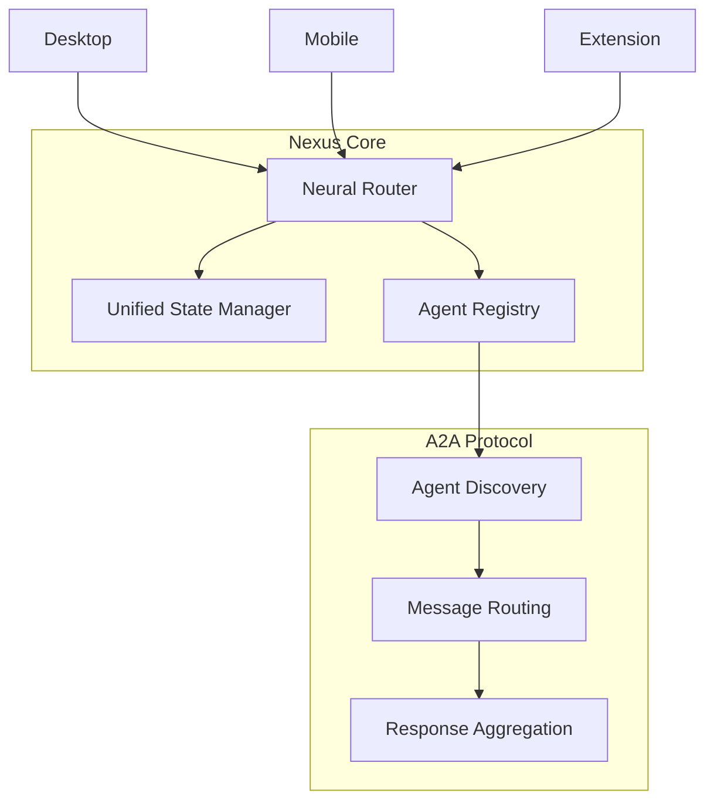
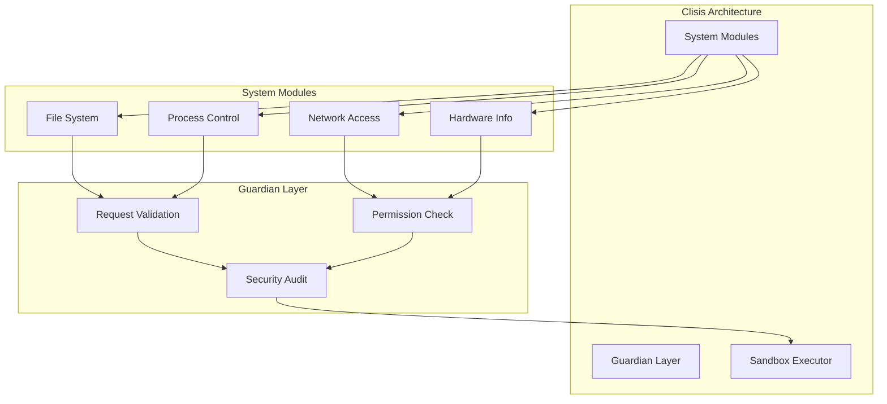
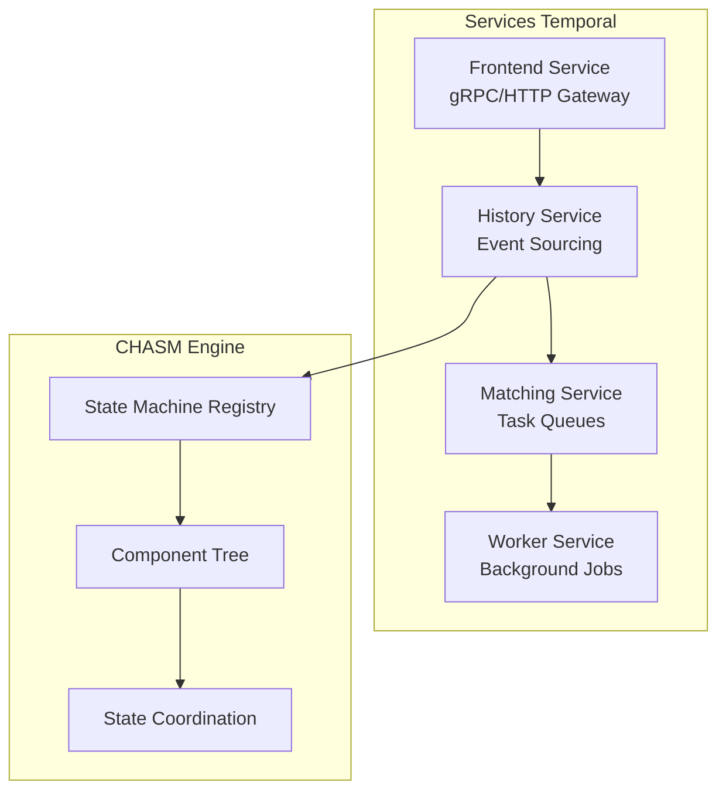
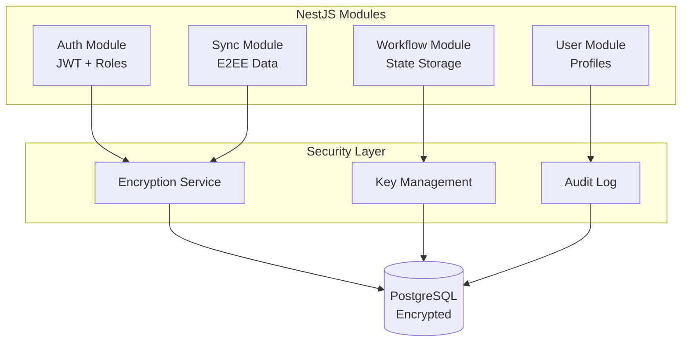
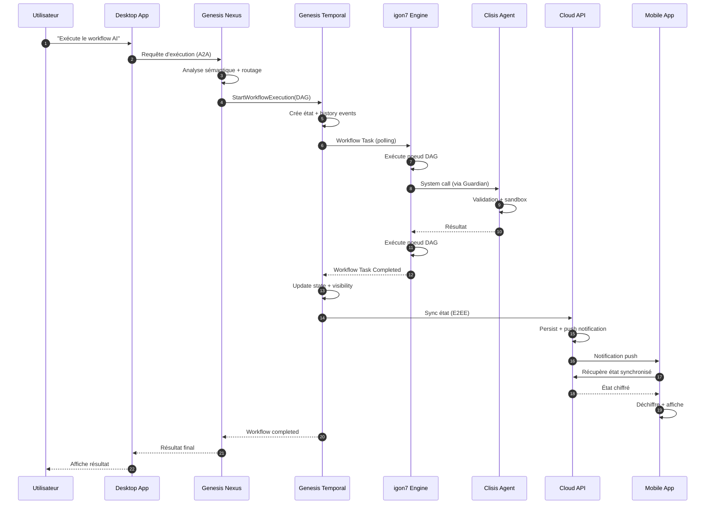
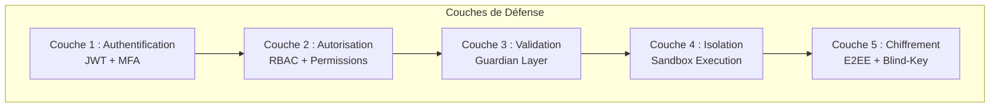
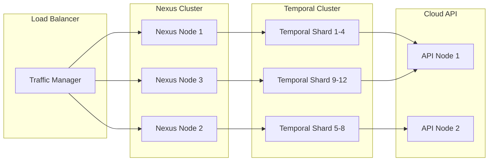
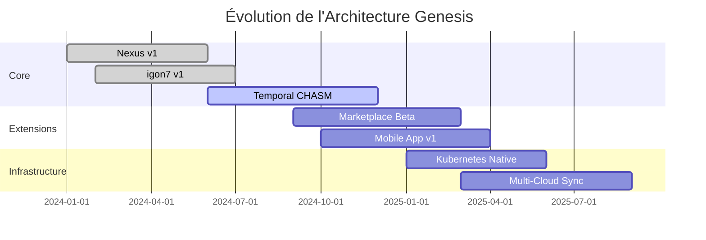

# Architecture du Système Genesis

Cette page présente une vue d'ensemble approfondie de l'architecture du système Genesis AI, de ses composants interconnectés et des principes de conception qui guident son développement.

---

## 🏛️ Vue d'ensemble Architecturale

Genesis AI suit une **architecture distribuée en couches** où chaque projet joue un rôle spécifique dans le flux de traitement des requêtes AI et de l'orchestration de workflows.

### Principes Architecturaux Fondamentaux

1. **Séparation des préoccupations** : Chaque projet a une responsabilité unique et bien définie
2. **Couplage lâche** : Les projets communiquent via des protocoles standardisés (A2A, gRPC, REST)
3. **Exécution durable** : Tous les workflows critiques sont persistés et reprenables
4. **Zero-Knowledge** : Les données sensibles restent chiffrées de bout en bout
5. **Local-First** : Priorité à l'exécution locale avec synchronisation cloud optionnelle

---

## 🗺️ Carte des Projets

---

## 📐 Diagrammes par Projet

### 1. igon7 Engine - Architecture DAG

**Flux de traitement :**
1. L'utilisateur définit un workflow DAG
2. Le DAG Builder valide et optimise le graphe
3. Le Core Engine orchestre l'exécution via Temporal
4. Le Monitoring tracke la progression et les erreurs

---

### 2. Genesis Nexus - Protocole A2A

**Fonctionnement du routage neural :**
1. La requête utilisateur est analysée sémantiquement
2. Le Neural Router identifie les agents compétents
3. Les messages sont routés via A2A Protocol
4. Les réponses sont agrégées et retournées

---

### 3. Clisis Agent - Guardian Layer

**Flux de sécurité :**
1. Chaque requête système passe par le Guardian Layer
2. Validation des permissions et du contexte
3. Audit de sécurité avant exécution
4. Exécution dans un environnement sandboxé

---

### 4. Genesis Temporal - CHASM Layer

**Cycle de vie d'un workflow :**
1. Frontend reçoit la requête de démarrage
2. History crée l'état initial et l'event log
3. Matching queue les tâches pour les workers
4. Worker exécute et rapporte la complétion
5. CHASM coordonne les machines à états multiples

---

### 5. Cloud API - Zero-Knowledge Sync

**Flux de synchronisation :**
1. Les données sont chiffrées côté client avant envoi
2. Cloud API stocke les données chiffrées sans les déchiffrer
3. La synchronisation push notifie les autres appareils
4. Chaque appareil déchiffre localement avec ses clés

---

## 🔄 Flux de Données Complets

### Scénario : Exécution d'un Workflow AI

---

## 🛡️ Architecture de Sécurité

### Modèle de Confiance Zéro

### Détail des Couches

| Couche | Mécanisme | Protection |
|--------|-----------|------------|
| **L1** | JWT + MFA | Authentification forte des utilisateurs |
| **L2** | RBAC | Contrôle d'accès basé sur les rôles |
| **L3** | Guardian | Validation contextuelle des requêtes |
| **L4** | Sandbox | Isolation des processus agents |
| **L5** | E2EE | Chiffrement des données sensibles |

---

## 📊 Stratégies de Scaling

### Scaling Horizontal

### Points de Scaling

1. **Nexus** : Partitionnement par namespace d'agents
2. **Temporal** : Augmentation des shards (défaut: 4, max: 128+)
3. **Cloud API** : Réplication PostgreSQL + read replicas
4. **igon7** : Workers distribués sur plusieurs noeuds

---

## 🔧 Points d'Intégration

### APIs Exposées

| Projet | API | Protocole | Port |
|--------|-----|-----------|------|
| **Nexus** | A2A Protocol | WebSocket/gRPC | 8080/9090 |
| **Temporal** | Workflow API | gRPC/HTTP | 7233/7243 |
| **Cloud API** | REST API | HTTPS | 3000 |
| **Marketplace** | Blockchain RPC | JSON-RPC | 8545 |
| **Desktop** | IPC Local | Unix Socket/Named Pipe | - |

### SDK Disponibles

- **TypeScript SDK** : Généré depuis OpenAPI (Cloud API)
- **Go SDK** : Temporal client natif
- **Deno SDK** : Wrapper pour A2A Protocol
- **Python SDK** : En développement

---

## 🎯 Décisions Architecturales Clés

### 1. Pourquoi Deno pour igon7 et Nexus ?

- **Sécurité native** : Permissions explicites (fs, net, env)
- **TypeScript first** : Typage fort sans configuration
- **Module URL** : Imports directs depuis CDN
- **Runtime moderne** : Top-level await, ES modules

### 2. Pourquoi Go pour Temporal ?

- **Performance** : Compilation native, goroutines légères
- **Écosystème Temporal** : Serveur de référence en Go
- **Concurrency** : Modèle CSP idéal pour workflows
- **Stabilité** : ABI stable, déploiement simple

### 3. Pourquoi NestJS pour Cloud API ?

- **Architecture modulaire** : Injection de dépendances
- **TypeScript** : Typage end-to-end
- **Écosystème** : Guards, interceptors, pipes intégrés
- **Scalabilité** : Utilisable avec microservices

### 4. Pourquoi Electron pour Desktop ?

- **Cross-platform** : Code unique pour Windows/macOS/Linux
- **Intégration Nexus** : Embedding direct du runtime Deno
- **UI riche** : React + Vite pour performances
- **IPC sécurisé** : Isolation main/renderer processes

---

## 📈 Évolution Future

### Roadmap Architecturale

---

## 📚 Références

- [Documentation igon7](./igon7-engine/overview)
- [Documentation Nexus](./genesis-nexus/overview)
- [Documentation Temporal](./genesis-temporal/overview)
- [Design System](https://github.com/genesisAI4/genesis-core/blob/main/DESIGN_SYSTEM.md)
- [AGENTS.md](https://github.com/genesisAI4/genesis_deno/blob/main/AGENTS.md)
