# Concepts Fondamentaux de Genesis AI

Ce document présente les concepts clés que vous devez comprendre pour maîtriser l'écosystème Genesis AI.

---

## 🧠 Intelligence Artificielle Distribuée

### Qu'est-ce qu'un Agent AI ?

Un **agent AI** dans Genesis est une entité autonome capable de :
- **Percevoir** son environnement via des capteurs ou des APIs
- **Raisonner** sur l'état du monde et les objectifs
- **Agir** via des outils, des APIs, ou des commandes système
- **Apprendre** des résultats de ses actions

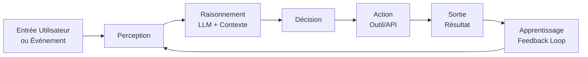

### Multi-Agent Systems (MAS)

Genesis utilise une **architecture multi-agents** où plusieurs agents spécialisés collaborent :

| Type d'Agent | Rôle | Exemple |
|--------------|------|---------|
| **Orchestrator** | Coordonne les autres agents | Nexus Router |
| **Specialist** | Expert dans un domaine | Code Writer, Data Analyst |
| **Executor** | Exécute des actions | Clisis System Agent |
| **Validator** | Vérifie la qualité | Guardian Layer |
| **Monitor** | Surveille l'exécution | Temporal Worker |

---

## 🔄 Workflows et Orchestration

### Qu'est-ce qu'un Workflow ?

Un **workflow** est une séquence orchestrée de tâches qui transforme une entrée en sortie. Dans Genesis, les workflows sont :

- **Déclaratifs** : Vous décrivez le "quoi", pas le "comment"
- **Durables** : Ils survivent aux redémarrages et pannes
- **Observables** : Chaque étape est tracée et monitorée
- **Composables** : Les workflows peuvent en appeler d'autres

### Directed Acyclic Graph (DAG)

Les workflows Genesis sont modélisés comme des **DAG** (Graphes Orientés Acycliques) :

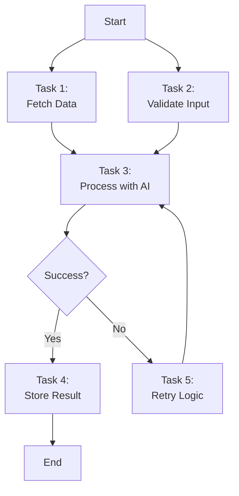

**Caractéristiques d'un DAG :**
- **Noeuds** : Tâches individuelles à exécuter
- **Arêtes** : Dépendances entre tâches
- **Acyclique** : Pas de boucles infinies (les retries sont gérés explicitement)
- **Orienté** : Flux d'exécution unidirectionnel

---

## 🔐 Zero-Knowledge Architecture

### Principe Fondamental

Le **zero-knowledge** signifie que le serveur cloud ne voit **jamais** vos données en clair. Seuls vous (et vos appareils de confiance) possédez les clés de déchiffrement.

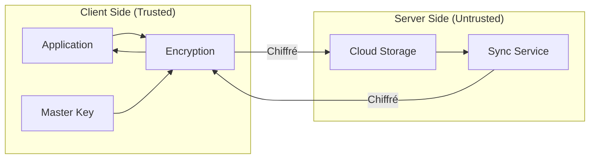

### Implémentation dans Genesis

1. **Génération de clés** : Chaque utilisateur génère une master key locale
2. **Chiffrement client** : Les données sont chiffrées AVANT envoi au cloud
3. **Stockage aveugle** : Cloud API stocke des blobs chiffrés
4. **Synchronisation** : Les autres appareils déchiffrent avec leurs clés
5. **Renouvellement** : Rotation périodique des clés sans perte de données

### Algorithmes Utilisés

| Usage | Algorithme | Taille de clé |
|-------|------------|---------------|
| **Chiffrement données** | AES-256-GCM | 256 bits |
| **Échange de clés** | X25519 (ECDH) | 256 bits |
| **Signature** | Ed25519 | 256 bits |
| **Hachage** | SHA-256 | 256 bits |
| **Dérivation de clés** | HKDF-SHA256 | Variable |

---

## 🎯 A2A Protocol (Agent-to-Agent)

### Vue d'ensemble

**A2A** est le protocole de communication inter-agents développé pour Genesis. Il permet à des agents hétérogènes de :
- Se **découvrir** mutuellement
- **Router** des messages de manière intelligente
- **Négocier** des tâches et responsabilités
- **Agréger** des réponses multiples

### Message Format

```typescript
interface A2AMessage {
  id: string;              // UUID unique
  from: AgentId;           // Expéditeur
  to: AgentId | Broadcast; // Destinataire
  type: MessageType;       // Request, Response, Event
  intent: string;          // Intention sémantique
  payload: unknown;        // Données du message
  context: Context;        // Contexte d'exécution
  timestamp: number;       // Unix timestamp
  signature: string;       // Signature cryptographique
}
```

### Routing Neural

Le **Neural Router** de Nexus utilise l'IA pour déterminer le meilleur agent destinataire :

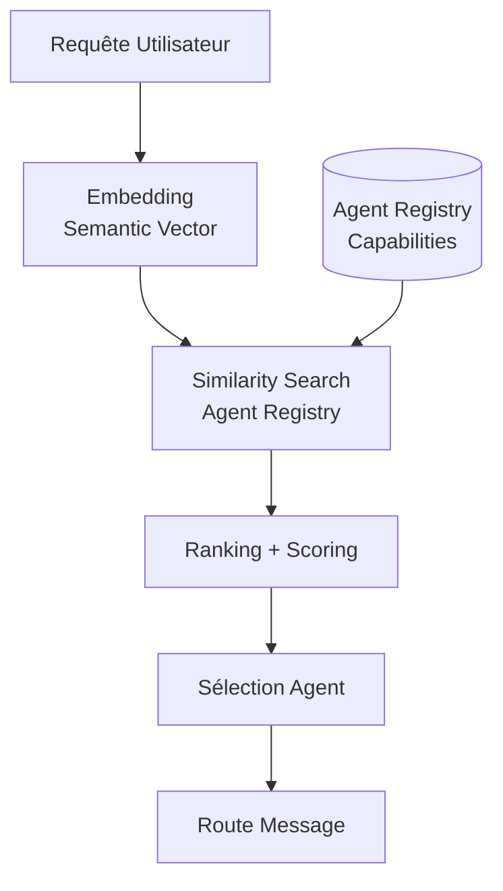

---

## 🛡️ Guardian Layer

### Rôle du Guardian

Le **Guardian Layer** est un système de validation de sécurité qui intercepte toutes les requêtes sensibles avant exécution.

### Flux de Validation

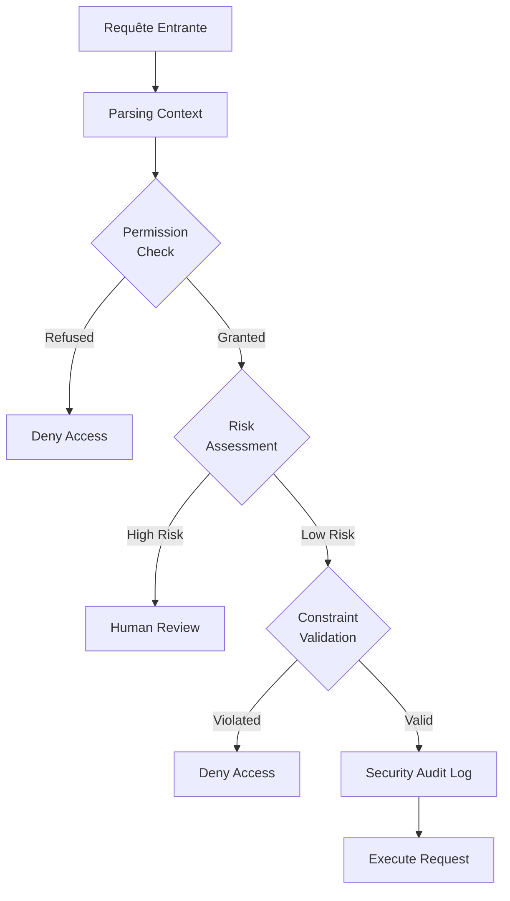

### Types de Contraintes

| Contrainte | Description | Exemple |
|------------|-------------|---------|
| **Path Restriction** | Limite les chemins de fichiers accessibles | `/home/user/*` uniquement |
| **Command Whitelist** | Commandes système autorisées | `ls`, `cat`, `grep` |
| **Network Allowlist** | Domaines réseau accessibles | `api.github.com` uniquement |
| **Resource Quota** | Limites de ressources (CPU, RAM) | Max 2GB RAM, 50% CPU |
| **Time Window** | Fenêtres temporelles d'exécution | 9h-18h uniquement |

---

## 📦 Sandboxed Execution

### Pourquoi la Sandbox ?

Chaque agent s'exécute dans un **environnement isolé** pour :
- **Prévenir les effets de bord** : Un agent ne peut pas corrompre un autre
- **Limiter les dégâts** : Un bug ou une attaque est contenue
- **Contrôler les ressources** : CPU, RAM, I/O sont limités
- **Auditer l'exécution** : Toutes les actions sont loguées

### Implémentation Deno

Genesis utilise **Deno** pour son modèle de sécurité natif :

```typescript
// Exécution avec permissions limitées
// deno run --allow-read=/tmp --allow-net=api.github.com agent.ts

Deno.permissions.query({ name: "read", path: "/etc" });
// → { state: "denied" }

Deno.permissions.query({ name: "read", path: "/tmp" });
// → { state: "granted" }
```

### Isolation Levels

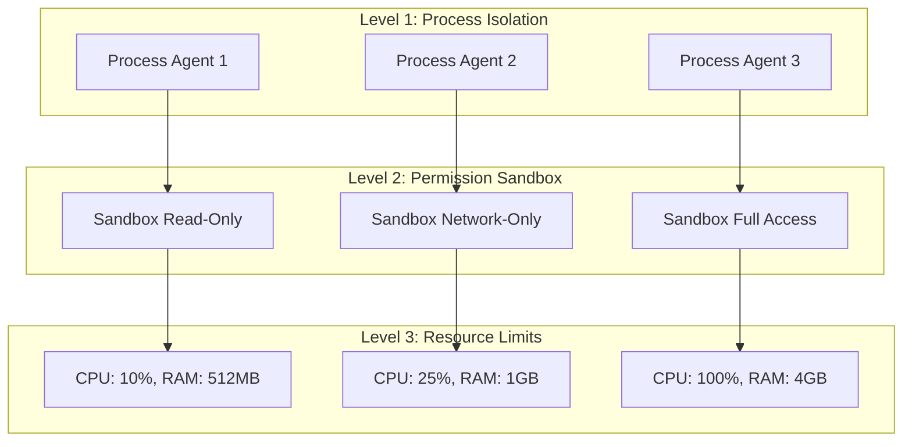

---

## 🔄 Durable Execution

### Définition

Une **exécution durable** est une exécution qui garantit la complétion même en cas de :
- Panne de courant
- Redémarrage du serveur
- Erreurs réseau temporaires
- Crash de l'application

### Mécanisme Temporal

Genesis Temporal utilise l'**event sourcing** pour la durabilité :

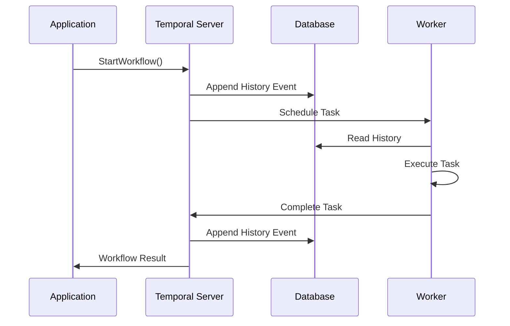

### Garanties

| Garantie | Description |
|----------|-------------|
| **At-least-once** | Les tâches sont exécutées au moins une fois |
| **Idempotency** | Les tâches dupliquées n'ont pas d'effet supplémentaire |
| **Timeout** | Les tâches trop longues sont automatiquement annulées |
| **Retry** | Les tâches échouées sont automatiquement retentées |
| **Cron** | Les workflows peuvent être planifiés périodiquement |

---

## 🔗 Blind-Key Execution

### Concept

Le **Blind-Key** est un mécanisme permettant d'exécuter des workflows nécessitant des credentials **sans jamais exposer ces credentials** à l'agent qui les utilise.

### Fonctionnement

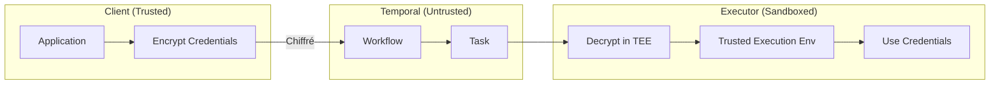

### Cas d'Usage

- **API Keys** : Appeler des APIs externes sans les exposer
- **Database Credentials** : Se connecter à des bases de données
- **OAuth Tokens** : Refresh tokens automatiquement
- **SSH Keys** : Connexion à des serveurs distants

---

## 📊 Unified State Management

### État Global Genesis

L'**état unifié** est une vue cohérente et synchronisée de tous les composants du système :

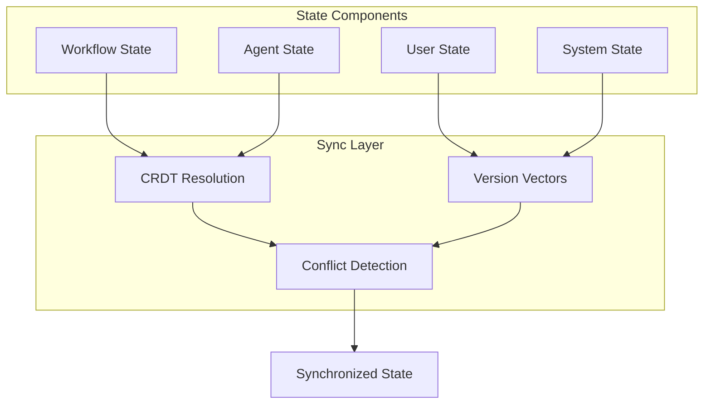

### CRDT (Conflict-free Replicated Data Types)

Genesis utilise des **CRDT** pour la synchronisation sans conflit :

- **G-Counter** : Compteur qui ne fait qu'incrémenter
- **PN-Counter** : Compteur qui incrémente et décrémente
- **LWW-Register** : Register Last-Writer-Wins
- **OR-Set** : Set d'éléments uniques avec ajout/suppression

### Exemple de Code

```typescript
import { CRDTCounter } from "@genesis/crdt";

const counter = new CRDTCounter("workflow-executions");

// Incrément local (pas de lock nécessaire)
counter.increment();
counter.increment();

// Synchronisation avec un autre noeud
const remoteState = await fetchRemoteState();
counter.merge(remoteState);

// Résultat cohérent sans conflit
console.log(counter.value); // → 4 (si remote avait 2)
```

---

## 🎨 Design Tokens

### Système de Design

Genesis utilise un **design system** basé sur des tokens :

```typescript
// DESIGN_SYSTEM.md
const tokens = {
  colors: {
    primary: {
      50: "#E3F2FD",
      100: "#BBDEFB",
      // ...
      900: "#0D47A1",
    },
    glass: {
      background: "rgba(255, 255, 255, 0.1)",
      border: "rgba(255, 255, 255, 0.2)",
      blur: "20px",
    },
  },
  spacing: {
    xs: "4px",
    sm: "8px",
    md: "16px",
    lg: "24px",
    xl: "32px",
  },
  typography: {
    fontFamily: {
      primary: "Inter, sans-serif",
      mono: "JetBrains Mono, monospace",
    },
    fontSize: {
      xs: "12px",
      sm: "14px",
      // ...
    },
  },
};
```

---

## 📈 Monitoring et Observabilité

### Trois Piliers

Genesis implémente les **trois piliers de l'observabilité** :

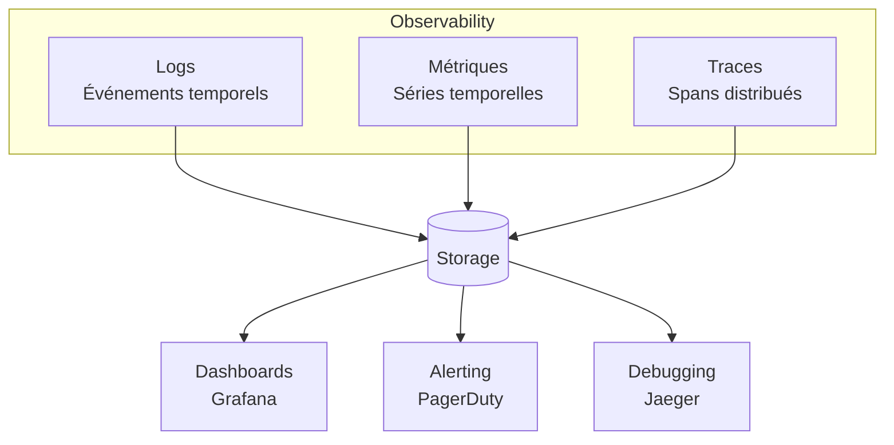

### Métriques Clés

| Catégorie | Métrique | Description |
|-----------|----------|-------------|
| **Performance** | Latency P99 | 99ème percentile de latence |
| **Performance** | Throughput | Requêtes par seconde |
| **Fiabilité** | Error Rate | Pourcentage de requêtes en erreur |
| **Fiabilité** | Availability | Pourcentage de temps uptime |
| **Business** | Workflow Success | Taux de réussite des workflows |
| **Business** | Agent Utilization | Utilisation des agents |

---

## 🧪 Testing et Simulation

### Stratégie de Test

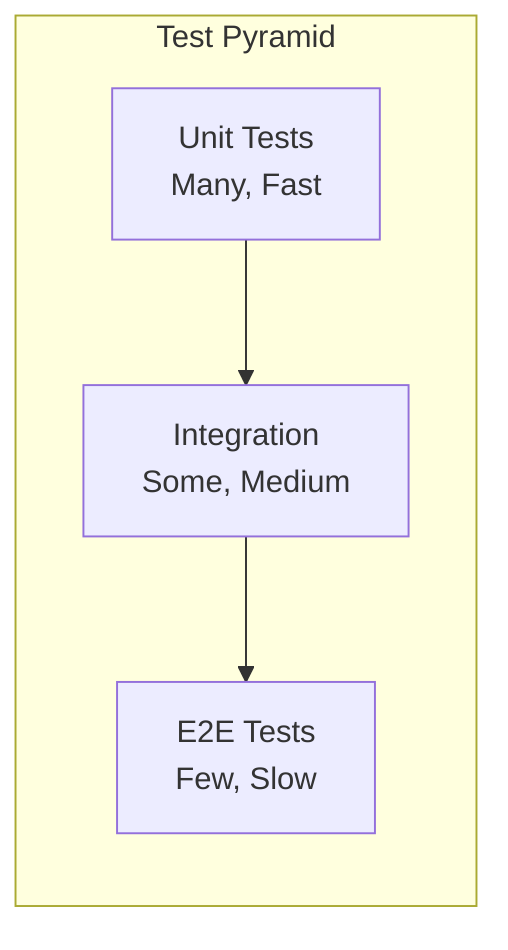

### Simulations Nexus

Genesis Nexus inclut des **scripts de simulation** pour tester des scénarios complexes :

```typescript
// simulation_scenario.ts
import { SimulationEngine } from "@genesis/nexus";

const scenario = {
  name: "High Load Agent Routing",
  agents: 100,
  requestsPerSecond: 1000,
  duration: "5m",
  chaos: {
    networkLatency: "100-500ms",
    agentFailures: 0.05, // 5% failure rate
  },
};

const engine = new SimulationEngine(scenario);
await engine.run();
await engine.report(); // → Metrics, bottlenecks, recommendations
```

---

## 📚 Références

- [A2A Protocol Specification](./genesis-nexus/a2a-protocol)
- [Security Model Deep Dive](./introduction/security-model)
- [Workflow Patterns](./advanced/workflow-patterns)
- [Testing Best Practices](./contributing/testing)
