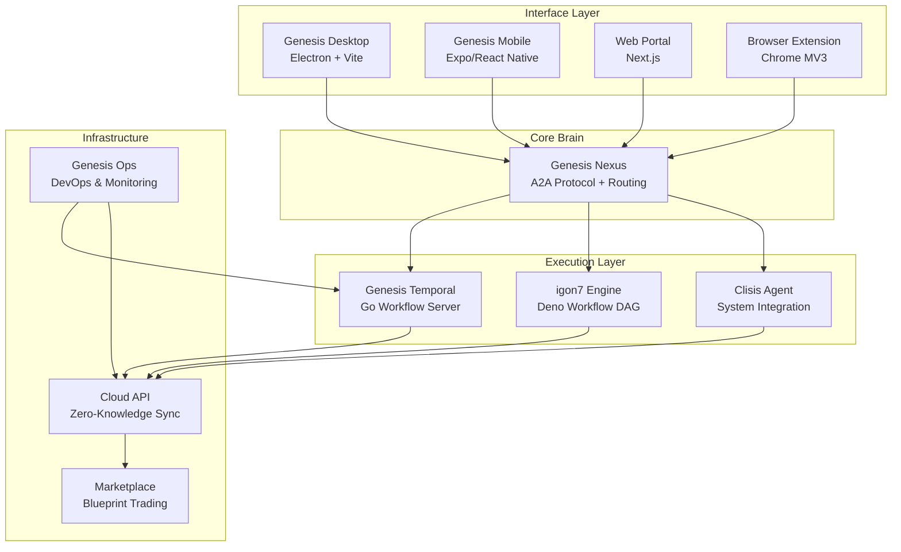
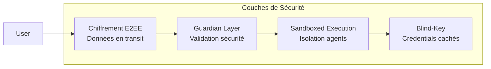
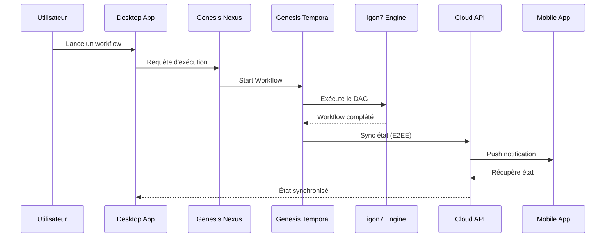

# Genesis AI - Documentation Complète

**Bienvenue dans la documentation officielle de Genesis AI** - l'écosystème d'orchestration AI distribué de nouvelle génération.

## 🌐 Vue d'ensemble

Genesis AI est une plateforme unifiée d'intelligence artificielle composée de **12 projets interconnectés** formant un écosystème distribué complet. Chaque projet joue un rôle spécifique dans l'orchestration, l'exécution, et la coordination des workflows AI.

### 🎯 Objectif Principal

Fournir un **assistant personnel AI universel** capable de :
- Orchestrer des workflows complexes via des DAG (Directed Acyclic Graphs)
- Exécuter des agents AI de manière sandboxée et sécurisée
- Synchroniser les états entre appareils avec chiffrement zero-knowledge
- Offrir des interfaces luxueuses et réactives (Desktop, Mobile, Web)
- Permettre l'échange de blueprints d'agents via un marketplace décentralisé

---

## 🏗️ Architecture du Système



---

## 📦 Les 12 Projets Genesis

### 1. **igon7 Engine** (Deno + PNPM)
**Rôle :** Moteur d'orchestration de workflows DAG

- **Runtime :** Deno avec gestion de packages PNPM
- **Architecture :** Monorepo Turborepo avec packages multiples
- **Fonctionnalité :** Orchestration de workflows basés sur des graphes orientés acycliques
- **Intégration :** S'exécute sur Temporal pour l'exécution durable
- **Cas d'usage :** Workflows AI complexes, pipelines de données, automations

📖 [Documentation détaillée →](./igon7-engine/overview)

---

### 2. **Genesis Nexus** (Deno)
**Rôle :** Cerveau central - Routage neural et protocole A2A

- **Runtime :** Deno
- **Protocole :** A2A (Agent-to-Agent) pour communication inter-agents
- **Fonctionnalité :** Routage neural des requêtes vers les agents appropriés
- **État :** Gestion unifiée de l'état global du système
- **Simulations :** Scripts de test et simulation de scénarios

📖 [Documentation détaillée →](./genesis-nexus/overview)

---

### 3. **Clisis Agent** (Deno)
**Rôle :** Agent système - Interaction OS et matériel

- **Runtime :** Deno
- **Sécurité :** Guardian Layer pour validation sécurisée
- **Fonctionnalité :** Contrôle système, accès hardware, exécution sandboxée
- **Isolation :** Environnements d'exécution isolés pour agents
- **Cas d'usage :** Automatisation système, gestion de fichiers, contrôle OS

📖 [Documentation détaillée →](./clisis-agent/overview)

---

### 4. **Genesis Temporal** (Go)
**Rôle :** Serveur de workflows durables

- **Runtime :** Go 1.26.0
- **Base :** Fork de Temporal Server optimisé pour Genesis
- **Fonctionnalité :** Exécution durable avec garanties de cohérence
- **Couche CHASM :** Coordination de machines à états hétérogènes
- **Persistance :** SQLite (local) ou PostgreSQL (production)

📖 [Documentation détaillée →](./genesis-temporal/overview)

---

### 5. **Genesis Cloud API** (Node.js + NestJS)
**Rôle :** Hub de synchronisation zero-knowledge

- **Runtime :** Node.js avec framework NestJS
- **Sécurité :** Chiffrement de bout en bout (E2EE)
- **Fonctionnalité :** Synchronisation d'état entre appareils
- **Base de données :** PostgreSQL avec migrations
- **Auth :** JWT-based avec rôles et permissions

📖 [Documentation détaillée →](./cloud-api/overview)

---

### 6. **Genesis Desktop** (Electron + Vite)
**Rôle :** Application desktop principale

- **Framework :** Electron avec bundler Vite
- **UI :** React + TypeScript avec design glassmorphism
- **Intégration :** Nexus embarqué en local
- **IPC :** Communication secure entre main et renderer processes
- **Build :** Packaging multi-plateforme (Windows, macOS, Linux)

📖 [Documentation détaillée →](./desktop-apps/genesis-desktop)

---

### 7. **Genesis Companion** (Electron)
**Rôle :** Interface desktop secondaire

- **Framework :** Electron
- **UI :** Design glassmorphism prestige
- **Fonctionnalité :** Vue complémentaire et contrôles rapides
- **Sync :** Connexion au Nexus local ou distant

📖 [Documentation détaillée →](./desktop-apps/genesis-companion)

---

### 8. **Genesis Mobile** (Expo/React Native)
**Rôle :** Cockpit de validation à distance

- **Framework :** Expo avec React Native
- **UI :** Composants natifs iOS et Android
- **Fonctionnalité :** Validation de workflows, monitoring
- **Connexion :** Nexus local ou cloud API
- **Build :** EAS Build pour déploiement stores

📖 [Documentation détaillée →](./mobile-app/overview)

---

### 9. **Genesis Web Portal** (Next.js)
**Rôle :** Portail web et landing page

- **Framework :** Next.js 14+ avec App Router
- **Fonctionnalités :** Landing page + cloud app
- **Auth :** Intégration avec Cloud API
- **SEO :** Optimisé pour les moteurs de recherche
- **Deploy :** Vercel ou hébergement personnalisé

📖 [Documentation détaillée →](./web-portal/overview)

---

### 10. **Genesis Extension** (Chrome MV3)
**Rôle :** Extension navigateur pour injection de contexte

- **Platform :** Chrome Manifest V3
- **Fonctionnalité :** Injection de contexte dans les pages web
- **Bridge :** Protocole de communication avec Nexus local
- **Permissions :** Accès contrôlé et minimal
- **Cas d'usage :** Enrichissement de contexte pour agents AI

📖 [Documentation détaillée →](./browser-extension/overview)

---

### 11. **Genesis Marketplace** (Deno)
**Rôle :** Marketplace décentralisé de blueprints d'agents

- **Runtime :** Deno
- **Fonctionnalité :** Achat/vente de blueprints d'agents
- **Encryption :** Blueprints chiffrés avant publication
- **Smart Contracts :** Exécution décentralisée des transactions
- **Monétisation :** Système de royalties pour créateurs

📖 [Documentation détaillée →](./marketplace/overview)

---

### 12. **Genesis Ops** (Shell/Docker)
**Rôle :** Infrastructure DevOps et monitoring

- **Outils :** Docker, Kubernetes, Shell scripts
- **Fonctionnalité :** Déploiement, monitoring, gouvernance
- **CI/CD :** Pipelines automatisés
- **Monitoring :** Prometheus, Grafana, alerting
- **Sécurité :** Hardening et audits automatisés

📖 [Documentation détaillée →](./genesis-ops/overview)

---

## 🔐 Modèle de Sécurité

Genesis AI implémente un **modèle de sécurité zero-knowledge** avec plusieurs couches de protection :



### Principes Clés :

1. **Zero-Knowledge Architecture** : Le cloud ne voit jamais les données en clair
2. **Guardian Layer** : Validation sécurité dans Clisis et Nexus
3. **Sandboxed Execution** : Chaque agent s'exécute dans un environnement isolé
4. **Blind-Key Execution** : Les credentials de workflow ne sont jamais exposés

📖 [Modèle de sécurité détaillé →](./introduction/security-model)

---

## 🚀 Démarrage Rapide

### Prérequis

- **Deno** v1.40+ pour les projets Deno
- **Node.js** v20+ pour les projets Node.js
- **Go** 1.26+ pour Genesis Temporal
- **PNPM** pour le monorepo igon7
- **Docker** pour le déploiement infrastructure

### Installation Rapide

```bash
# 1. Cloner le dépôt
git clone https://github.com/genesisAI4/genesis-docs.git
cd genesis_deno

# 2. Installer les dépendances igon7
cd igon7_deno && pnpm install

# 3. Installer les dépendances mobile
cd ../genesis-mobile && npm install

# 4. Installer les dépendances cloud-api
cd ../genesis-cloud-api && npm install

# 5. Démarrer Genesis Temporal (Go)
cd ../genesis-temporal
make start

# 6. Démarrer le Nexus
cd ../genesis-nexus
deno task dev
```

📖 [Guide d'installation complet →](./getting-started/installation)

---

## 📊 Flux de Données



---

## 🎨 Design System

Genesis AI utilise un **design system unifié** basé sur :

- **Glassmorphism** : Effets de verre dépoli pour une esthétique premium
- **Material Design 3** : Principes de design Google modernisés
- **Tailwind CSS** : Utility-first CSS pour un styling cohérent
- **Framer Motion** : Animations fluides et réactives
- **Radix UI** : Composants accessibles et sans style

📖 [Design System complet →](https://github.com/genesisAI4/genesis-core/blob/main/DESIGN_SYSTEM.md)

---

## 📚 Ressources Additionnelles

- [Guide de contribution](./contributing/development-setup)
- [Standards de code](./contributing/coding-standards)
- [Référence API](./api-reference/overview)
- [Exemples de workflows](./igon7-engine/examples)
- [Dépannage](./advanced/troubleshooting)

---

## 🤝 Communauté

- **Discord :** [Rejoindre la communauté](https://discord.gg/genesisai)
- **X (Twitter) :** [@genesis_ai](https://x.com/genesis_ai)
- **GitHub :** [github.com/genesisAI4](https://github.com/genesisAI4)

---

## 📄 Licence

Genesis AI est distribué sous licence MIT. Consultez le fichier `LICENSE` dans chaque dépôt de projet.

---

**Prêt à commencer ?** → [Guide de démarrage rapide](./getting-started/quickstart)
