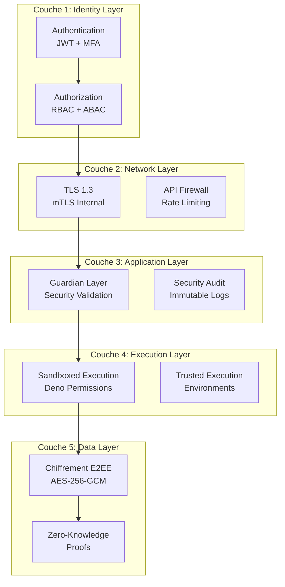
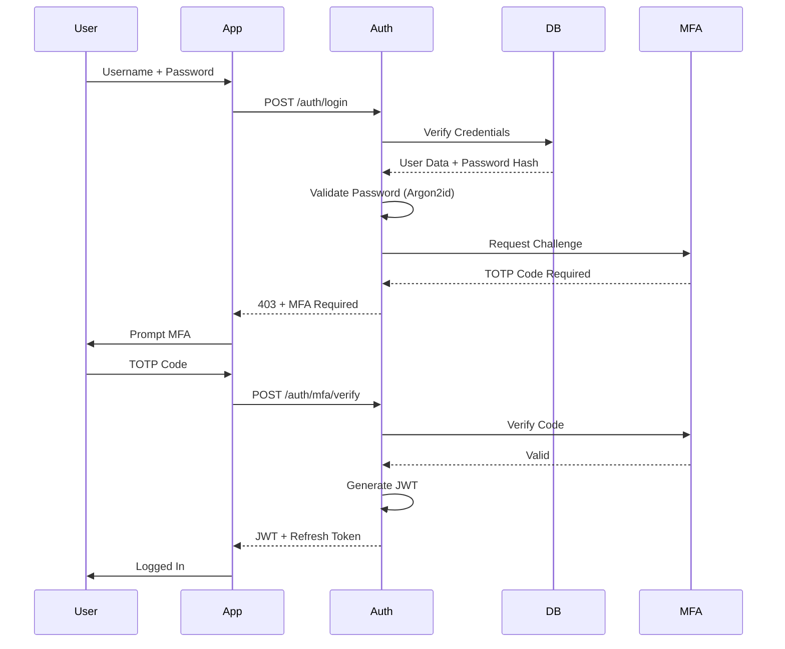
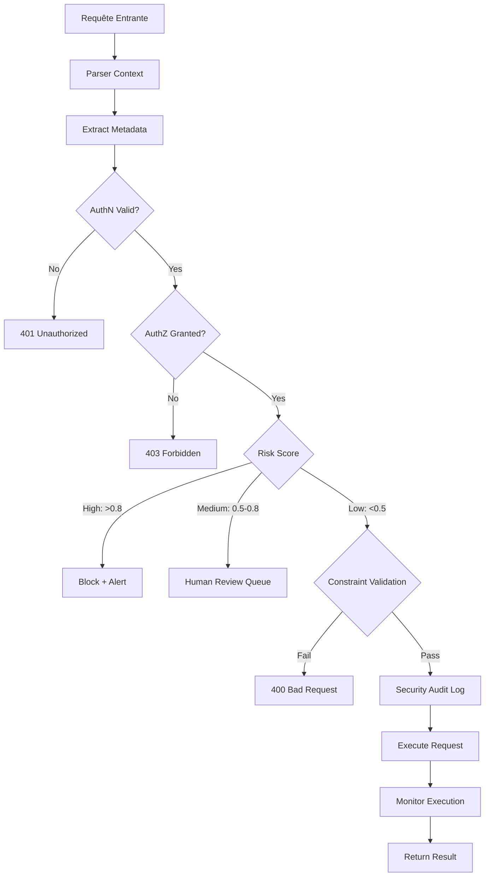
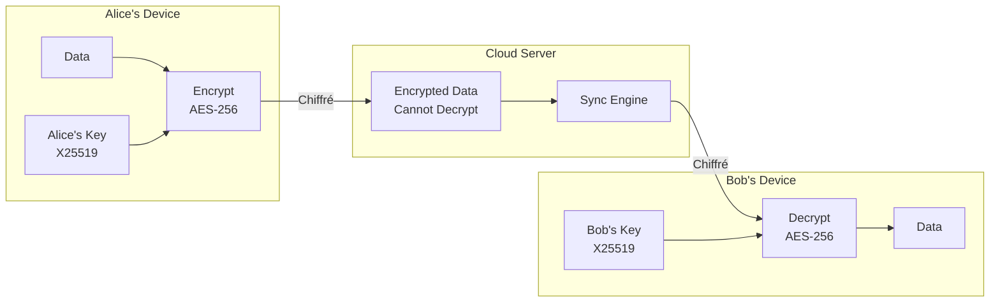
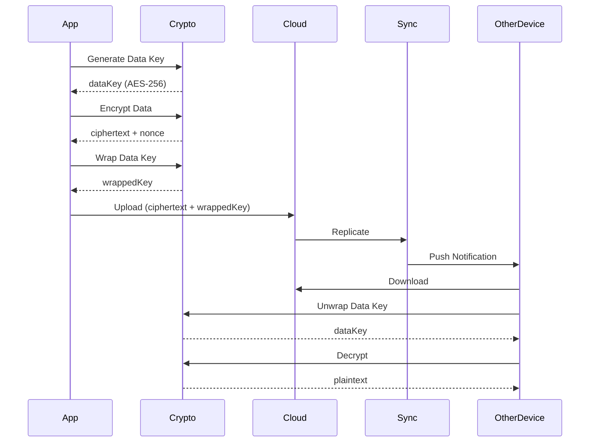
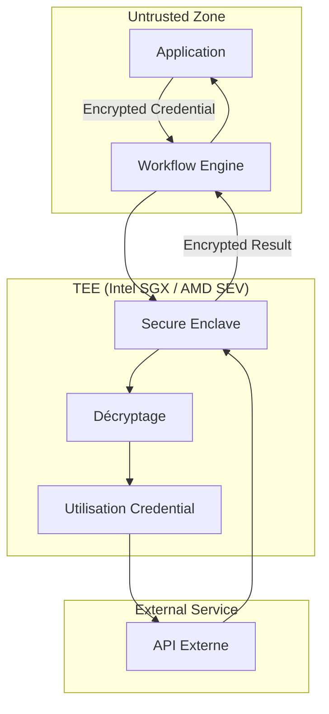
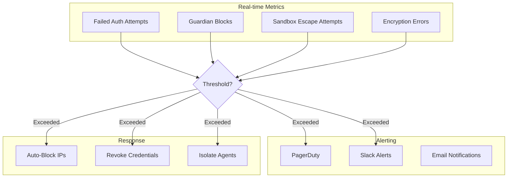
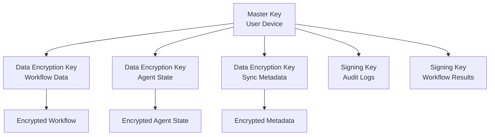

# Modèle de Sécurité Genesis

La sécurité est **fondamentale** dans l'architecture de Genesis AI. Ce document détaille notre approche de sécurité zero-knowledge, nos couches de protection, et nos garanties de confidentialité.

---

## 🏰 Architecture de Sécurité en Profondeur

Genesis implémente une **défense en profondeur** avec 5 couches de sécurité superposées :



---

## 🔑 Couche 1 : Authentification (AuthN)

### JWT-Based Authentication

Genesis utilise des **JSON Web Tokens (JWT)** pour l'authentification :

```typescript
interface GenesisJWT {
  header: {
    alg: "RS256" | "ES256";
    typ: "JWT";
    kid: string; // Key ID
  };
  payload: {
    sub: string;        // User ID
    iss: "genesis-ai";  // Issuer
    aud: string[];      // Audience (services)
    exp: number;        // Expiration
    iat: number;        // Issued At
    jti: string;        // JWT ID (unique)
    roles: string[];    // User Roles
    permissions: string[]; // Fine-grained Permissions
    mfa_verified: boolean; // MFA Status
    device_id: string;  // Device Fingerprint
  };
}
```

### Multi-Factor Authentication (MFA)

**Obligatoire** pour tous les accès sensibles :

| Méthode | Sécurité | UX | Usage |
|---------|----------|----|-------|
| **TOTP** | ⭐⭐⭐⭐ | Bonne | Authenticator apps |
| **WebAuthn** | ⭐⭐⭐⭐⭐ | Excellente | Hardware keys, Biometrics |
| **SMS** | ⭐⭐ | Moyenne | Fallback uniquement |
| **Email** | ⭐⭐ | Moyenne | Recovery uniquement |

### Flow d'Authentification



---

## 🚪 Couche 2 : Autorisation (AuthZ)

### RBAC + ABAC Hybride

Genesis combine **Role-Based Access Control (RBAC)** et **Attribute-Based Access Control (ABAC)** :

```typescript
interface Permission {
  resource: string;      // ex: "workflow", "agent", "secret"
  action: string;        // ex: "create", "read", "update", "delete"
  conditions: Condition[]; // ABAC conditions
}

interface Condition {
  attribute: string;     // ex: "workflow.owner_id"
  operator: "eq" | "ne" | "in" | "contains";
  value: unknown;
}

// Exemple de politique
const workflowPolicy: Policy = {
  role: "developer",
  permissions: [
    {
      resource: "workflow",
      action: ["create", "read", "update"],
      conditions: [
        { attribute: "workflow.owner_id", operator: "eq", value: "${user.id}" }
      ]
    },
    {
      resource: "agent",
      action: ["execute"],
      conditions: [
        { attribute: "agent.security_level", operator: "in", value: ["low", "medium"] }
      ]
    }
  ]
};
```

### Matrice des Permissions

| Rôle | Workflows | Agents | Secrets | Users |
|------|-----------|--------|---------|-------|
| **Admin** | CRUD all | CRUD all | CRUD all | CRUD all |
| **Developer** | CRUD own | Execute | Read own | Read own |
| **Viewer** | Read all | Read all | None | None |
| **Service** | Execute | Execute | Use assigned | None |

---

## 🔒 Couche 3 : Guardian Layer

### Architecture du Guardian

Le **Guardian Layer** est un middleware de sécurité qui intercepte **toutes** les requêtes :



### Risk Scoring Algorithm

```typescript
interface RiskAssessment {
  baseScore: number;     // 0-1 based on action type
  modifiers: {
    timeOfDay: number;   // +0.1 if outside business hours
    location: number;    // +0.2 if new location
    frequency: number;   // +0.3 if unusual frequency
    sensitivity: number; // +0.4 if accessing sensitive data
  };
  totalScore: number;    // Weighted sum
  
  getLevel(): "LOW" | "MEDIUM" | "HIGH" | "CRITICAL";
}

// Exemple
const risk: RiskAssessment = {
  baseScore: 0.3, // Standard API call
  modifiers: {
    timeOfDay: 0.1,    // 2 AM
    location: 0.0,     // Known IP
    frequency: 0.0,    // Normal rate
    sensitivity: 0.4,  // Accessing secrets
  },
  totalScore: 0.8,     // → HIGH RISK
};
```

### Constraints Validation

```typescript
interface SecurityConstraint {
  type: "PATH" | "COMMAND" | "NETWORK" | "RESOURCE" | "TIME";
  pattern: string;     // Regex or glob pattern
  action: "ALLOW" | "DENY" | "SANITIZE";
  message?: string;    // Error message if denied
}

const defaultConstraints: SecurityConstraint[] = [
  {
    type: "PATH",
    pattern: "/etc/**",
    action: "DENY",
    message: "Access to /etc is forbidden"
  },
  {
    type: "PATH",
    pattern: "/home/${user}/**",
    action: "ALLOW"
  },
  {
    type: "COMMAND",
    pattern: "rm -rf /",
    action: "DENY",
    message: "Dangerous command blocked"
  },
  {
    type: "NETWORK",
    pattern: "http://169.254.169.254/**", // AWS metadata
    action: "DENY",
    message: "Cloud metadata access blocked"
  },
  {
    type: "TIME",
    pattern: "Mon-Fri 09:00-18:00",
    action: "ALLOW"
  }
];
```

---

## 📦 Couche 4 : Sandboxed Execution

### Deno Security Model

Genesis exploite le **modèle de sécurité natif de Deno** :

```bash
# Permissions explicites requises
deno run \
  --allow-read=/home/user,/tmp \
  --allow-write=/tmp \
  --allow-net=api.github.com,api.openai.com \
  --allow-env=OPENAI_API_KEY \
  --allow-run=git,npm \
  agent.ts
```

### Isolation Architecture

```mermaid
graph TB
    subgraph "Host System"
        Kernel[OS Kernel]
        FS[File System]
        Net[Network Stack]
    end

    subgraph "Deno Runtime"
        V8[V8 JavaScript Engine]
        Perm[Permission Manager]
        Ops[Ops (System Calls)]
    end

    subgraph "Agent Sandbox"
        Agent[Agent Code]
        Limit[Resource Limits]
        Monitor[Execution Monitor]
    end

    Kernel --> V8
    V8 --> Perm
    Perm --> Ops
    Ops --> FS
    Ops --> Net
    
    Agent --> V8
    Limit --> V8
    Monitor --> Perm
```

### Resource Quotas

```typescript
interface ResourceQuota {
  cpu: {
    maxPercent: number;    // Max CPU % (0-100)
    maxCores: number;      // Max CPU cores
  };
  memory: {
    maxBytes: number;      // Max RAM in bytes
    gcThreshold: number;   // GC trigger threshold
  };
  disk: {
    maxReadBytes: number;  // Max read I/O
    maxWriteBytes: number; // Max write I/O
  };
  network: {
    maxConnections: number; // Max concurrent connections
    maxBandwidth: number;   // Bytes per second
  };
  time: {
    maxDuration: number;   // Max execution time (ms)
    timeout: number;       // Hard timeout (ms)
  };
}

const defaultQuota: ResourceQuota = {
  cpu: { maxPercent: 50, maxCores: 2 },
  memory: { maxBytes: 1024 * 1024 * 512, gcThreshold: 400 * 1024 * 1024 }, // 512MB
  disk: { maxReadBytes: 100 * 1024 * 1024, maxWriteBytes: 50 * 1024 * 1024 }, // 100MB read, 50MB write
  network: { maxConnections: 10, maxBandwidth: 10 * 1024 * 1024 }, // 10MB/s
  time: { maxDuration: 5 * 60 * 1000, timeout: 10 * 60 * 1000 }, // 5min normal, 10min hard
};
```

---

## 🔐 Couche 5 : Chiffrement E2EE

### Architecture Zero-Knowledge



### Key Derivation

```typescript
import { hkdf } from "@std/crypto/hkdf";
import { randomBytes } from "@std/crypto/random";

// Master Key Generation
const masterKey = randomBytes(32); // 256 bits

// Derive encryption key for specific purpose
const encryptionKey = await hkdf(
  "SHA-256",
  masterKey,
  "workflow-encryption-salt",
  "workflow-encryption-info",
  32
);

// Derive signing key
const signingKey = await hkdf(
  "SHA-256",
  masterKey,
  "workflow-signing-salt",
  "workflow-signing-info",
  32
);
```

### Encryption Flow



---

## 🎭 Blind-Key Execution

### Concept

Le **Blind-Key** permet d'utiliser des credentials sensibles **sans jamais les révéler** à l'agent qui les utilise.

### Architecture TEE (Trusted Execution Environment)



### Implémentation

```typescript
interface BlindKeyConfig {
  credential: Uint8Array;  // Chiffré avec clé publique TEE
  publicKey: string;       // Clé publique du TEE
  usage: string;           // Usage autorisé
  expiry: number;          // Expiration
}

async function executeWithBlindKey<T>(
  config: BlindKeyConfig,
  executor: (credential: Uint8Array) => Promise<T>
): Promise<T> {
  // 1. Envoyer credential chiffré au TEE
  const encrypted = await encryptForTEE(config.credential, config.publicKey);
  
  // 2. TEE déchiffre et exécute dans l'enclave
  const result = await teeExecute(encrypted, async (decryptedCredential) => {
    // Cette fonction s'exécute DANS l'enclave
    return executor(decryptedCredential);
  });
  
  // 3. Résultat chiffré retourné
  return decryptResult(result);
}

// Usage
const apiKey = await executeWithBlindKey(
  {
    credential: encryptedApiKey,
    publicKey: teePublicKey,
    usage: "openai-api-call",
    expiry: Date.now() + 3600000,
  },
  async (credential) => {
    const response = await fetch("https://api.openai.com/v1/chat", {
      headers: { Authorization: `Bearer ${credential}` }
    });
    return response.json();
  }
);
// apiKey est le résultat, mais le credential n'a jamais été exposé
```

---

## 📋 Audit et Compliance

### Security Audit Log

Toutes les actions de sécurité sont journalisées dans un **log immuable** :

```typescript
interface SecurityAuditLog {
  id: string;              // UUID
  timestamp: number;       // Unix timestamp (nanoseconds)
  actor: {
    userId: string;
    deviceId: string;
    ipAddress: string;
    location: GeoLocation;
  };
  action: {
    type: string;          // ex: "WORKFLOW_EXECUTE"
    resource: string;      // ex: "workflow:123"
    details: unknown;      // Action-specific details
  };
  security: {
    riskScore: number;
    riskLevel: "LOW" | "MEDIUM" | "HIGH" | "CRITICAL";
    guardianChecks: GuardianCheck[];
    mfaVerified: boolean;
  };
  outcome: {
    success: boolean;
    errorCode?: string;
    duration: number;      // Execution time (ms)
  };
  signature: string;       // Signature cryptographique
  previousHash: string;    // Hash du log précédent (blockchain-like)
  hash: string;            // Hash de ce log
}
```

### Compliance Standards

Genesis est conçu pour être compliant avec :

| Standard | Description | Statut |
|----------|-------------|--------|
| **GDPR** | Protection données personnelles UE | ✅ Compliant |
| **SOC 2 Type II** | Contrôles de sécurité | 🟡 En cours |
| **HIPAA** | Données de santé (US) | 🟡 En cours |
| **ISO 27001** | Management de la sécurité | ⚪ Planifié |
| **PCI DSS** | Données de paiement | ⚪ Non applicable |

---

## 🛡️ Security Testing

### Chaos Testing Protocol

Genesis implémente un **protocole de chaos testing** pour valider la résilience :

```typescript
interface ChaosTestScenario {
  name: string;
  target: "NETWORK" | "COMPUTE" | "STORAGE" | "SECURITY";
  action: string;
  expectedBehavior: string;
}

const chaosScenarios: ChaosTestScenario[] = [
  {
    name: "Network Partition",
    target: "NETWORK",
    action: "Block all traffic to Cloud API for 60s",
    expectedBehavior: "Local execution continues, sync resumes after partition"
  },
  {
    name: "Credential Leak Simulation",
    target: "SECURITY",
    action: "Attempt to exfiltrate encrypted credentials",
    expectedBehavior: "Guardian blocks, alerts triggered, audit logged"
  },
  {
    name: "DDoS Attack",
    target: "NETWORK",
    action: "Flood API with 10000 req/s",
    expectedBehavior: "Rate limiting activates, legitimate traffic unaffected"
  },
  {
    name: "Sandbox Escape Attempt",
    target: "SECURITY",
    action: "Agent tries to access /etc/passwd",
    expectedBehavior: "Deno permission denied, Guardian alerted"
  }
];
```

### Penetration Testing

Tests de penetration réguliers sur :

1. **API Endpoints** : OWASP Top 10 vulnerabilities
2. **Authentication** : JWT vulnerabilities, session fixation
3. **Authorization** : IDOR, privilege escalation
4. **Encryption** : Weak crypto, key management
5. **Sandbox** : Escape attempts, resource exhaustion

---

## 📊 Security Metrics

### Dashboard de Sécurité



### Métriques Clés

| Métrique | Cible | Alert Threshold |
|----------|-------|-----------------|
| **Failed Auth Rate** | < 1% | > 5% sur 5min |
| **Guardian Block Rate** | < 0.1% | > 1% sur 5min |
| **Encryption Error Rate** | 0% | > 0.01% |
| **Sandbox Escape Attempts** | 0 | > 0 |
| **Mean Time to Detect (MTTD)** | < 1min | > 5min |
| **Mean Time to Respond (MTTR)** | < 5min | > 15min |

---

## 🔑 Key Management

### Hierarchy of Keys



### Key Rotation

```typescript
interface KeyRotationPolicy {
  masterKey: {
    rotationPeriod: "1 year";
    notificationDays: 30;
    gracePeriod: "7 days";
  };
  dataKey: {
    rotationPeriod: "30 days";
    automatic: true;
  };
  signingKey: {
    rotationPeriod: "90 days";
    automatic: true;
  };
}

async function rotateMasterKey(userId: string, newMasterKey: Uint8Array) {
  // 1. Déchiffrer toutes les data keys avec l'ancienne master key
  const oldMasterKey = await getMasterKey(userId);
  const dataKeys = await unwrapAllDataKeys(oldMasterKey);
  
  // 2. Re-chiffrer avec la nouvelle master key
  const rewrappedKeys = await wrapDataKeys(dataKeys, newMasterKey);
  
  // 3. Mettre à jour le stockage
  await storeMasterKey(userId, newMasterKey);
  await storeDataKeys(userId, rewrappedKeys);
  
  // 4. Notifier les autres appareils
  await notifyDevices(userId, "MASTER_KEY_ROTATED");
  
  // 5. Audit log
  await auditLog("MASTER_KEY_ROTATED", { userId });
}
```

---

## 📚 Références

- [OWASP Top 10](https://owasp.org/www-project-top-ten/)
- [NIST Cybersecurity Framework](https://www.nist.gov/cyberframework)
- [Deno Security Model](https://deno.land/manual/basics/permissions)
- [Temporal Security](https://docs.temporal.io/security)
- [Zero-Knowledge Proofs](https://zkproof.org/)

---

## 🚨 Incident Response

### Procédure de Réponse

En cas d'incident de sécurité :

1. **Détection** : Alertes automatiques via monitoring
2. **Containment** : Isolation immédiate du composant compromis
3. **Investigation** : Analyse des logs d'audit et traces
4. **Remediation** : Correctif et déploiement d'urgence
5. **Post-Mortem** : Analyse root cause et actions préventives

### Contact Sécurité

Pour rapporter une vulnérabilité :

- **Email :** security@genesisai.io
- **PGP Key :** [Télécharger](https://genesisai.io/.well-known/security.txt)
- **Bug Bounty :** Programme en cours de lancement

---

**Dernière mise à jour :** 28 Mars 2026  
**Version :** 1.0.0
