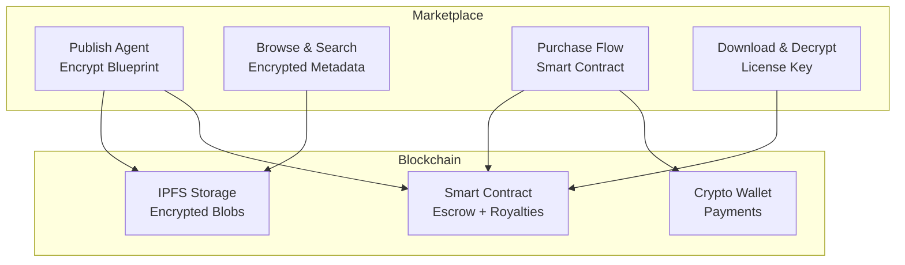

# Marketplace - Vue d'ensemble

**Genesis Marketplace** est une plateforme décentralisée pour l'échange de blueprints d'agents AI chiffrés.

---

## 🛒 Fonctionnalités

- **Blueprint Trading** : Achat/vente de blueprints d'agents
- **Encryption** : Blueprints chiffrés avant publication
- **Smart Contracts** : Transactions décentralisées
- **Royalties** : Revenus récurrents pour créateurs

---

## 🏗️ Architecture

---

## 📚 Références

- [Blueprint Trading](./marketplace/blueprint-trading)
- [Encryption](./marketplace/encryption)
- [Smart Contracts](./marketplace/smart-contracts)
- [Publishing Agents](./marketplace/agent-publishing)

---

**Version :** 1.0.0  
**Runtime :** Deno  
**Blockchain :** EVM-compatible  
**Storage :** IPFS
