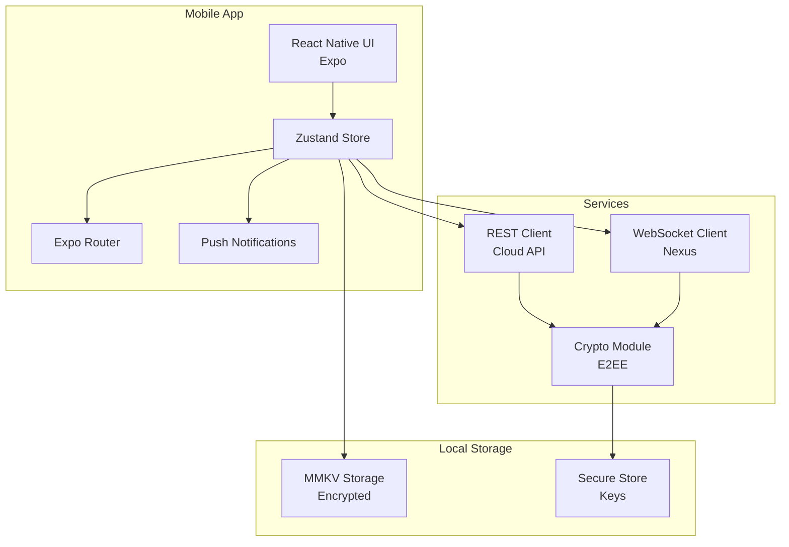

# Mobile App - Vue d'ensemble

**Genesis Mobile** est l'application mobile React Native/Expo permettant la validation et le monitoring des workflows Genesis à distance.

---

## 📱 Fonctionnalités

- **Validation Cockpit** : Approuver/rejeter des workflows sensibles
- **Monitoring** : Suivi en temps réel de l'exécution
- **Notifications** : Alertes push pour événements importants
- **Sync** : Synchronisation E2EE avec Cloud API

---

## 🏗️ Architecture



---

## 🚀 Quickstart

```bash
# Installation
cd genesis-mobile
npm install

# Démarrage (Expo)
npm start

# Build iOS
npm run ios

# Build Android
npm run android

# Build avec EAS
eas build --platform ios
eas build --platform android
```

---

## 📚 Références

- [Architecture Mobile](./mobile-app/architecture)
- [Validation Cockpit](./mobile-app/validation-cockpit)
- [Connexion Nexus](./mobile-app/nexus-connection)
- [Composants](./mobile-app/components)
- [Build & Déploiement](./mobile-app/build-deployment)

---

**Version :** 1.0.0  
**Framework :** Expo SDK 50+  
**UI :** React Native  
**Navigation :** Expo Router
