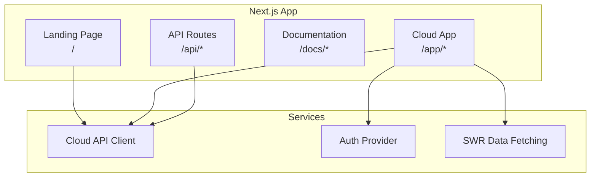

# Web Portal - Vue d'ensemble

**Genesis Web Portal** est le portail web Next.js servant de landing page et d'interface cloud pour Genesis AI.

---

## 🌐 Fonctionnalités

- **Landing Page** : Présentation de Genesis AI
- **Cloud App** : Interface web complète
- **Dashboard** : Monitoring et gestion
- **Documentation** : Accès aux docs

---

## 🏗️ Architecture Next.js

---

## 📚 Références

- [Architecture Next.js](./web-portal/nextjs-architecture)
- [Landing Page](./web-portal/landing-page)
- [Cloud App](./web-portal/cloud-app)
- [Authentification](./web-portal/authentication)

---

**Version :** 1.0.0  
**Framework :** Next.js 14+  
**Deployment :** Vercel  
**Styling :** Tailwind CSS
